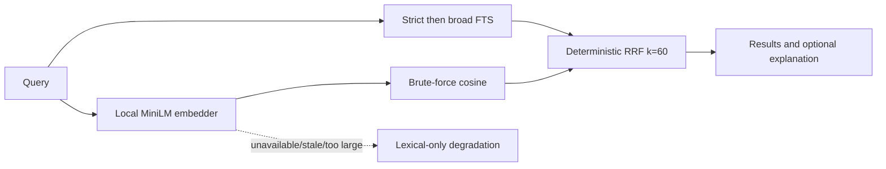

# Feature: Opt-in hybrid semantic memory search

## Requirements

- Keep lexical strict-to-broad FTS as the default and as a protected hybrid channel.
- Enable semantic retrieval only when `memory.semantic` is `true`; absent means false.
- Work locally after a lazy, pinned model download and degrade to lexical-only when offline.
- Preserve deterministic, explainable ranking and warm p95 search latency below 50 ms at 1,000 rows.
- Add only an additive migration; never edit an applied migration.
- Provide semantic status/download and resumable re-embedding commands.
- Keep the embedding runtime below 150 MB excluding the model cache.

Non-goals: ANN indexing, chunking memories, configurable models/fusion constants, automatic migration-time downloads, and multilingual retrieval.

## Gate evidence and decisions

The expanded-100 benchmark contains 100 memories and 100 queries. Against current strict-to-broad FTS, MiniLM hybrid RRF produced paraphrase nDCG@5 0.7590 versus 0.6576 (+15.41%) and recall@5 0.76 versus 0.68 (+11.76%). Overall MRR@5 improved from 0.8637 to 0.9275. Identifier-exact hit@1 stayed 0.96 with zero per-query regressions, and repeated fusion rankings were identical. BGE failed the paraphrase gates (+8.75% nDCG and +5.88% recall), so the smaller MiniLM model is selected.

`onnxruntime-web@1.22.0` plus `@huggingface/tokenizers@0.1.3` installs at 100 MB on Linux and has no native/platform-specific dependency. Direct ONNX output matched Transformers.js output to float precision. The pinned q8 MiniLM model is a separate 23 MB lazy download. Measured runtime: 426 ms load, 58 ms first inference, and roughly 12-14 ms warm inference.

## Design

- Model: `Xenova/all-MiniLM-L6-v2` at revision `751bff37182d3f1213fa05d7196b954e230abad9`, q8, 384 dimensions.
- Cache: `~/.ai-devkit/models/Xenova--all-MiniLM-L6-v2/<revision>/` with checksummed config, tokenizer, and ONNX files.
- Document text: trimmed title, blank line, trimmed content, then sorted tags when present.
- Storage: nullable float32 little-endian BLOB and an embedding compatibility version.
- Fusion: `1/(60 + lexicalRank) + 1/(60 + semanticRank)`, then lexical presence, lexical rank, semantic rank, and ID tie-breaks.
- Search skips semantic scanning above 5,000 eligible rows. Missing/stale embeddings remain lexical candidates.
- Updating title, content, or tags invalidates an embedding; a scope-only update retains it.
- Backfill processes stable ID-ordered batches and commits each replacement atomically.

## Interfaces

- Config: `memory.semantic: boolean`, default false.
- CLI: `memory semantic status`, `memory semantic download`, `memory reembed [--force]`, and `memory search --explain`.
- Search results retain lexical `strategy` (`strict`, `broad`, or `recent`) and add retrieval mode/status. Per-item channel ranks and RRF details appear only with explain enabled.
- Existing synchronous APIs remain lexical-compatible. Async semantic-aware command/server paths dynamically import the runtime only when enabled.

## Implementation plan

- [x] Add migration and embedding invalidation/storage tests.
- [x] Add deterministic semantic primitives and RRF tests.
- [x] Add pinned model downloader and lightweight ONNX runtime tests.
- [x] Add status, download, and resumable re-embed APIs and CLI tests.
- [x] Add async hybrid search with offline/corrupt/stale degradation tests; large-corpus validation remains in the performance gate.
- [x] Wire config through CLI and MCP while preserving default behavior.
- [ ] Run expanded-100 gate through the built CLI.
- [ ] Run 1,000-row warm latency gate.
- [ ] Run six-project build, full tests, lint, and e2e.

## Testing record

- [x] Migration adds nullable columns without changing existing rows.
- [x] Content fields invalidate embeddings; scope-only updates do not.
- [x] Model file checksums and pinned revision are enforced.
- [x] Runtime output is normalized and 384-dimensional.
- [x] RRF is deterministic and protects lexical ties.
- [x] Offline and missing-model search returns lexical results.
- [x] Stale/corrupt embeddings are excluded safely.
- [x] Backfill resumes and skips current rows; force mode remains in final CLI validation.
- [x] CLI surfaces config, status, download, reembed, and explanations.
- [x] Default lexical API and strict/broad strategies remain compatible in targeted tests.

## Rollback

Set `memory.semantic` to false. The additive columns become inert and older named-column queries continue to work. Deleting a knowledge row deletes its BLOB with no auxiliary index cleanup. Model files can be removed independently from the validated cache directory. A later cleanup migration may null the columns, but rollback does not require reversing schema history.
