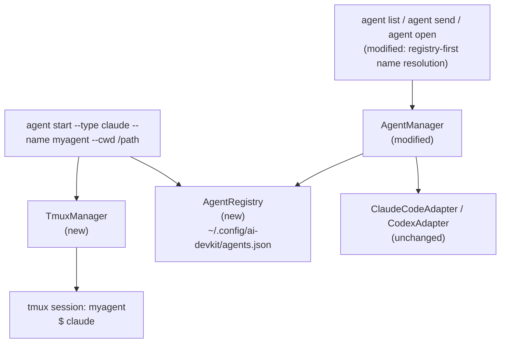

# System Design & Architecture

## Architecture Overview



**`agent start` flow (happy path):**
1. Validate `--name` format, tmux availability, `--cwd` exists, name not live in registry
2. `TmuxManager.createSession(name, cwd)` — `tmux new-session -d -s <name> -c <cwd>`
3. `TmuxManager.sendKeys(name, agentCommand)` — `tmux send-keys -t <name> "<cmd>" Enter`
4. Poll up to 5s (500ms interval) via `TmuxManager.getPaneChildPid(name)` for the agent process PID
5. `AgentRegistry.register({ name, pid, type, tmuxSession: name, cwd, startedAt })`
6. Print success output with attach command

**`agent start` flow (PID poll timeout):**
- If no child PID is found within 5s: `tmux kill-session -t <name>`, exit non-zero with message "Agent process not found — verify `<cmd>` is in PATH"
- No orphaned tmux sessions left behind

**`agent list` / `agent send` / `agent open` flow:**
- `AgentManager.listAgents()`: aggregate adapter results → `registry.prune()` → overlay registry names by PID match
- `AgentManager.resolveAgent(input, agents)`: registry lookup by name first → fall through to existing CWD+PID name match

## Data Models

### Registry entry (`~/.config/ai-devkit/agents.json`)

```typescript
interface RegistryEntry {
  name: string;        // user-supplied, unique key
  pid: number;         // PID of the agent process inside tmux
  type: AgentType;     // 'claude' | 'codex'
  tmuxSession: string; // tmux session name (same as `name` for now)
  cwd: string;         // resolved absolute path
  startedAt: string;   // ISO 8601
}

type RegistryFile = { entries: RegistryEntry[] };
```

Registry is a flat JSON file. Reads prune entries using two checks:
1. `process.kill(pid, 0)` — process is alive
2. Process start time must match `startedAt` within 60s tolerance (guards against OS PID recycling)

Start time is read via `/proc/<pid>/stat` on Linux or `ps -o lstart= -p <pid>` on macOS. If the start time check is unavailable, fall back to kill-0 only and document the limitation.

## API Design

### `TmuxManager` (new — `packages/agent-manager/src/terminal/TmuxManager.ts`)

```typescript
class TmuxManager {
  isAvailable(): Promise<boolean>
  sessionExists(name: string): Promise<boolean>
  createSession(name: string, cwd: string): Promise<void>
  sendKeys(session: string, keys: string): Promise<void>
  getPaneChildPid(session: string): Promise<number | null>
}
```

- `createSession`: runs `tmux new-session -d -s <name> -c <cwd>`
- `sendKeys`: runs `tmux send-keys -t <name> "<keys>" Enter`
- `getPaneChildPid`: runs `tmux list-panes -t <name> -F '#{pane_pid}'`, then finds the child process of that pane PID (the actual `claude`/`codex` process) via `pgrep -P <panePid>`

### `AgentRegistry` (new — `packages/agent-manager/src/utils/AgentRegistry.ts`)

```typescript
class AgentRegistry {
  register(entry: RegistryEntry): void
  lookup(name: string): RegistryEntry | null
  lookupByPid(pid: number): RegistryEntry | null
  list(): RegistryEntry[]
  remove(name: string): boolean
  prune(): void   // removes entries with dead/recycled PIDs; called on every read
  isAlive(entry: RegistryEntry): boolean  // kill-0 + startedAt cross-check
}
```

Path: `~/.config/ai-devkit/agents.json`. Creates directory/file if absent. Writes are atomic (write to `.tmp` then rename).

**Concurrent access:** two simultaneous `agent start` calls with the same `--name` may both pass the name-free check before either writes. This is an acceptable edge case (rare, self-correcting on next prune). File locking is not implemented in this iteration.

### CLI subcommand (`packages/cli/src/commands/agent.ts`)

```
agent start
  --type <type>    required  'claude' | 'codex'
  --name <name>    required  alphanumeric + hyphens, max 64 chars
  --cwd  <path>    optional  defaults to process.cwd()
```

**Output on success:**
```
Agent "myagent" started (claude, PID 12345)
Working directory: ~/projects/myapp
Attach: tmux attach -t myagent
```

### `AgentManager` modifications

**Constructor injection:**
```typescript
class AgentManager {
  constructor(private registry: AgentRegistry = AgentRegistry.default()) {}
}
```
`AgentRegistry.default()` returns a module-level singleton backed by the default path `~/.config/ai-devkit/agents.json`. Tests can inject a custom instance.

**`listAgents()`:** after aggregating adapter results, call `registry.prune()` then for each `AgentInfo` whose `pid` matches a registry entry, override `info.name` with the registry name.

**`resolveAgent(input, agents)`:** before existing exact/partial name matching, check `registry.lookup(input)`; if found and its PID appears in the agent list, return that agent.

**`createAgentManager()` CLI helper** passes `AgentRegistry.default()` explicitly to ensure the same instance is used across `agent start`, `agent list`, and `agent send` within a process lifetime.

## Component Breakdown

| Component | Location | Change |
|---|---|---|
| `TmuxManager` | `packages/agent-manager/src/terminal/TmuxManager.ts` | New |
| `AgentRegistry` | `packages/agent-manager/src/utils/AgentRegistry.ts` | New |
| `agent start` subcommand | `packages/cli/src/commands/agent.ts` | New subcommand |
| `AgentManager.listAgents()` | `packages/agent-manager/src/AgentManager.ts` | Registry overlay |
| `AgentManager.resolveAgent()` | `packages/agent-manager/src/AgentManager.ts` | Registry-first lookup |
| `packages/agent-manager/src/index.ts` | exports | Export new classes |
| `createAgentManager()` (CLI helper) | `packages/cli/src/commands/agent.ts` | Pass registry instance |

## Design Decisions

**Registry over adapter modification:** Agent detection adapters are intentionally decoupled from identity management. Injecting the registry overlay into `AgentManager` (not adapters) keeps adapters stateless and testable.

**Name = tmux session name:** Keeping them identical simplifies lookup and avoids a two-level indirection. If a user renames the tmux session externally, the registry prunes the entry on next PID check.

**PID of child process, not pane PID:** `tmux list-panes -F '#{pane_pid}'` gives the shell PID. The agent adapter scans for `claude`/`codex` executables, so we must find the child process (the actual binary) to match what adapters report.

**Atomic registry writes:** Prevents corrupt JSON if the process is killed mid-write.

**`--type` allowlist at CLI:** Only `claude` and `codex` are accepted. The command string sent to tmux is derived from the type: `claude` → `"claude"`, `codex` → `"codex"`. No shell interpolation of user input.

**`pgrep` dependency for `getPaneChildPid`:** `pgrep -P <panePid>` is used to find the agent child process of the tmux shell pane. `pgrep` is available on macOS (built-in) and Linux (via `procps`). This is a soft dependency — if absent, `agent start` will fail at the PID poll step with a clear error.

**1 session = 1 agent:** each `agent start` creates one dedicated tmux session named after the agent. Sessions are independent — killing one does not affect others. This is the confirmed model (vs. shared session with windows).

## Non-Functional Requirements

- Registry reads/writes complete in <50ms (local file, small JSON)
- `agent start` completes (session created + process detected) in <3s on a typical machine
- No new external runtime dependencies (tmux is a system tool, not an npm package)
- Name validation: `/^[a-z0-9][a-z0-9-]{0,62}[a-z0-9]$/` (lowercase alphanumeric + hyphens, 2-64 chars) to be safe as tmux session names
