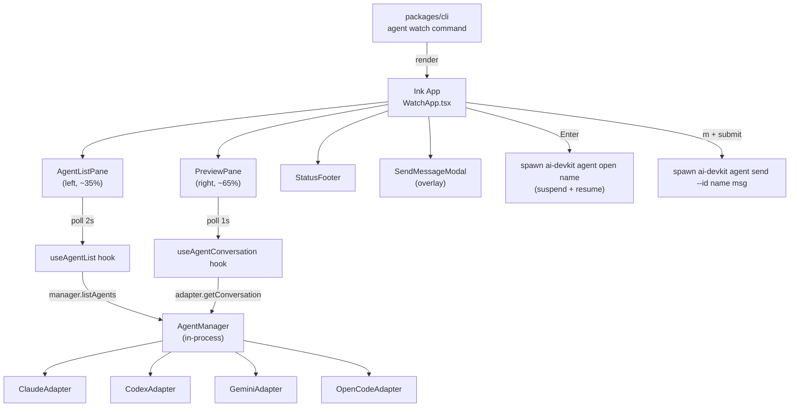

# System Design & Architecture — Agent Watch

## Architecture Overview

`ai-devkit agent watch` is a new CLI subcommand that launches an Ink-based React TUI inside the user's terminal. The TUI reads agent state in-process via the existing `AgentManager` and adapter APIs, renders a two-pane master-detail view, and shells out to existing `ai-devkit agent open` / `ai-devkit agent send` commands for user actions.



### Key components and responsibilities

- **`agent watch` command** (`packages/cli/src/commands/agent.ts`): Registers the subcommand, verifies stdout is a TTY, instantiates `AgentManager`, and renders the Ink app with `render(<WatchApp manager={...} />)`.
- **`WatchApp`**: Root Ink component. Owns selection state, modal state, "ended-agent" banner state. Wires polling hooks to panes.
- **`AgentListPane`**: Renders the live agent table, handles `↑↓`/`j k` selection, exposes the selected `AgentInfo` to parent.
- **`PreviewPane`**: Renders the selected agent's recent conversation messages with collapsible tool calls. Auto-scrolls to bottom unless user scrolls up.
- **`StatusFooter`**: Renders agent counts, selected agent metadata, keybinding hints, transient error/info lines.
- **`SendMessageModal`**: Overlay text input; on submit, spawns `ai-devkit agent send --id <name> <text>`. On cancel, returns to list.
- **Polling hooks** (`useAgentList`, `useAgentConversation`): Encapsulate the polling state machine — setInterval, in-flight cancellation, error capture, "data freshness" timestamps.
- **Action runners** (`runAgentOpen`, `runAgentSend`): Suspend Ink, spawn the child CLI via `tea.ExecProcess`-equivalent (Ink supports this via stdin/stdout takeover), wait for exit, resume.

### Technology stack

| Choice | Rationale |
|---|---|
| **Ink 5** (`ink`, `ink-text-input`, `ink-spinner`) | React for terminals; matches existing TS codebase; ecosystem covers list/input/spinner widgets. Ink 5 supports ESM-only deps and aligns with current Node ≥18 target. |
| **In-process `AgentManager`** | Avoids fork/parse overhead of `ai-devkit agent list --json` polling; preview reads session files via the adapter directly. Trade-off: TUI depends on `@ai-devkit/agent-manager` package internals. |
| **`child_process.spawn` for `open`/`send`** | Keep the existing CLI as the source of truth for these verbs. No duplication of terminal-focus or send logic. |
| **No new persistent state, no daemon** | v1 is a pure viewer; closing the TUI loses nothing. Polling is sufficient at the stated cadence. |

## Data Models

The TUI does not introduce new persistent data. It consumes existing types from `@ai-devkit/agent-manager`:

### From `manager.listAgents()`
```ts
type AgentInfo = {
  name: string;
  type: 'claude' | 'codex' | 'gemini_cli' | 'opencode';
  status: AgentStatus;          // RUNNING | WAITING | IDLE | UNKNOWN
  projectPath: string;
  summary?: string;             // "working on" line
  lastActive: Date;
  sessionId?: string;
  sessionFilePath?: string;
}
```

### From `adapter.getConversation(sessionFilePath, opts)`
```ts
type ConversationMessage = {
  role: 'user' | 'assistant' | 'tool_use' | 'tool_result';
  content: string;
  timestamp?: string;
  // tool-call specific fields when verbose
}
```

### TUI-local view models

- `WatchState`: `{ agents: AgentInfo[], selectedName: string | null, lastListUpdate: Date, listError: string | null, view: 'list' | 'sendModal' }`
- `PreviewState`: `{ messages: ConversationMessage[], expandedToolIndexes: Set<number>, autoScroll: boolean, lastPreviewUpdate: Date, previewError: string | null }`

### Sort order

The TUI uses the order returned by `AgentManager.listAgents()` directly: WAITING → RUNNING → IDLE → UNKNOWN, then `lastActive` desc within each group. Waiting agents bubble to the top for free; the non-color row cue (requirement #4) is reinforcement. No client-side re-sort, no upstream change.

## API Design

### New CLI surface
```
ai-devkit agent watch
```
No flags in v1. Constants in code: list poll = 2000ms, preview poll = 1000ms, preview tail = 20 messages. No JSON output mode (interactive only). Exits 0 on `q`, 1 on fatal init error (no TTY, manager init failure).

### Internal interfaces

- `WatchApp` consumes `{ manager: AgentManager }` as prop.
- Polling hooks take the manager + cadence and return `{ data, error, isLoading, lastUpdated }`. They handle their own intervals and cancellation; React unmount stops the loop.
- Action runners take `{ name, message? }` and return `Promise<{ exitCode: number, stderr: string }>` after the child process exits.

### Suspend / resume for `agent open`

Ink's `useApp().exit()` returns control to the parent process. The runner uses Ink's documented "exec external command" pattern:
1. Capture current screen state (cursor position, alt-screen).
2. Call `app.unmount()` to release stdin/stdout.
3. `spawn('ai-devkit', ['agent', 'open', name], { stdio: 'inherit' })`.
4. Await exit.
5. Re-`render(<WatchApp />)`, restoring the prior `selectedName`.

For `agent send`, the child's stdio is also inherited so any prompts (e.g., the existing "agent not waiting" warning) display in-place; the user sees normal CLI output then is returned to the TUI.

## Component Breakdown

### File layout
```
packages/cli/src/commands/agent.ts          # add .command('watch')
packages/cli/src/tui/watch/
  WatchApp.tsx                              # root component
  AgentListPane.tsx
  PreviewPane.tsx
  StatusFooter.tsx
  SendMessageModal.tsx
  hooks/
    useAgentList.ts
    useAgentConversation.ts
    useTerminalSize.ts
  actions/
    runAgentOpen.ts
    runAgentSend.ts
  render/
    formatStatus.tsx                        # color + glyph + label (no-color cue)
    formatMessage.tsx                       # assistant / tool_use / tool_result rendering
  state/
    watchReducer.ts                         # selection, modal, banner state
```

### Polling state machine

Single hook handles both panes (parameterized):

```
state: idle | loading | success | error
on mount → start interval
each tick → if not loading: fetch; on resolve → setState success; on reject → setState error (keep stale data visible)
selection change (preview only) → cancel in-flight, refetch immediately
unmount → clear interval, abort in-flight
```

Cancellation: hold a `runToken` ref, bump on every fetch start, only commit results matching the current token.

### Narrow-terminal fallback

Detect via `useTerminalSize` (listens on `process.stdout` `resize`). Below 100 columns, hide the preview pane and show a footer line: `resize ≥100 cols to show preview`. Selection still works.

## Design Decisions

### D1. In-process manager vs shell-out
**Chosen:** in-process import of `@ai-devkit/agent-manager`.
**Alternative:** spawn `ai-devkit agent list --json` / `agent detail --json --tail 20`.
**Trade-off:** in-process is ~10–20ms faster per tick and avoids JSON parse + process startup cost (Node CLI cold start is ~150–300ms). The cost is tighter coupling: a manager API rename will break the TUI. Accepted because both packages ship together and the manager is internal to ai-devkit.

### D2. Polling vs streaming
**Chosen:** polling (2s list, 1s preview).
**Alternative:** add `--watch` NDJSON to `agent list`, subscribe via stdin.
**Trade-off:** polling ships now without modifying the manager. Worst-case staleness is 2s for the list, which satisfies success criterion #3 (3s). Streaming can be added later behind the same hook interface.

### D3. Use the manager's native sort
**Chosen:** consume `listAgents()` order as-is (status priority, then `lastActive` desc within each group).
**Alternative:** re-sort client-side or change the manager.
**Trade-off:** native order already surfaces waiting agents first, which is the actual UX goal behind the requirement; client-side re-sort would have hidden that signal. Zero new code, zero coupling.

### D4. Inherited stdio vs captured stdio for `agent open` / `send`
**Chosen:** inherited (`stdio: 'inherit'`).
**Alternative:** capture stdout/stderr and render inside the TUI.
**Trade-off:** capturing requires re-implementing prompts and color handling. Inherited just hands the terminal over; for `open`, that's required anyway since it focuses another terminal window. Inherited stdio also makes it impossible to leak the parent's TUI state — the child sees a clean terminal.

### D5. Single window vs multi-window
**Chosen:** single window, two panes.
**Alternative:** Ink-supported tabs/windows.
**Trade-off:** Single window matches requirements (no splits in v1) and keeps the mental model simple. Tabs can be added later without restructuring.

### D6. Tool-call rendering: collapsed by default
**Chosen:** Render `tool_use` / `tool_result` as one-liners (`→ read src/auth/mw.ts`); `v` toggles expansion on the focused message.
**Alternative:** Always expand (more context, but a single 50-line file read dominates the preview).
**Trade-off:** Collapsed default preserves the "what is the agent doing right now" signal. Expansion stays available.

### D7. Pure viewer, no kill action
**Chosen:** No destructive verbs in v1. Confirms non-goal from requirements.
**Alternative:** Add a `k` keybinding + new `ai-devkit agent kill` CLI verb.
**Trade-off:** Out of scope by requirement. Worth revisiting in a follow-up once the CLI verb exists.

## Non-Functional Requirements

| Property | Target | How |
|---|---|---|
| **Launch latency** | <1s on ≤10 agents | First render before first poll completes (skeleton row); manager init is sync. |
| **Selection-to-preview latency** | <1s | Preview poll fires immediately on selection change, not on next interval. |
| **State-change visibility** | ≤3s | 2s list poll cadence + 1 frame render < 3s ceiling. |
| **Input latency** | <100ms | Ink renders on state change; keystrokes never wait for I/O (in-flight fetches don't block input). |
| **CPU at idle (20 agents)** | <5% of one core on M-series Mac | Polling at 2s × `listAgents` (which already runs in parallel across adapters); preview reads only one session file per second. |
| **Memory** | <50 MB resident | One Node process; no transcript buffering beyond current `--tail`. |
| **Compatibility** | macOS, Linux | Inherits from agent module. Windows: explicitly unsupported in v1. |
| **Security** | No new attack surface | TUI does not parse user input as code; `agent send` payload is passed as an argv element, not shell-interpreted. |
| **Failure isolation** | Adapter errors don't crash the TUI | `listAgents()` already swallows per-adapter errors; the TUI surfaces them as a footer line, not a crash. |

## Open Items Resolved from Requirements Phase

- **Preview rendering (req open item):** collapsed tool calls, `v` to expand (D6).
- **Narrow-terminal fallback:** threshold 100 cols, list-only below.
- **Resize behavior:** redraw on `SIGWINCH`/`stdout.resize`; preview re-wraps to new width; selection preserved.
- **Empty / missing session file:** preview shows distinct messages — "No messages yet" vs "Session file unreadable: <path>" with the cause; list keeps polling.
