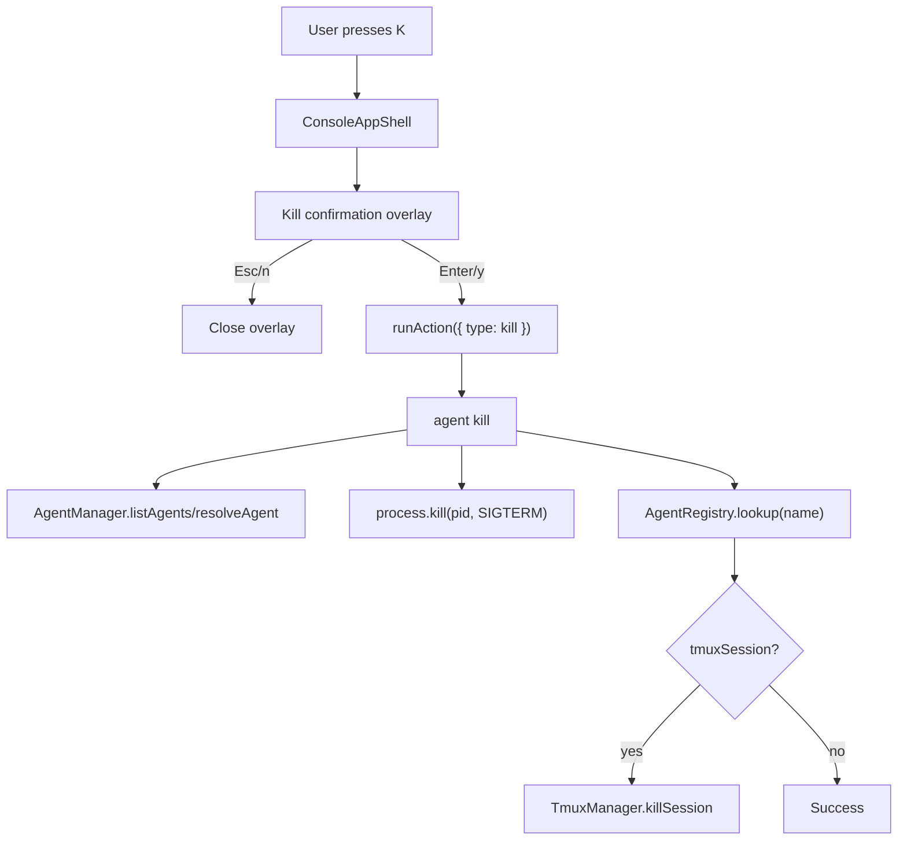

# System Design & Architecture

## Architecture Overview

Kill support follows the existing console action pattern: the TUI handles key input and presentation, while the destructive operation runs through a CLI subprocess. The CLI receives the agent name, resolves it against the current live agent list, sends `SIGTERM` to the PID, and cleans up the registry-backed tmux session when available.

## Data Models

- `ConsoleAction`
  - Add `{ type: 'kill'; agentName: string }`.
- `AgentInfo`
  - Existing selected agent data supplies `name`, `pid`, and optionally `tmuxSession`.
- `RegistryEntry`
  - `AgentRegistry.lookup(name)` supplies a preserved `tmuxSession` when the live adapter did not populate it.

## API Design

- Add CLI command: `ai-devkit agent kill <name>`
  - Resolves `<name>` like `open`/`send`.
  - Rejects no-match and ambiguous matches with existing agent-list messaging patterns.
  - Calls a reusable service function for process/tmux cleanup.
- Add service function: `killAgent(agent, deps)`
  - Inputs: selected `AgentInfo`, `AgentRegistry`, `TmuxManager`, optional signal.
  - Behavior: `process.kill(agent.pid, 'SIGTERM')`, then `tmux.killSession(session)` when a session name exists.

## Component Breakdown

| Component | Change |
|-----------|--------|
| `ConsoleAppShell` | Track pending kill confirmation and handle `K`, `y`, `Enter`, `n`, `Esc` |
| New `KillConfirmDialog` | Render centered absolute-positioned confirmation overlay |
| `StatusFooter` | Include `K kill` in key hints |
| `runAction` | Add `kill` action that spawns `agent kill <name>` |
| `agent.service.ts` | Add kill service with tmux cleanup |
| `commands/agent.ts` | Add `agent kill` command |

## Design Decisions

- Keep lowercase `k` as up navigation and use uppercase `K` for kill.
- Require confirmation before invoking the subprocess.
- Render the confirmation as an absolute-positioned overlay so the list, preview, input, and footer keep their existing dimensions.
- Use subprocess actions consistently with existing console `open` and `send`.
- Resolve tmux session from the registry as a fallback because `AgentInfo` may be adapter-derived and not always contain registry metadata.
- Treat missing/already-ended process as non-fatal enough to continue tmux cleanup; the user action intent is to ensure the selected agent is stopped.

## Non-Functional Requirements

- The confirmation overlay must be keyboard-only, absolute-positioned, and not resize the main console panes.
- TUI errors should appear as transient messages.
- Kill must not take over stdin/stdout from Ink.
- Tests should cover both process-only and tmux-backed agents.
