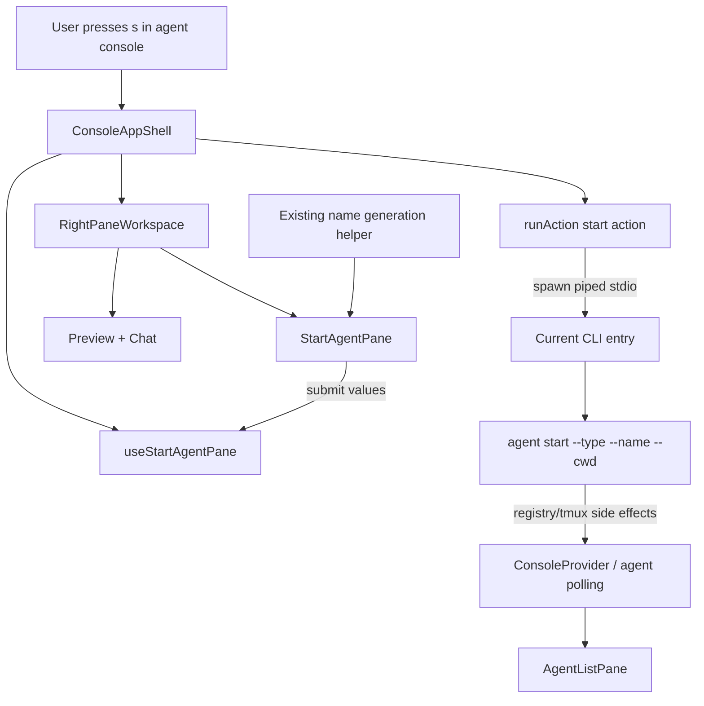

# System Design & Architecture

## Architecture Overview
**What is the high-level system structure?**



The console remains the orchestration layer. The agent list is the stable left navigation pane. The right pane is a mode-driven workspace: the default mode renders preview + chat input, and `start-agent` mode renders the start-agent form. `useStartAgentPane` owns the start lifecycle, and `runAction` handles process execution as the only bridge from TUI actions to CLI subcommands. Existing `agent start` code remains responsible for validation, tmux creation, PID polling, registry writes, and attach instructions.

## Data Models
**What data do we need to manage?**

```typescript
type StartableAgentType = 'claude' | 'codex' | 'gemini_cli' | 'opencode';

interface StartAgentFormState {
  type: StartableAgentType;
  cwd: string;
  name: string;
  focus: 'type' | 'cwd' | 'name' | 'submit' | 'cancel';
  error?: string;
  isSubmitting: boolean;
}

type RightPaneMode =
  | { type: 'preview' }
  | { type: 'start-agent' };

type ConsoleAction =
  | { type: 'open'; agentName: string }
  | { type: 'send'; agentName: string; message: string }
  | { type: 'start'; agentType: StartableAgentType; name: string; cwd: string };
```

No new persistent data is introduced. Persistent agent state remains owned by `agent start` and the existing agent registry.

## API Design
**How do components communicate?**

### `StartAgentPane`

```typescript
interface StartAgentPaneProps {
  initialType?: StartableAgentType;
  initialName: string;
  initialCwd: string;
  onSubmit(values: { type: StartableAgentType; name: string; cwd: string }): void;
  onCancel(): void;
  error?: string | null;
  isSubmitting?: boolean;
  width: number;
  height: number;
}
```

The pane is controlled by `ConsoleAppShell` and `useStartAgentPane`: the shell decides the active `RightPaneMode`, passes defaults, and routes submit/cancel events to the start lifecycle hook. The hook invokes `runAction`, manages inline errors/submitting state, returns to preview mode after success/cancel, and calls `refresh()` after a successful start.

### `runAction`

Extend the existing action union and argv switch:

```typescript
case 'start':
  return [
    ...baseArgs,
    'agent',
    'start',
    '--type',
    action.agentType,
    '--name',
    action.name,
    '--cwd',
    action.cwd,
  ];
```

Spawn behavior stays unchanged: `stdio: ['ignore', 'pipe', 'pipe']`.

### Console refresh

`useAgentList` currently owns `manager.listAgents({ sortBy: 'status' })` inside its polling effect. Add a `refresh(): Promise<void>` method to `UseAgentListResult` by extracting the existing fetch-once logic into a stable callback. `ConsoleProvider` can pass that through context. `ConsoleAppShell` calls `refresh()` after successful start so the new agent appears immediately, without duplicating list-loading logic outside the hook.

### Generated name helper

`generateAgentName(cwd)` currently lives in `packages/cli/src/util/agent.ts` after being extracted from `packages/cli/src/commands/agent.ts`. Import it from both `commands/agent.ts` and the console start-pane lifecycle hook. Preserve current behavior exactly:

```typescript
const folder = path.basename(cwd)
  .toLowerCase()
  .replace(/[^a-z0-9]+/g, '-')
  .replace(/^-+|-+$/g, '')
  .slice(0, 50) || 'agent';
return `${folder}-${Date.now().toString(36)}`;
```

## Component Breakdown
**What are the major building blocks?**

| Component | Location | Change |
|---|---|---|
| `ConsoleAppShell` | `packages/cli/src/tui/console/ConsoleApp.tsx` | Own right-pane mode state, handle `s`, route submit/cancel flow, and render the active workspace |
| `useStartAgentPane` | `packages/cli/src/tui/console/hooks/useStartAgentPane.ts` | Own start defaults, submit/cancel lifecycle, success transient, refresh, and inline start-pane errors |
| `StartAgentPane` | `packages/cli/src/tui/console/StartAgentPane.tsx` | New native Ink right-pane workspace with type selector, cwd field, name field |
| Console action types | `packages/cli/src/tui/console/actions/types.ts` | Add `start` action |
| `runAction` | `packages/cli/src/tui/console/actions/runAction.ts` | Add argv mapping for `agent start --type --name --cwd` |
| Name helper utility | `packages/cli/src/util/agent.ts` | Shared `generateAgentName(cwd)` imported by command + console |
| `useAgentList` / console context | `packages/cli/src/tui/console/hooks/useAgentList.ts`, `state/ConsoleContext.tsx` | Expose `refresh()` for immediate post-start list reload |
| Footer | `packages/cli/src/tui/console/StatusFooter.tsx` | Add `s start` to shortcut text |
| Tests | `packages/cli/src/__tests__/tui/console/**` | Cover new action argv and start-pane behavior |

## Design Decisions
**Why did we choose this approach?**

**Right-pane workspace pattern:** The left agent list stays stable as navigation while the right pane changes based on the active feature. This avoids terminal overlay artifacts and establishes a reusable pattern for future console features such as web, logs, or settings.

**Shell out via `runAction`:** This follows the existing `open` and `send` pattern. It keeps `agent start` as the behavior source of truth and avoids introducing a second start path with subtly different validation or tmux handling.

**Simple cwd text field:** Directory browsing is useful but out of scope for v1. A text field maps directly to `--cwd` and keeps the start pane small.

**Generated default name:** Reusing the existing generation function keeps console defaults aligned with CLI defaults and reduces repeated naming logic.

**Refresh in hook/context:** The hook already centralizes loading, equality checks, in-flight suppression, and error state. Exposing `refresh()` keeps those rules in one place and avoids a one-off `manager.listAgents` call in `ConsoleAppShell`.

**Type values passed exactly:** The start-pane selections use the supported `agent start` type values directly, including `gemini_cli`, so there is no hidden display-to-value mapping to test or maintain.

**Inline failure retry:** Failed start keeps the start-agent workspace active and displays stderr inline. This lets users fix invalid cwd/name/type values without changing modes.

**Alternatives considered:**
- Use Inquirer after pausing the TUI: simpler implementation, but it is not a native console popup and would interrupt the console model.
- Call start service internals directly: avoids a subprocess, but diverges from the established console action pattern and requires more coupling between the TUI and start implementation.
- Add directory picker: better UX for path discovery, but more scope and keyboard complexity than needed for this version.
- Overlay modal: looked like a popup but introduced terminal-specific background/opacity artifacts and obscured the future workspace pattern.

## Non-Functional Requirements
**How should the system perform?**

- Right-pane mode switching should not block polling or conversation preview updates.
- Subprocess output must not write directly to the TUI terminal.
- Error output should be trimmed to fit transient/start-pane display without overflowing narrow terminals.
- User-supplied values must only be passed as argv entries to `spawn`, never interpolated into a shell command.
- Existing console shortcuts and input focus behavior must remain stable.
