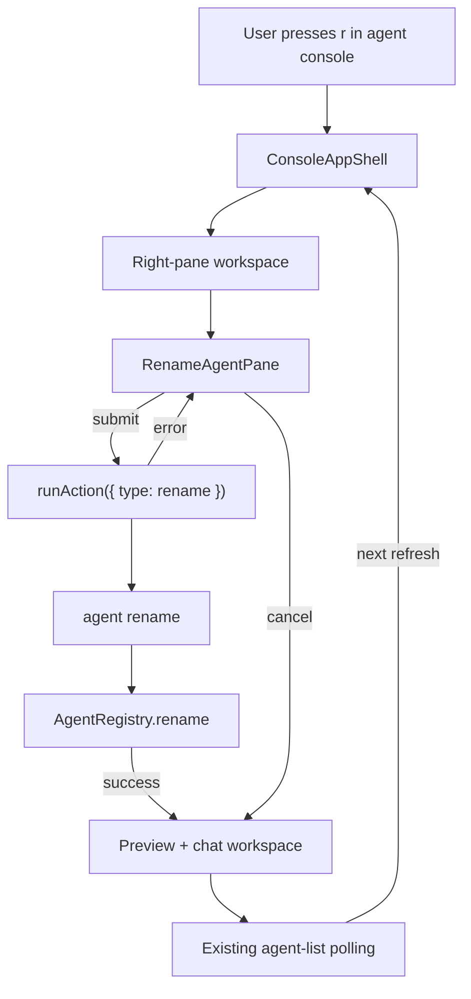

# System Design & Architecture

## Architecture Overview



The console remains an orchestration layer. The selected agent comes from the current agent-list state, rename mode renders in the dynamic workspace, and the actual mutation is delegated to the existing CLI command through `runAction`.

## Data Models

```ts
type RightPaneMode =
  | { type: 'preview' }
  | { type: 'start-agent' }
  | { type: 'rename-agent'; agentName: string };

type ConsoleAction =
  | { type: 'open'; agentName: string }
  | { type: 'send'; agentName: string; message: string }
  | { type: 'start'; agentType: StartableAgentType; name: string; cwd: string }
  | { type: 'rename'; currentName: string; newName: string };

interface RenameAgentPaneProps {
  currentName: string;
  initialName: string;
  error?: string | null;
  isSubmitting?: boolean;
  width: number;
  height: number;
  onSubmit(values: { newName: string }): void;
  onCancel(): void;
}
```

No new persistent data is introduced. Registry state remains owned by `agent rename` and `AgentRegistry.rename()`.

## API Design

### `runAction`

Add a rename action branch:

```ts
case 'rename':
  return [
    ...baseArgs,
    'agent',
    'rename',
    action.currentName,
    action.newName,
  ];
```

Spawn behavior stays unchanged: arguments are passed as argv entries with piped stdout/stderr, never shell-interpolated.

### Rename Lifecycle Hook

Add `useRenameAgentPane` or equivalent local state in the console shell:

- Initialize `newName` from the selected agent name when rename mode opens.
- Keep `error` and `isSubmitting` state for retry and duplicate-submit prevention.
- On submit, trim the name and call `runAction({ type: 'rename', currentName, newName })`.
- On success, return to preview mode. Do not call `refresh()`.
- On failure, keep rename mode active and show trimmed stderr/stdout error text.

## Component Breakdown

| Component | Location | Change |
|---|---|---|
| `ConsoleAppShell` | `packages/cli/src/tui/console/ConsoleApp.tsx` | Add `r` shortcut, `rename-agent` mode, and submit/cancel wiring |
| `RenameAgentPane` | `packages/cli/src/tui/console/RenameAgentPane.tsx` | New native Ink workspace with current name display, editable name field, submit/cancel/error/submitting states |
| Console action types | `packages/cli/src/tui/console/actions/types.ts` | Add `rename` action |
| `runAction` | `packages/cli/src/tui/console/actions/runAction.ts` | Map rename action to `agent rename` argv |
| `StatusFooter` | `packages/cli/src/tui/console/StatusFooter.tsx` | Add `r rename` to shortcut text |
| Tests | `packages/cli/src/__tests__/tui/console/**` | Cover pane helpers and action argv |

## Design Decisions

**Right-pane workspace:** Matches the accepted approach and the existing start-agent console pattern. It provides enough space for editing and error feedback without adding a terminal prompt.

**CLI command as source of truth:** The console does not reimplement name validation, conflict handling, no-op behavior, stale pruning, or registry writes. This keeps behavior aligned with `agent rename`.

**No immediate refresh:** Successful rename returns to preview mode and waits for the next existing polling refresh. This avoids adding refresh-specific selection logic for a behavior the user does not require.

**Selected-agent only:** Rename is scoped to the current selection. This keeps keyboard flow simple and prevents accidental edits to non-visible agents.

**Lowercase `r`:** No existing console shortcut uses `r`; uppercase `K` remains kill and lowercase `k` remains upward navigation.

## Non-Functional Requirements

- Rename mode must not block polling or normal TUI rendering.
- Subprocess output must not write directly to the terminal while Ink is active.
- Long error output should be trimmed to fit the workspace.
- User-supplied names must only be passed as argv values to `spawn`.
- Narrow-terminal behavior should match the start workspace: replace the available main content area when a separate right pane is not available.

## Phase 3 Design Review

Reviewed on 2026-06-02 against the Phase 2 requirements. Every goal, user story, success criterion, non-goal, and constraint has corresponding design coverage:

- `r rename` is represented in `ConsoleAppShell`, `RightPaneMode`, and `StatusFooter`.
- Selected-agent scope is represented by `rename-agent` mode storing the selected `agentName`.
- CLI delegation is represented by the `rename` `ConsoleAction` and `runAction` argv mapping.
- Error retry behavior is represented by rename lifecycle state and keeping the pane active on failure.
- Successful rename deliberately returns to preview without `refresh()`, matching the user decision to wait for normal polling.
- Narrow terminal behavior follows the existing start-workspace pattern.

Design is complete enough for Phase 4. No unresolved architecture gaps remain.
