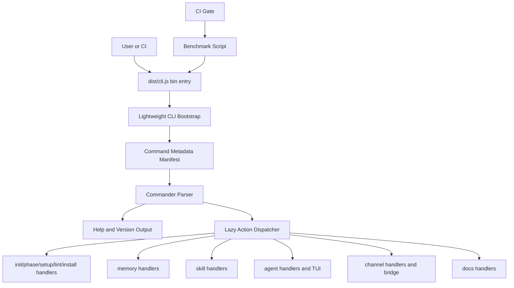

# System Design & Architecture

## Architecture Overview



The optimized CLI should separate cheap command metadata from expensive command execution code.

The approved architecture is a two-step optimization:

1. Implement a lightweight static command metadata layer plus lazy action dispatcher first. This keeps TypeScript source maintainable and removes eager command-handler imports from startup/help paths.
2. Run the benchmark after the lazy metadata/dispatcher refactor. If p50 remains above `50 ms`, add generated or bundled `dist` optimization using only existing repo tooling and without changing package manifests.

Key components:

- **Lightweight CLI bootstrap**: The published entrypoint that loads only Commander, version metadata, command metadata, and dispatch glue.
- **Command metadata manifest**: Static data for command names, descriptions, arguments, and options. This enables help/version output without importing handlers.
- **Lazy action dispatcher**: Imports the actual command module only when the selected action executes.
- **Command handler modules**: Existing command implementations, refactored only as needed to avoid top-level imports that are not needed by the selected subcommand.
- **Benchmark script**: Local and CI entrypoint for startup/help timing and representative command smoke checks.

## Data Models

### Command Metadata

```typescript
interface CliCommandDefinition {
  name: string;
  description: string;
  arguments?: CliArgumentDefinition[];
  options?: CliOptionDefinition[];
  subcommands?: CliCommandDefinition[];
  action?: LazyActionDefinition;
}

interface LazyActionDefinition {
  module: string;
  exportName: string;
}
```

The exact shape can be simpler if hand-written registration helpers are clearer. The design requirement is that help-visible command metadata is available without importing heavy handler modules.

### Benchmark Result

```typescript
interface BenchmarkCaseResult {
  label: string;
  command: string[];
  iterations: number;
  minMs: number;
  p50Ms: number;
  p95Ms: number;
  maxMs: number;
  avgMs: number;
  failures: number;
}
```

## API Design

No public CLI API changes are allowed. Internal APIs may be introduced:

- `registerCommandMetadata(program, definitions)` to build Commander commands from metadata.
- `lazyAction(modulePath, exportName)` to wrap `.action(...)` with dynamic import and error handling.
- `runCliBenchmark(cases, options)` to execute benchmark cases with repeated child processes.

Existing command modules should continue exposing testable handler functions where practical.

## Component Breakdown

### CLI Bootstrap

- Owns `program.name`, package version loading, root command metadata, and `program.parse`.
- Must not import heavy command modules at top level.
- Must not import `ink`, `react`, `inquirer`, `telegraf`, `@ai-devkit/agent-manager`, `@ai-devkit/memory`, or channel bridge code unless the chosen command requires them.

### Command Registration

- Keeps help text equivalent to current help output.
- Registers command actions through lazy dispatch wrappers.
- May be hand-written first to reduce risk; generated metadata is allowed if it improves maintainability.

### Command Handlers

- Existing command behavior remains source of truth.
- Heavy subcommand-specific dependencies should move into the action path when feasible. Example: `agent console` should be the path that loads Ink/React, not `agent --help`.
- Shared utility imports are acceptable only when they are lightweight enough for the target.

### Build Output

- The build may produce generated or bundled `dist` artifacts.
- Source maps or clear generated-file provenance must exist if output becomes hard to inspect.
- `packages/cli/package.json` `bin` behavior must remain install-compatible.

### Benchmarking

- Benchmark direct built CLI execution after `npm run build`.
- Use at least 20 iterations per startup/help command.
- Record p50 and p95; p50 is the enforcement metric for `<50 ms`.
- Use temporary directories/config for memory benchmark cases.

## Design Decisions

### 1. Optimize Current Node CLI First

Rust is intentionally out of scope. Measurements show most overhead comes from eager imports and CLI bootstrap shape, not local CPU-heavy work. The fastest low-risk path is to remove unnecessary Node module loading.

### 2. Preserve CLI Semantics

Performance work must be behavior-preserving. Any command output, option parsing, or exit-code change is a regression unless explicitly approved later.

### 3. Allow Bootstrap/Build Restructuring

The `<50 ms` target is aggressive. Dynamic imports alone may not be enough with native ESM file fanout, so the design allows a lightweight bootstrap, generated metadata, or bundled artifacts without adding dependencies.

Chosen path: do not start with bundling. Start with static metadata plus lazy dispatch because it is easier to review and preserves source/debug clarity. Treat bundling or generated `dist` output as a measured second step only if the first step does not meet the target.

### 4. No New Dependencies

The implementation must use existing repo tooling or plain Node scripts. If bundling is required, use tooling already available through the current lockfile without changing manifests, or implement a non-bundled fallback.

## Alternatives Considered

- **Action-only dynamic imports**: Simple and likely helpful, but may not hit `<50 ms` if command metadata still imports large modules.
- **Static command metadata plus lazy handlers**: Chosen first step. Better startup characteristics while keeping source maintainable; requires keeping metadata and handler behavior aligned.
- **Bundled bootstrap or CLI**: Conditional second step. Can reduce ESM file-load overhead; requires careful handling of dynamic imports, source maps, shebang, templates, and daemon entrypoints.
- **Rust rewrite**: Best native startup potential, but too much scope for this feature and does not directly address command compatibility risk.

## Non-Functional Requirements

- Startup/help benchmark p50 `<50 ms` for required commands.
- Lightweight command RSS should drop materially from current `~100 MB+` import paths; exact memory threshold is secondary to startup target.
- CI benchmark must avoid single-run flakiness through repeated sampling.
- The implementation must remain portable on supported Node versions and existing npm workspace tooling.
- No additional secrets, credentials, or network services are needed for tests.
