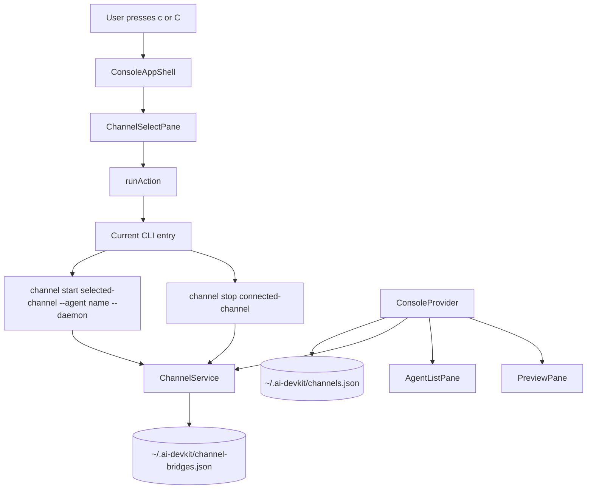

# Agent Console Channel Controls Design

## Architecture Overview



The console reads live channel bridge metadata with the existing `ChannelService` and reads configured channels through `ConfigStore`, which points at `~/.ai-devkit/channels.json`. It does not parse registry or config files directly. Start and stop remain subprocess actions routed through `runAction`, matching the existing console pattern for agent start/open/send/rename/kill behavior.

## Data Models

```typescript
interface ChannelBridgeProcess {
  channelName: string;
  channelType: string;
  agentName: string;
  agentPid: number;
  bridgePid: number;
  startedAt: string;
  logPath?: string;
}

interface AgentChannelStatus {
  channelName: string;
  channelType: string;
  bridgePid: number;
}

type AgentChannelStatusMap = Record<string, AgentChannelStatus>;

interface ConfiguredChannel {
  name: string;
  type: string;
  enabled: boolean;
  botUsername?: string;
}

type ConsoleAction =
  | ExistingConsoleAction
  | { type: 'channel-start'; agentName: string; channelName: string }
  | { type: 'channel-stop'; channelName: string };
```

The status map is keyed by `agentName` because existing bridge metadata records the agent name and the console selection/actions are name-driven.

## API Design

### Console Context

Expose channel state alongside agent state:

```typescript
interface ConsoleContextValue {
  channelStatuses: AgentChannelStatusMap;
  refreshChannels(): Promise<void>;
  configuredChannels: ConfiguredChannel[];
  refreshConfiguredChannels(): Promise<void>;
}
```

`useChannelState` creates a `ChannelService`, calls `getLiveBridges()`, converts results into the status map, and refreshes status after successful channel actions. It also creates a `ConfigStore`, calls `getConfig()`, and exposes non-secret configured channel metadata for the selector. `ConsoleProvider` combines this channel state with the existing agent list context.

### Action Runner

Add channel actions to the existing argv builder:

```typescript
case 'channel-start':
  return ['channel', 'start', action.channelName, '--agent', action.agentName, '--daemon'];
case 'channel-stop':
  return ['channel', 'stop', action.channelName];
```

Values are passed as argv entries to `spawn`; no shell interpolation is introduced.

### UI Components

- `ConsoleAppShell`: handles `c` and `C` when no text input owns keyboard focus.
- `useChannelActions`: owns channel selector/start/stop action orchestration and transient messages.
- `useChannelState`: owns configured channel and live bridge state loading.
- `ChannelSelectPane`: right-pane selector for channels configured in `~/.ai-devkit/channels.json`.
- `AgentListPane`: receives `channelStatuses` and shows a compact `remote` marker beside connected agents.
- `PreviewPane`: receives selected agent channel status and switches border color to green when connected.
- `PreviewPane`: renders status text such as `Connected: <channel-name>`.
- `StatusFooter`/`HelpPane`: document `c channel` and `C stop channel`.

## Component Breakdown

| Component | Change |
|---|---|
| `packages/cli/src/tui/console/actions/types.ts` | Add channel start/stop action types |
| `packages/cli/src/tui/console/actions/runAction.ts` | Map channel actions to existing CLI commands |
| `packages/cli/src/tui/console/state/ConsoleContext.tsx` | Expose agent list plus channel state |
| `packages/cli/src/tui/console/hooks/useChannelState.ts` | Load configured channels and live bridge status |
| `packages/cli/src/tui/console/hooks/useChannelActions.ts` | Open selector and run channel start/stop actions |
| `packages/cli/src/tui/console/ConsoleApp.tsx` | Route `c`/`C` shortcuts and render channel selector workspace |
| `packages/cli/src/tui/console/ChannelSelectPane.tsx` | New native Ink right-pane workspace for choosing configured channel |
| `packages/cli/src/tui/console/AgentListPane.tsx` | Render `remote` marker for connected agents |
| `packages/cli/src/tui/console/PreviewPane.tsx` | Green border and connected status text |
| `packages/cli/src/tui/console/StatusFooter.tsx` | Add shortcut hints |
| `packages/cli/src/tui/console/HelpPane.tsx` | Add channel shortcut documentation |
| `packages/cli/src/__tests__/tui/console/**` | Cover action argv and render states |

## Design Decisions

### Use Daemon Commands

The console starts channels with `--daemon` because foreground bridges are long-running. This keeps the TUI responsive and delegates process management to the existing channel daemon service.

### Use Existing ChannelService for Status

The TUI should not parse `~/.ai-devkit/channel-bridges.json` directly. `ChannelService.getLiveBridges()` already owns stale process handling and registry conventions.

### Select From Configured Channels

The console supports multiple configured channels by reading `~/.ai-devkit/channels.json` through `ConfigStore`. `c` opens a selector instead of hardcoding `telegram`.

### Agent Name Keying

The console already sends actions by agent name, and bridge metadata stores `agentName`. Keying the status map by name avoids coupling UI state to PID matching rules.

## Non-Functional Requirements

- Channel state refresh must not block rendering or agent list polling.
- Start/stop commands must pipe stdio like existing console actions.
- Visual indicators must remain compact in narrow terminals.
- The preview green border should use the existing design-system color vocabulary where available.
- Channel metadata surfaced in the UI must not include secrets.
