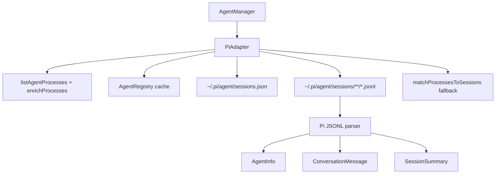

# Design: Pi Adapter in @ai-devkit/agent-manager

## Architecture Overview



`PiAdapter` follows the existing adapter shape:
- Discover candidate Pi processes.
- Return registry-cached session matches when valid.
- Prefer tracker-based PID matching for remaining processes.
- Discover session files and apply shared legacy matching for anything not matched by tracker data.
- Map parsed sessions into `AgentInfo`.
- Fall back to process-only agents when session parsing is unavailable.

## Data Models

### Agent Type

`AgentType` adds:

```ts
'pi'
```

### Tracker Metadata

The tracker schema is a plain PID-to-session-path map:

```json
{
  "12345": "/Users/me/.pi/agent/sessions/project/session.jsonl"
}
```

The adapter only trusts entries whose PID matches a live process and whose path exists under the Pi sessions directory.

### Pi Session

Pi JSONL is parsed permissively. Entries may expose timestamps, roles, content, cwd/project path, session id, and event type under common top-level or nested fields. The adapter derives:
- `sessionId`: explicit id when available, otherwise filename UUID/timestamp fallback.
- `projectPath`: explicit cwd/project path when available, otherwise process cwd for running agents. For fallback matching, encoded Pi project directory names are compared against live process CWDs instead of decoded, because path segments may contain hyphens.
- `summary`: latest user message.
- `sessionStart`: earliest timestamp or file birthtime/mtime.
- `lastActive`: latest timestamp or file mtime.

## API Design

- Public adapter contract remains `AgentAdapter`.
- CLI and channel agent-manager wiring register `new PiAdapter()` with the existing adapters.
- Package exports expose `PiAdapter`.
- No external network APIs or authentication are introduced.

## Component Breakdown

### `PiAdapter`
- `canHandle(processInfo)`: identifies Pi executable/script tokens.
- `detectAgents()`: combines registry cache, tracker matching, fallback matching, and process-only fallback.
- `getConversation(sessionFilePath)`: reads JSONL and normalizes message entries.
- `listSessions(opts)`: enumerates historical Pi session files and applies optional strict `cwd`.

### Tracker Matching
- Reads `~/.pi/agent/sessions.json` with `safeReadFile`.
- Extracts numeric object keys whose values are string session paths.
- Validates the session path exists and is inside `~/.pi/agent/sessions`.
- Parses the matched session directly.

### Fallback Matching
- Recursively discovers `*.jsonl` session files under `~/.pi/agent/sessions`.
- Uses shared `matchProcessesToSessions()` with session birth/mtime and resolved CWD when available.

## Design Decisions

- Use exact tracker matching first because PID metadata is more reliable than file timestamp heuristics.
- Keep legacy fallback because tracker installation is optional.
- Parse Pi JSONL permissively because the adapter should tolerate minor schema drift.
- Do not add a shared tracker abstraction yet; Pi is the first adapter with this specific extension file.
- Validate tracker paths under the Pi sessions directory to avoid arbitrary file reads from compromised metadata.

## Non-Functional Requirements

- Detection must avoid throwing on malformed JSON, missing directories, or unreadable files.
- Recursive session discovery should be bounded to `.jsonl` files under the Pi sessions root.
- Tracker path validation must prevent escaping the Pi sessions root.
- Existing adapter behavior and exports must remain source-compatible.
