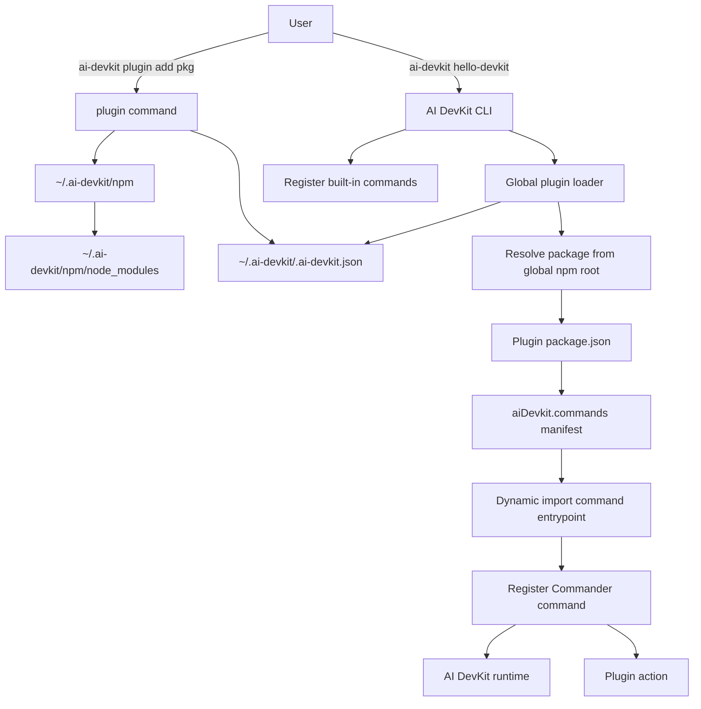

# System Design & Architecture

## Architecture Overview
**What is the high-level system structure?**



AI DevKit remains the host CLI. Plugins are global npm packages installed into an AI DevKit-managed npm project at `~/.ai-devkit/npm`. The global AI DevKit config lists enabled plugins. At startup, the CLI registers built-ins, discovers globally configured plugins, validates each manifest, and lets each plugin register contributed commands with Commander.

### Key Components
| Component | Responsibility |
|---|---|
| `plugin` CLI command | Add, remove, and list global npm plugins. |
| Global config manager | Read/write `~/.ai-devkit/.ai-devkit.json` and its `plugins` array. |
| Plugin npm manager | Ensure `~/.ai-devkit/npm`, run npm install/remove, and report package status. |
| Plugin manifest loader | Resolve package manifests from `~/.ai-devkit/npm/node_modules` and validate `aiDevkit.commands`. |
| Plugin command loader | Import plugin entrypoints and register contributed Commander commands. |
| AI DevKit runtime | Stable host context passed to plugin registration. |

## Data Models
**What data do we need to manage?**

### Global Config
```typescript
interface GlobalAiDevkitConfig {
  version?: string;
  plugins?: string[];
  memory?: {
    path?: string;
  };
  [key: string]: unknown;
}
```

### Plugin Manifest
The MVP keeps the manifest in `package.json` so plugin authors do not need an extra file. Command entries must point to JavaScript files importable by Node at runtime. Plugin authors may build those files from TypeScript, but the host does not execute `.ts` entrypoints in the MVP.

```json
{
  "name": "@example/hello-ai-devkit",
  "type": "module",
  "aiDevkit": {
    "commands": [
      {
        "name": "hello-devkit",
        "description": "Print a plugin test message",
        "entry": "./dist/command.js"
      }
    ]
  }
}
```

```typescript
interface AiDevkitPluginManifest {
  commands: AiDevkitPluginCommand[];
}

interface AiDevkitPluginCommand {
  name: string;
  description?: string;
  entry: string;
}
```

### Runtime Contract
```typescript
interface AiDevkitRuntime {
  cwd: string;
  homeDir: string;
  configPath: string;
  getConfig(): Promise<GlobalAiDevkitConfig>;
  getMemoryDbPath(): Promise<string>;
  logger: {
    info(message: string): void;
    warn(message: string): void;
    error(message: string): void;
  };
}
```

## API Design
**How do components communicate?**

### CLI Surface
```bash
ai-devkit plugin add <npm-package>
ai-devkit plugin remove <npm-package>
ai-devkit plugin list
ai-devkit <plugin-command> [...args]
```

### Plugin Entrypoint
Each command entrypoint exports `register`.

```typescript
import type { Command } from 'commander';

export async function register(command: Command, runtime: AiDevkitRuntime): Promise<void> | void {
  command
    .description('Print a plugin test message')
    .option('--name <name>', 'Name to greet')
    .action(async options => {
      runtime.logger.info(`Hello ${options.name ?? 'AI DevKit'}`);
    });
}
```

AI DevKit creates the top-level command from the manifest, then passes that `Command` instance to the plugin entrypoint. This keeps command naming and conflict handling in the host while letting plugins define options and actions.

## Component Breakdown
**What are the major building blocks?**

### `packages/cli/src/commands/plugin.ts`
- Registers `plugin add`, `plugin remove`, and `plugin list`.
- Delegates package work to a service layer.
- Renders install/remove/list results through existing terminal UI helpers.

### `packages/cli/src/services/plugin/plugin-package.service.ts`
- Ensures `~/.ai-devkit/npm/package.json`.
- Runs npm commands with argument arrays, not shell interpolation.
- Supports install and uninstall for npm package names only.

### `packages/cli/src/lib/GlobalConfig.ts`
- Reads/writes `~/.ai-devkit/.ai-devkit.json`.
- Adds/removes plugin names with deduplication.
- Preserves unrelated global config fields.
- Reuses the existing global config manager instead of creating a plugin-only config service.

### `packages/cli/src/services/plugin/plugin-loader.service.ts`
- Resolves plugin package manifests by reading `~/.ai-devkit/npm/node_modules/<package>/package.json` directly.
- Validates manifest shape and command names.
- Detects command conflicts before registration.
- Imports entrypoints with `pathToFileURL()`.

### `packages/cli/src/services/plugin/runtime.ts`
- Builds the `AiDevkitRuntime` passed to plugins.
- Centralizes config and memory path access.
- Keeps future host APIs behind a stable surface.

## Design Decisions
**Why did we choose this approach?**

| Decision | Choice | Rationale |
|---|---|---|
| Plugin source | npm only | Keeps install model familiar and avoids designing multiple source protocols. |
| Scope | Global only | Simplifies MVP and matches the user request. |
| Install root | `~/.ai-devkit/npm` | Stable across `npx`, global, and local AI DevKit invocations. |
| Config | `~/.ai-devkit/.ai-devkit.json` `plugins` | Keeps enabled plugin state in AI DevKit's global config. |
| Manifest location | `package.json` `aiDevkit.commands` | Easy for npm packages and avoids a second file lookup. |
| Manifest read path | Direct file read under `~/.ai-devkit/npm/node_modules` | Avoids Node package `exports` blocking access to `package.json`. |
| Command API | `register(command, runtime)` | Lets plugins use Commander options/help while host owns top-level names. |
| Runtime API | Small host-provided object | Prevents plugins from importing unstable AI DevKit internals. |
| Entrypoint file type | JavaScript only | Avoids runtime TypeScript loaders, keeps plugin execution predictable, and lets authors use normal build output. |

### Alternatives Considered
- **Install beside AI DevKit binary**: rejected because `npx`, global installs, local installs, and permissions make the binary location unstable.
- **Project-local plugins first**: deferred because it adds config precedence and project trust questions.
- **Run plugins through `npx` every time**: rejected for MVP because it makes every plugin command slower and network-dependent.
- **Hard-code optional tools into core CLI**: rejected because optional dependencies and release cadence should stay separate from core.
- **Execute TypeScript entrypoints directly**: deferred because it requires a runtime loader such as `tsx` or `ts-node` and complicates production execution.

## Non-Functional Requirements
**How should the system perform?**

### Performance
- Plugin discovery only scans configured plugins.
- Missing or invalid plugins should not prevent built-in commands from running.
- Plugin entrypoints are imported during command registration in MVP; if startup becomes too slow, later work can defer entrypoint import until command action execution.

### Security
- Installing a plugin is trusted npm package execution.
- Package names must be passed to npm as arguments, never interpolated into shell commands.
- Manifest `entry` must resolve inside the plugin package root.
- Manifest `entry` must resolve to a JavaScript file.
- Built-in command names cannot be overridden by plugins.

### Reliability
- `plugin add` validates the manifest after install and rolls back config updates if validation fails.
- `plugin add` also uninstalls the package when manifest validation fails after npm install succeeds, so invalid plugins are not left enabled or installed by default.
- `plugin remove` should remove config entries even if the package is already absent, with a warning.
- Loader errors should be clear and isolated to the affected plugin where possible.
