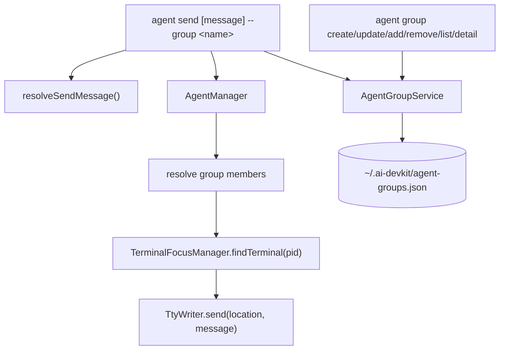

# Agent Groups - Design

## Architecture Overview



Agent group management is a local CLI feature. The group service owns validation, persistence, and duplicate handling. `agent send --group` reads the stored member identifiers, resolves them against live agents, and reuses the existing terminal delivery path for each target.

## Data Models

```typescript
export interface AgentGroup {
  name: string;
  members: string[];
  createdAt: string;
  updatedAt: string;
}

export interface AgentGroupFile {
  version: 1;
  groups: AgentGroup[];
}
```

Storage path:

- Default: `path.join(os.homedir(), '.ai-devkit', 'agent-groups.json')`
- The file is user-scoped and local-machine scoped.
- Missing file means no configured groups.
- Writes use the existing temp-file-and-rename pattern from `AgentRegistry` so partial writes do not leave a truncated group file.

Validation:

- Group names use the existing `NAME_REGEX` convention.
- Members are non-empty strings after trimming.
- Members are unique within a group.
- Groups are unique by name.
- Unknown file versions and malformed JSON produce explicit user-facing errors instead of being silently treated as empty state.

## API Design

### CLI Interface

Management:

```text
ai-devkit agent group create <name> --agent <identifier> [--agent <identifier>...]
ai-devkit agent group update <name> --agent <identifier> [--agent <identifier>...]
ai-devkit agent group add <name> <identifier>
ai-devkit agent group remove-agent <name> <identifier>
ai-devkit agent group remove <name>
ai-devkit agent group list
ai-devkit agent group detail <name>
```

Delivery:

```text
ai-devkit agent send [message] --group <name> [--stdin]
```

Rules:

- `agent send` accepts exactly one target selector: `--id` or `--group`.
- The current `requiredOption('--id ...')` must become optional, with action-level validation enforcing exactly one target selector. This preserves the existing `--id` UX while allowing `--group`.
- `--timeout` and `--wait` are valid only with `--id`.
- `--json` remains wait-result JSON for single-target sends only; group send rejects it before delivery in this feature.
- Positional message, explicit `--stdin`, and implicit piped stdin keep the existing `resolveSendMessage()` behavior.

### Internal Interfaces

Location: `packages/cli/src/services/agent/agent-group.service.ts`

```typescript
export class AgentGroupService {
  constructor(filePath?: string);
  list(): AgentGroup[];
  get(name: string): AgentGroup | undefined;
  create(name: string, members: string[]): AgentGroup;
  update(name: string, members: string[]): AgentGroup;
  addMember(name: string, member: string): AgentGroup;
  removeMember(name: string, member: string): AgentGroup;
  remove(name: string): void;
}

export function createDefaultAgentGroupService(): AgentGroupService;
```

The service should use synchronous file operations like `AgentRegistry` does because commands are short-lived CLI actions. The constructor accepts a file path so tests can use a temporary file without mutating real user config. CLI code uses `createDefaultAgentGroupService()` so command handlers depend on group behavior rather than storage construction.

Send orchestration lives in `packages/cli/src/services/agent/agent.service.ts`:

```typescript
export function assertSendTargetOptions(options: SendTargetOptions): void;
export async function sendToAgent(options: SendToAgentOptions): Promise<void>;
export async function waitForAgentResponse(params: WaitForAgentResponseParams): Promise<AgentSendWaitResult>;
export async function sendToAgentGroup(options: SendToAgentGroupOptions): Promise<void>;
```

`commands/agent.ts` stays responsible for root agent command wiring, prompt-source resolution, group lookup for send, and user-facing output adapters. `commands/agent/group.command.ts` owns `agent group` management command registration. Terminal delivery, wait-mode preparation, response polling, group member resolution, deduplication, and delivery summaries are service-layer responsibilities.

Typed errors:

- `AgentGroupNotFoundError`
- `AgentGroupConflictError`
- `AgentGroupInvalidNameError`
- `AgentGroupInvalidMemberError`
- `AgentGroupEmptyMembersError`
- `AgentGroupStorageError`

## Component Breakdown

### AgentGroupService

- Reads and writes the JSON group file.
- Creates the parent `~/.ai-devkit` directory when needed.
- Normalizes and validates group names and members.
- Throws typed errors for not found, conflict, invalid name, invalid member, and empty members.
- Writes formatted JSON for user inspectability.

### CLI `agent group`

- Registers a nested command under `agent`.
- Maps command arguments and options to `AgentGroupService`.
- Prints concise success output for mutations.
- Prints table output for list/detail.
- Handles group service typed errors in the command layer and exits non-zero for invalid operations.
- Does not resolve members against live agents during create/update/add; groups may be prepared before agents are running.

### CLI `agent send --group`

- Parses `--group <name>` alongside existing `--id`.
- Calls `assertSendTargetOptions()` to validate mutually exclusive target and unsupported option combinations before reading live agents or sending.
- Resolves the group name through `AgentGroupService`.
- Delegates group fan-out to `sendToAgentGroup()`.
- Keeps single-target delivery delegated to `sendToAgent()`, which also owns wait-mode response handling through `waitForAgentResponse()`.

Resolution phases:

1. Load the group and validate it has members.
2. List live agents once.
3. Resolve every stored member identifier against that same live-agent snapshot.
4. If any member is missing or ambiguous, print all resolution errors and return before terminal delivery.
5. Deduplicate resolved live agents.
6. Send to each target sequentially, continuing after terminal discovery or send failures.

## Design Decisions

| Decision | Choice | Rationale |
|---|---|---|
| Storage location | `~/.ai-devkit/agent-groups.json` | Matches user-local agent metadata expectations and avoids project-specific files for runtime sessions. |
| Storage owner | CLI agent service layer | Groups are local CLI configuration. `agent-manager` remains focused on live agent discovery, registries, and terminal interaction. |
| Membership value | User-entered agent identifier string | Keeps groups stable across process restarts and lets existing agent resolution handle names, slugs, and partials. |
| Command namespace | `agent group ...` | Keeps lifecycle under the existing `agent` command without crowding top-level CLI commands. |
| Send selector | Add `--group`; make it mutually exclusive with `--id` | Keeps single-target behavior intact and avoids accidental double delivery. |
| Delivery order | Sequential in configured member order | Deterministic output and easier partial-failure reporting. |
| Missing member | Report and continue resolving, but do not deliver if any missing or ambiguous members exist | Avoids partial sends when the requested group target set is not well-defined. |
| Member validation timing | Validate syntax at write time; resolve liveness at send time | Allows users to create groups before agents are running while still preventing malformed config. |
| Runtime delivery failure | Continue to remaining resolved targets and exit non-zero | A terminal failure for one agent should not block delivery to other valid agents. |
| Group wait mode | Reject `--wait --group` | Aggregated wait semantics need separate design. |
| JSON output | Reject `--json --group` in this feature | Current JSON means wait result; group result schema should be designed when needed. |

Alternatives considered:

- **Shell loop documentation only:** rejected because it leaves persistence, validation, and failure behavior to every user.
- **Dynamic groups by query:** rejected for first version because explicit group membership is simpler and safer for message fan-out.
- **Store process IDs:** rejected because PIDs are unstable and stale quickly.

## Non-Functional Requirements

- **Reliability:** Group file corruption should produce a clear error that names the file path.
- **Security:** The feature must not introduce shell interpolation; terminal delivery continues through existing `TtyWriter` safeguards.
- **Performance:** Group operations are local file reads/writes. Send fan-out should be acceptable for small human-managed groups.
- **Compatibility:** Existing command behavior and tests for `agent send --id` remain unchanged.
- **Observability:** Group send output names each target agent and summarizes success/failure counts.

## Requirements Coverage

| Requirement area | Design coverage |
|---|---|
| Create/update/remove/list/detail groups | `agent group` CLI plus `AgentGroupService` CRUD methods. |
| Local user-scoped storage | `~/.ai-devkit/agent-groups.json` with explicit file schema and atomic writes. |
| Multiple agent identifiers per group | `members: string[]`, duplicate validation, and write-time member validation. |
| `agent send --group` fan-out | Group send resolution phases and sequential terminal delivery. |
| Existing `agent send --id` compatibility | Optional target selector with action-level exactly-one validation. |
| Stdin behavior | Reuses `resolveSendMessage()` before fan-out so stdin is read once. |
| Missing or ambiguous members | Pre-delivery resolution failure with all missing/ambiguous members reported. |
| Runtime per-agent failures | Continue delivery, report per target, set non-zero exit code. |
| Unsupported `--wait` and `--json` combinations | Explicit pre-delivery rejection for group sends. |
| Security constraints | No shell interpolation; reuse `TtyWriter` and existing execFile-based paths. |

## Open Questions

None blocking for implementation. Group wait mode, group JSON output, nested groups, and dynamic groups remain deferred future enhancements.
