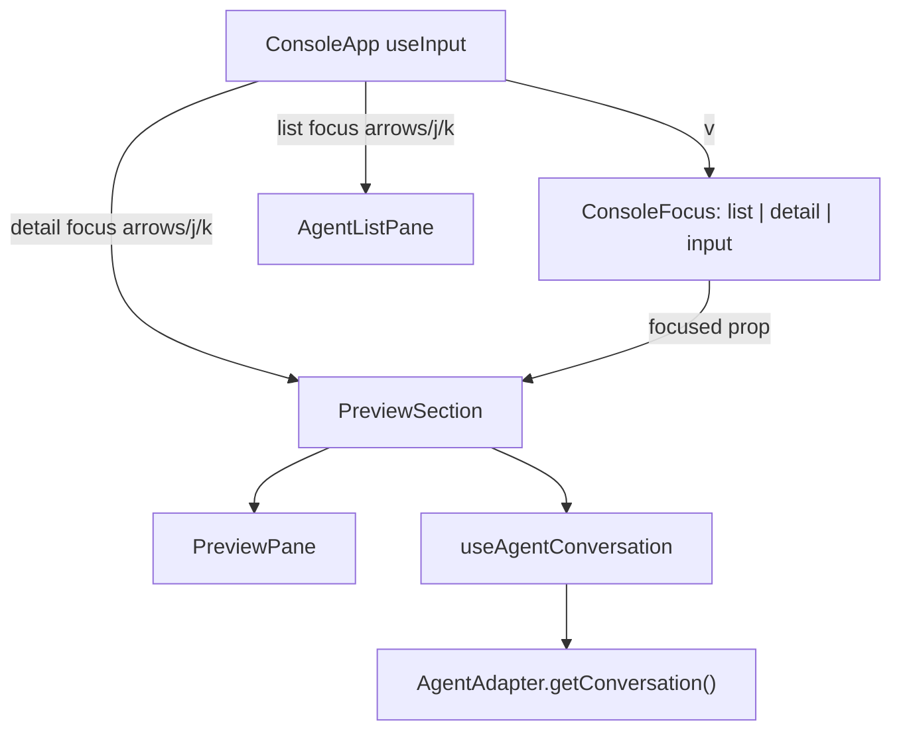

# System Design & Architecture

## Architecture Overview

The feature extends the existing Ink console focus model. The agent list continues to own selection; the right-side preview/detail pane becomes a focus target that can consume scroll keys without changing list selection.



Responsibilities:

- `ConsoleApp`: owns focus state, global key routing, selected agent, and detail scroll offset.
- `PreviewSection`: receives focus and scroll offset props, keeps fetching selected-agent messages, computes/clamps the valid viewport range, and passes render constraints to `PreviewPane`.
- `PreviewPane`: renders metadata, chat rows, empty/error states, and scroll affordances from a supplied clamped viewport.
- `useAgentConversation`: remains responsible only for polling/caching conversation messages.

## Data Models

Extend console focus:

```typescript
export type ConsoleFocus = 'list' | 'detail' | 'input';
```

Add scroll state in `ConsoleApp`:

```typescript
const [detailScrollOffset, setDetailScrollOffset] = useState(0);
```

The offset represents logical rendered lines above the current detail viewport. A value of `0` means the viewport is pinned to the newest/latest rendered content at the bottom. Positive values move the viewport upward into older chat content.

`PreviewPane` should expose pure helpers for testable rendering math:

```typescript
interface DetailViewport {
  lines: string[];
  clampedOffset: number;
  maxOffset: number;
  hasAbove: boolean;
  hasBelow: boolean;
}
```

`clampedOffset` is returned so `PreviewSection` can notify `ConsoleApp` when the current offset is no longer valid after a message update or terminal resize.

## API Design

No external API changes.

Internal prop changes:

```typescript
interface PreviewSectionProps {
  selectedName: string | null;
  height: number;
  focused?: boolean;
  scrollOffset?: number;
  onScrollOffsetClamp?: (offset: number) => void;
}

interface PreviewPaneProps {
  agent: AgentInfo | null;
  messages: ConversationMessage[];
  error: ConversationFetchError | null;
  isLoading: boolean;
  maxLines?: number;
  channelStatus?: AgentChannelStatus;
  scrollOffset?: number;
  onScrollOffsetClamp?: (offset: number) => void;
}
```

`ConsoleApp` key behavior:

- `v` from list focus: set focus to `detail` if an agent is selected and wide preview is visible.
- `Esc` or left arrow from detail focus: set focus to `list`.
- Up/down arrows and `j/k` from detail focus: adjust `detailScrollOffset` within `[0, maxOffset]`.
- Because `ConsoleApp` does not own rendered-line calculation, scroll key handling may increment/decrement the requested offset and rely on `PreviewSection`/`PreviewPane` to clamp and report the valid value.
- Up/down arrows and `j/k` from list focus: keep existing selected-agent navigation.
- `i`/`m` from detail focus: may enter input focus when an agent is selected, same as list focus.

## Component Breakdown

Console components:

- `packages/cli/src/tui/console/types.ts`
  - Add `detail` to `ConsoleFocus`.
- `packages/cli/src/tui/console/ConsoleApp.tsx`
  - Route `v`, scroll, escape, and left-arrow behavior.
  - Reset detail scroll offset when selected agent changes.
  - Pass `focused={focus === 'detail'}` into `PreviewSection`.
- `packages/cli/src/tui/console/PreviewSection.tsx`
  - Apply focused panel styling to the preview panel.
  - Pass scroll offset and message budget into `PreviewPane`.
  - Clamp scroll offset when messages or height change and report the clamped offset upward.
- `packages/cli/src/tui/console/PreviewPane.tsx`
  - Render a viewport over chat content instead of truncating only from the newest message.
  - Show simple `↑`/`↓` affordances in the header when more content exists.
  - Preserve current metadata, channel status, loading, empty, and error output.
- Tests under `packages/cli/src/__tests__/tui/console`
  - Add helper tests for viewport calculations and update focus/layout tests where needed.

## Design Decisions

| Decision | Choice | Rationale |
| --- | --- | --- |
| Focus model | Add `detail` to `ConsoleFocus` | Matches existing focus routing and panel styling without a new modal mode. |
| Shortcut | `v` enters detail focus | Matches the requested workflow and avoids existing console shortcuts. |
| Scroll ownership | `ConsoleApp` owns requested offset; preview clamps it | Key handling and selected-agent reset stay centralized while rendered-line math stays near preview rendering. |
| Rendering math | Pure helper in preview module | Keeps Ink rendering simple and gives unit tests deterministic coverage. |
| Narrow mode | Keep `v` inactive while preview is hidden | Avoids focusing invisible UI; future full-screen transcript can be designed separately. |

Alternatives considered:

- Reuse `agent detail` command output inside the console: rejected because it would duplicate formatting and bypass existing preview polling.
- Add a replacement-pane mode for detail: deferred because the requested workflow specifically highlights the detail pane and current wide layout already has one.
- Fetch full session history by default: deferred to avoid changing polling cost; basic scrolling can operate on the current conversation tail first, then increase tail if needed during implementation review.

## Non-Functional Requirements

Performance:

- Scroll keypresses must not read session files or call `getConversation()`.
- Viewport calculation should be linear in the currently loaded message count.
- Existing polling interval and cache behavior should remain unchanged unless implementation proves the 20-message tail is too limiting for the feature.

Reliability:

- Missing session files, unsupported adapters, parse errors, empty message sets, and loading states must render with existing behavior while focused.
- Scroll offset must be clamped when terminal height changes or message count changes.

Security:

- No new file paths, shell commands, network calls, or permissions are introduced.
- Conversation content is already local session content exposed by the console; this feature changes navigation only.
