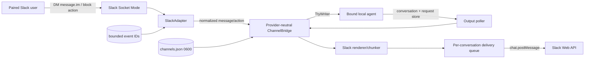

# Slack Channel Connector Design

## Architecture Overview



`channel-connector` remains unaware of agents. It owns provider adapters, normalized transport types, rendering, SDK integration, and local channel configuration. The CLI owns agent discovery, terminal writes, conversation/request polling, authorization policy coordination, and bridge lifecycle.

## Technology Choices

- `@slack/socket-mode`: official Socket Mode lifecycle and envelope acknowledgment.
- `@slack/web-api`: official credential validation and `chat.postMessage` calls, including platform errors/rate-limit metadata.
- Existing `marked` lexer: semantic Markdown tokenization shared conceptually with Telegram, with a dedicated Slack renderer.
- Vitest SDK mocks/fixtures: no network or credentials in automated tests.

## Data Models

```ts
interface BaseChannelEntry {
  enabled: boolean;
  createdAt: string;
}

type ChannelEntry =
  | BaseChannelEntry & { type: 'telegram'; config: TelegramConfig }
  | BaseChannelEntry & { type: 'slack'; config: SlackConfig };

interface SlackConfig {
  appToken: string;
  botToken: string;
  appId: string;
  botUserId: string;
  workspaceId: string;
  workspaceName?: string;
  authorizedUserId?: string;
  authorizedConversationId?: string;
  transport: 'socket-mode';
  audience: 'dm';
}
```

Normalized events gain optional stable identity/thread fields while remaining source-compatible:

```ts
interface IncomingMessage {
  channelType: string;
  chatId: string;
  userId: string;
  text: string;
  timestamp: Date;
  messageId?: string;
  threadId?: string;
  workspaceId?: string;
  metadata?: Record<string, unknown>;
}

interface IncomingInteraction {
  channelType: string;
  chatId: string;
  userId: string;
  interactionId: string;
  messageId: string;
  actionId: string;
  value: string;
  workspaceId?: string;
  timestamp: Date;
}
```

## Internal API Design

```ts
interface ChannelAdapter {
  readonly type: string;
  start(): Promise<void>;
  stop(): Promise<void>;
  sendMessage(chatId: string, text: string, options?: SendMessageOptions): Promise<SentMessage>;
  onMessage(handler: MessageHandler): void;
  isHealthy(): Promise<boolean>;
}

interface InteractiveChannelAdapter extends ChannelAdapter {
  onInteraction(handler: InteractionHandler): void;
  sendQuestion(chatId: string, question: ChannelQuestion): Promise<SentMessage>;
  finalizeInteraction(chatId: string, messageId: string): Promise<void>;
}
```

The optional send return/options are backward-compatible at runtime; Telegram can ignore threading and return its message ID. The CLI uses a type guard rather than importing provider-specific methods.

## Slack Adapter Responsibilities

- Construct/inject official SDK clients.
- Validate `auth.test` identity during setup through a separate factory/service.
- Start/stop Socket Mode and expose connection health.
- Acknowledge every recognized envelope before awaiting agent work.
- Normalize only plain-text `message.im` events.
- Reject wrong team, bots/self, subtypes, missing IDs, shared-channel contexts, and unauthorized identities.
- Maintain a bounded bridge-lifetime event-ID set and mark IDs before handler dispatch.
- Normalize `block_actions`, acknowledge immediately, and pass authorized action values to the CLI.
- Render and enqueue outbound messages.

## Pairing and Authorization

1. Setup validates tokens and stores verified app/workspace/bot identity, but no Slack user.
2. Starting an unpaired bridge generates a CSPRNG pairing code with a ten-minute TTL and prints it only to the local terminal.
3. The adapter accepts only DM events for the configured workspace. A message matching the active code atomically stores `authorizedUserId` and `authorizedConversationId`; the code is invalidated.
4. All subsequent messages and interactions must match workspace, user, and conversation. Authorization is rechecked immediately before terminal writes to prevent workflow bypass.
5. Pairing messages are consumed by the bridge and never sent to the agent.

## Rendering, Chunking, and Delivery

- Parse CommonMark into semantic tokens before rendering each chunk.
- Translate headings/bold/italic/strike/code/links/lists into conservative Slack `mrkdwn` and escape `&`, `<`, and `>` unless deliberately producing a link.
- Do not enable name parsing; plain `@channel`, `@here`, and `@everyone` remain inert text.
- Split at token, paragraph, line, word, then Unicode code-point boundaries. Re-open fenced code per chunk.
- Keep each top-level `text` payload at or below 4,000 JavaScript characters.
- Send the first chunk normally, record its `ts`, and send remaining chunks with `thread_ts` equal to that parent.
- Use a bounded FIFO queue per conversation. A single worker preserves ordering, waits on rate-limit retry metadata, applies bounded exponential backoff to transient failures, and drops/reports overflow rather than consuming unbounded memory.

## Questions and Prompt Semantics

- Move question parsing/specification and terminal-key mapping out of the Telegram-specific service.
- Provider renderers implement question presentation; Slack uses Block Kit section/actions with stable action IDs and short opaque values.
- Active question state is keyed by an opaque request ID and bound to workspace, conversation, user, agent session, and expiry.
- The adapter acknowledges the Slack action before the CLI writes the digit/Escape key.
- Replays, stale actions, and mismatched identities are acknowledged and ignored.
- Non-question agent requests remain notifications. Generic Slack text is delivered as normal terminal input and is never reclassified as approval by message content.

## CLI and Setup Integration

- `channel connect <type> --name` dispatches to a provider setup strategy.
- Slack setup prompts secretly for app and bot tokens, validates with official SDKs, and persists the verified entry.
- `channel start` resolves a named entry regardless of type; omission retains the legacy exactly-one-Telegram behavior unless exactly one total channel exists.
- The runner uses an adapter factory and provider-neutral authorization/interaction helpers.
- List/status use provider display metadata rather than Telegram casts.
- Daemon arguments include only channel and agent names; tokens remain in `channels.json`.

## Security Boundaries

- Trust boundaries: Slack network → official SDK event → adapter validation → CLI authorization → local TTY; agent output → renderer → external Slack API.
- Tokens are password inputs, stored only in mode-`0600` config, never interpolated into shell commands or logs.
- IDs are exact-match allowlisted and treated as opaque Slack identifiers.
- Pairing codes use `crypto.randomBytes`, expire, are single-use, and use timing-safe comparison.
- External text is data. It is not executed, used as a path/URL, or automatically converted into privileged Slack mentions.
- Queue, text, block actions, event IDs, and question sessions have explicit bounds.
- SDK TLS verification stays enabled.

## Alternatives and Decisions

- Socket Mode is selected over a public Events API because the daemon is local-first and behind NAT/firewalls.
- A user-owned, undistributed app is selected over OAuth because the MVP is single-workspace and Marketplace distribution is incompatible with Socket Mode/remote-terminal policy.
- DM-only is selected over `app_mention` to minimize accidental exposure and scopes.
- Provider capabilities are selected over a single Telegram-shaped interface; providers can support interactions and threading without leaking SDK types into the CLI.
- The existing JSON secret store is retained for compatibility; a keychain abstraction is deferred.

## Non-Functional Requirements

- Incoming envelope acknowledgment begins synchronously and completes within Slack's three-second expectation.
- Normal online round trip remains within one existing two-second agent poll plus Slack API latency.
- Queue defaults are bounded (100 outbound jobs per conversation; 1,000 recent event IDs; ten-minute interaction/pairing TTL).
- Reconnects are delegated to the official Socket Mode client; `isHealthy` reflects connection lifecycle.
- All new code is mockable through injected SDK-shaped clients and clocks/sleep functions.
- No public API removal; Telegram remains fully supported.

## Official Platform References

- Socket Mode: https://docs.slack.dev/apis/events-api/using-socket-mode/
- Events/retries: https://docs.slack.dev/apis/events-api/
- Web API rate limits: https://docs.slack.dev/apis/web-api/rate-limits/
- Message formatting: https://docs.slack.dev/messaging/formatting-message-text/
- `chat.postMessage`: https://docs.slack.dev/reference/methods/chat.postmessage
- Interactivity: https://docs.slack.dev/interactivity/handling-user-interaction/
- App manifests: https://docs.slack.dev/app-manifests/
