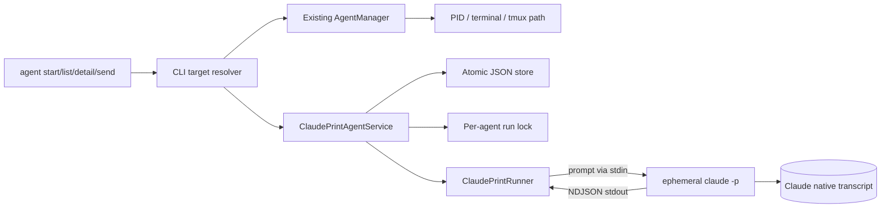
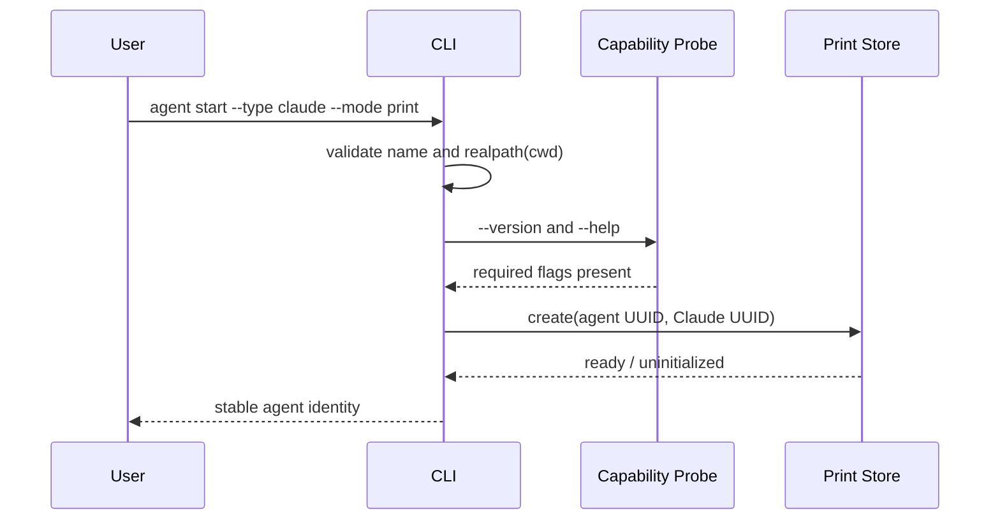
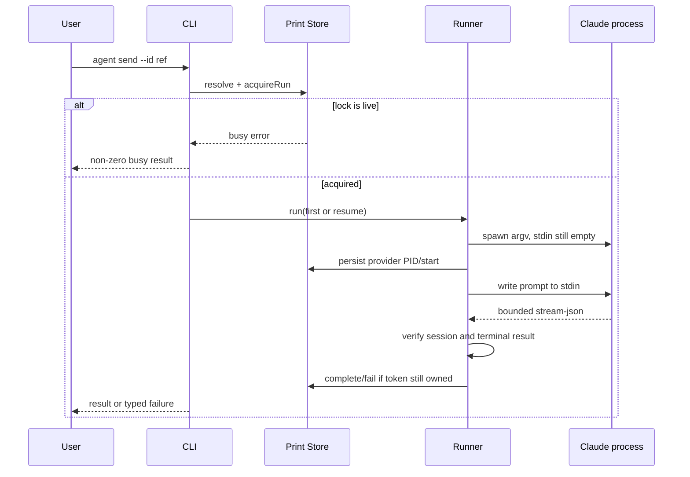

# Claude Print-Mode Agent Design

## Architecture Overview

Print agents are an additive control path beside the existing process adapters. Existing `AgentManager`, terminal discovery, tmux start, interactive send/wait, groups, channels, and TUI continue to operate on live `AgentInfo` objects. A small print-agent service in `agent-manager` owns durable records and Claude print execution; CLI command orchestration combines the two target kinds only for start, list, detail, and direct send.



### Design boundaries

- `AgentInfo` remains the live-process type with a required PID. Print agents do not fabricate one.
- `PrintAgent` is a separate durable type.
- `AgentManager.listAgents()` remains live-only so existing TUI, channels, groups, kill, open, rename, and terminal flows do not accidentally acquire print semantics.
- CLI list/detail/direct-send use a small combined resolver. Other commands remain unchanged.
- Only Claude is implemented. The runner is injectable for tests but no generic multi-provider framework is introduced.

## Data Models

### Store file

Default path: `~/.ai-devkit/print-agents.json`.

```ts
interface PrintAgentStoreFile {
  version: 1;
  agents: PrintAgent[];
}

type PrintAgentState = 'ready' | 'running' | 'degraded';
type PrintSessionHealth = 'uninitialized' | 'healthy' | 'unknown' | 'mismatch';
type PrintRunStatus = 'succeeded' | 'failed' | 'interrupted';

interface PrintAgent {
  id: string;                    // immutable AI DevKit UUID
  name: string;                  // unique among print agents
  provider: 'claude';
  mode: 'print';
  cwd: string;                   // canonical real path
  providerSessionId: string;     // immutable caller-assigned Claude UUID
  state: PrintAgentState;
  sessionHealth: PrintSessionHealth;
  createdAt: string;
  updatedAt: string;
  lastActiveAt: string | null;
  lastResult: PrintLastResult | null;
  activeRun: PrintActiveRun | null;
}

interface PrintLastResult {
  status: PrintRunStatus;
  completedAt: string;
  exitCode: number | null;
  summary: string;               // sanitized and bounded
}

interface ProcessIdentity {
  pid: number;
  startedAt: string;             // OS-observed process start identity
}

interface PrintActiveRun {
  token: string;                 // random ownership token
  owner: ProcessIdentity;
  provider: ProcessIdentity | null;
  startedAt: string;
}
```

No prompts, transcripts, event history, tool inputs, full provider output, queues, or multiple provider sessions are stored.

### Lock files

- Store mutation lock: sibling directory `print-agents.json.lock`.
- Per-agent execution lock: `~/.ai-devkit/print-agent-locks/<agent-id>.lock/owner.json`.
- Directory creation with `mkdir` is the cross-process atomic primitive.
- Lock owner metadata uses the same token and process identities as `activeRun`.

The per-agent lock is authoritative for exclusion. Persisted `activeRun` makes state inspectable and supports recovery. The store mutation lock serializes create and record updates but is held only for short file operations, never for a Claude run.

## API Design

### Store

```ts
interface PrintAgentStoreOptions {
  filePath?: string;
  lockTimeoutMs?: number;
  now?: () => Date;
  processInspector?: ProcessInspector;
}

class PrintAgentStore {
  create(input: CreatePrintAgentInput): Promise<PrintAgent>;
  list(): Promise<PrintAgent[]>;
  getById(id: string): Promise<PrintAgent | null>;
  resolve(ref: string): Promise<PrintAgent | PrintAgent[] | null>;
  acquireRun(id: string): Promise<{ agent: PrintAgent; token: string }>;
  recordProviderProcess(id: string, token: string, identity: ProcessIdentity): Promise<void>;
  completeRun(id: string, token: string, result: PrintRunCompletion): Promise<PrintAgent>;
  failRun(id: string, token: string, result: PrintRunFailure): Promise<PrintAgent>;
  reconcile(id?: string): Promise<void>;
}
```

All state-changing methods take the store mutation lock, reread current state, verify the ownership token, write a temporary file with owner-only permissions, `fsync` as practical, and atomically rename it over the target.

### Claude capability probe

```ts
interface ClaudeCliProbe {
  validate(executable?: string): Promise<{
    executable: string;
    version: string;
  }>;
}
```

Validation runs only `claude --version` and `claude --help`. It requires help text to advertise `--print`, `--session-id`, `--resume`, `--output-format`, and `stream-json`. It does not authenticate, invoke a model, inspect transcripts, or compare against a speculative hard-coded maximum version.

### Runner

```ts
interface ClaudePrintRunRequest {
  agent: PrintAgent;
  prompt: string;
  executable?: string;
  firstRun: boolean;
  onSpawn(identity: ProcessIdentity): Promise<void>;
}

interface ClaudePrintRunResult {
  sessionId: string;
  result: string;
  exitCode: number;
}

interface ClaudePrintRunner {
  run(request: ClaudePrintRunRequest): Promise<ClaudePrintRunResult>;
}
```

Initial argv:

```text
-p --session-id UUID --output-format stream-json --verbose
```

Resume argv:

```text
-p --resume UUID --output-format stream-json --verbose
```

The runner uses `spawn` with `shell: false`, the stored cwd, piped stdin/stdout/stderr, and no prompt argv. It intentionally does not add `--continue`, permission modes, allowlists, bypass flags, `--bare`, MCP, hook, or settings flags.

The runner follows this order to close the crash-recovery race:

1. Spawn Claude with stdin open and no prompt in argv.
2. Obtain and fingerprint the provider PID.
3. Await `onSpawn`, which persists the provider identity under the owned lock.
4. Only after persistence succeeds, write the prompt to stdin and close stdin.

If the parent dies before step 3, the provider has received no prompt. If it dies after step 3, recovery knows the provider process identity and must retain busy state while that exact process remains alive.

### Stream protocol

The runner uses a bounded incremental NDJSON decoder:

- maximum line size: 1 MiB;
- maximum captured stderr: 64 KiB;
- maximum persisted result summary: 4 KiB;
- unknown object/event types are ignored;
- non-object JSON and malformed lines fail the run;
- every string `session_id` observed must equal the stored UUID;
- exactly one terminal `type: "result"` event is required;
- its result text must be a string and its session ID must match;
- successful completion requires both a valid result event and exit code 0.

Full result text may be returned to the invoking terminal/JSON response, but only the bounded sanitized summary is persisted.

### Combined CLI target resolution

```ts
type DirectAgentTarget =
  | { kind: 'interactive'; agent: AgentInfo }
  | { kind: 'print'; agent: PrintAgent };
```

Resolution order:

1. Exact print-agent stable ID.
2. Gather exact case-insensitive name matches across print and live agents.
3. If exactly one, use it; if multiple, report ambiguity with mode/type.
4. Apply existing live-agent partial matching only when no print name matches.
5. Print names are not partially matched in MVP, preventing a durable target from unexpectedly shadowing existing live partial resolution.

Direct `agent send --id` uses this resolver. Group sends remain live-only.

### Send option behavior

- Print sends are always synchronous.
- `--wait` is accepted as a no-op semantic confirmation, preserving scripts that add it.
- `--timeout` is rejected for print agents with a clear error. Enforcing it would require process cancellation semantics that are explicitly outside the MVP; silently ignoring it would be unsafe. Interactive timeout behavior is unchanged.
- `--json` emits a print-specific result object without echoing the prompt.
- Interactive send behavior and JSON shape remain unchanged.

## Component Breakdown

### `agent-manager`

- `print/PrintAgent.ts`: durable types and typed errors.
- `print/PrintAgentStore.ts`: atomic JSON persistence, name/ID resolution, locking, ownership, reconciliation, and path safety.
- `print/ProcessInspector.ts`: exact PID/start-time liveness checks, injectable in tests.
- `print/ClaudeCliProbe.ts`: non-billable local capability validation.
- `print/ClaudePrintRunner.ts`: safe process launch, stdin delivery, bounded stream parsing, session verification.
- `print/ClaudePrintAgentService.ts`: create/send orchestration and state transitions.
- Public exports from the package index.

### `cli`

- Extend start option parsing with `--mode <mode>` defaulting to `interactive`.
- Route only `claude + print` to the print service; route all default/interactive calls to existing `startAgent` unchanged.
- Add combined list rows and JSON representation.
- Add combined direct-send resolution and print execution branch.
- Add combined agent detail rendering.
- Keep open, rename, kill, groups, channels, and TUI on existing live-agent paths.

### Tests and fixtures

- Store tests use temporary directories and injected process identities.
- Runner tests use an executable fake Claude fixture or injected spawn behavior.
- CLI tests inject print services/stores and preserve existing mocks.
- Fake end-to-end test uses a temporary store, temporary cwd, deterministic NDJSON, and invocation capture. It must prove first-send `--session-id`, later `--resume`, prompt-on-stdin, and stable persistence without network/model use.

## Lifecycle Data Flows

### Create



### Send/resume



### Reconciliation

On list, detail, create, and acquire:

1. Inspect records marked `running` and their lock metadata.
2. If owner or recorded provider identity is alive with the same OS start time, retain `running`/busy.
3. If lock metadata is temporarily incomplete and younger than the lock initialization grace period, retain busy.
4. If neither exact process is alive, acquire the store mutation lock, verify state again, mark last result `interrupted`, set session health `unknown`, set state `degraded`, clear `activeRun`, and remove the owned stale lock directory.
5. A degraded agent may be sent again only when no live lock remains. Acquisition moves it to `running`; success restores `ready/healthy`.

No recovery path kills a process.

## Design Decisions

### Atomic JSON instead of SQLite

Chosen because the record set is tiny, no query/event history is required, the repository already uses atomic JSON registries, and atomic `mkdir` supplies the missing cross-process exclusion. SQLite would add schema/migration/driver scope for one record collection and one lock invariant.

The current live `agents.json` is not reused because it prunes dead PIDs and models only interactive process lifetime. A separate file prevents semantic coupling and backward-compatibility risk.

### Separate print type instead of weakening `AgentInfo`

Making PID optional would ripple through adapters, terminal managers, TUI, channels, groups, sorters, and tests. A union only at the three affected CLI workflows keeps process assumptions explicit.

### Synchronous runner rather than worker/queue

This directly implements the binding user journey and makes ownership simple: the sending CLI process owns one provider child. Concurrent attempts fail through the run lock.

### Caller-assigned provider UUID

AI DevKit knows the expected identity before launch and can pass `--session-id` on the first run. Stream output verifies rather than discovers identity. Later runs use exact `--resume`; `--continue` is prohibited.

### Preserve configured Claude behavior

The feature adds no permission or customization flags. Claude loads the same cwd/user/project configuration it normally would. This preserves user intent and interactive compatibility, while documentation and error output make clear that non-interactive permission requests cannot be answered by AI DevKit.

### No automatic retry

Provider runs may execute tools and external side effects. Any protocol, exit, or interruption failure is reported and persisted once; the user decides whether to send another message.

## Security Design

### Prompt and secret disclosure

- Prompt travels only through stdin after provider identity persistence.
- Prompt is never logged, persisted, included in errors, or returned in JSON metadata.
- Spawn uses discrete argv and `shell: false`.
- Provider stderr/result persistence is sanitized, control characters normalized, and length-bounded.

### Session and cwd binding

- Creation requires an existing directory and stores `realpath`.
- Send rechecks that the path is an existing directory and that `realpath` still equals the stored value.
- The immutable provider UUID cannot be replaced by output.
- Any emitted mismatched session ID degrades the agent and fails the run.

### Store and symlink safety

- The configured store parent must be an actual directory, not a symlink.
- Existing store, temporary, lock, and lock-owner paths are checked with `lstat` and rejected when symlinked.
- Store files use owner-only mode where supported.
- Temporary names include a random token and use exclusive creation.
- Atomic rename occurs only within the validated parent.
- Lock removal verifies the expected directory and ownership token before deleting its contained metadata and directory.

### Busy locking and PID reuse

- Liveness requires PID plus OS-observed process start time.
- Ownership tokens prevent a late finisher from clearing a replacement lock.
- The prompt is withheld until provider identity is durable.
- Missing/corrupt young lock metadata fails closed as busy.
- Stale recovery never sends signals.

### Provider output

- NDJSON is untrusted input with explicit byte limits.
- Parsed objects are inspected through type guards, not cast as trusted domain values.
- Prototype-bearing or unknown fields do not flow into stored objects.
- Output cannot change cwd, provider UUID, executable, store path, or lock ownership.

### Permission and side effects

- No bypass or auto-approval option is introduced.
- Existing Claude settings, hooks, skills, plugins, MCP servers, and permissions may still cause tools or side effects; this is explicitly visible in docs and is why automatic retry is forbidden.
- A provider failure is not rollback and is never labeled success.

### Interactive compatibility

- Existing adapter, registry, terminal, kill, group, channel, and TUI APIs remain live-only.
- Print resolution is added only to explicitly reviewed CLI paths.
- Interactive is the default start mode.

## Non-Functional Requirements

- Store operations should complete in milliseconds for normal local agent counts.
- Lock acquisition fails quickly with a bounded timeout; run locks never wait for another send.
- Reads tolerate a missing store as an empty collection but surface malformed or unsafe storage.
- Writes are crash-safe at the file replacement boundary.
- Output parsing has constant per-line memory bounds and bounded persisted diagnostics.
- Unknown future Claude stream events remain forward-compatible.
- CLI capability validation is based on current help surface rather than a hard-coded version allowlist.
- All provider tests are deterministic and offline.

## Official Provider Basis

- Claude Code documents `-p` as non-interactive, stdin input, structured `stream-json`, a final result message with session metadata, and exit code 0/non-zero success semantics: <https://code.claude.com/docs/en/headless>.
- Claude Code documents exact session resumption by ID and locally persisted project-associated sessions: <https://code.claude.com/docs/en/sessions>.
- Permission modes and auto-approval change tool behavior, so the MVP intentionally adds none: <https://code.claude.com/docs/en/permission-modes>.
- Hooks and project configuration may execute during a run; they are inherited rather than silently disabled: <https://code.claude.com/docs/en/hooks-guide>.

## Design Review Result

Every requirements goal, user story, success criterion, constraint, and explicit non-goal has a corresponding component, data field, control flow, or test seam. No blocking architecture decision remains. The implementation plan must preserve the narrow CLI integration boundary and must not expand this design into queues, generic provider contracts, transcript storage, channels, tasks, or TUI behavior.
