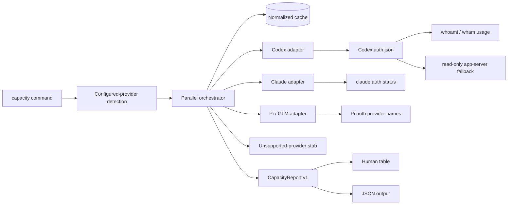
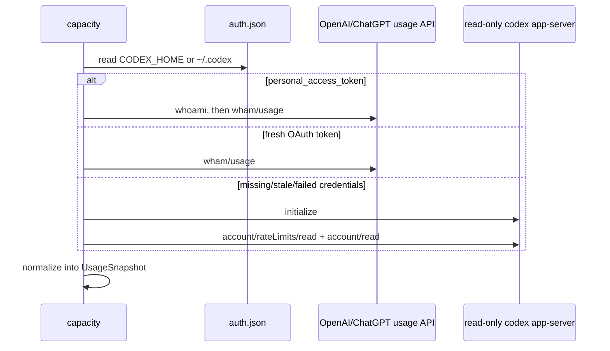

# Capacity Command Design

## Architecture Overview



The Commander registration layer delegates to a report orchestrator. Detection, provider adapters, normalization, cache, and rendering are separate modules with dependency injection at subprocess and orchestration boundaries.

## Command API

```text
capacity [provider] [--json] [--max-age <seconds>] [--refresh]
```

- No provider: detect only configured providers.
- Provider: request one known provider even if it is not configured, while reporting its actual state.
- `--json`: serialize the report with two-space indentation.
- `--max-age`: accept a non-negative integer; default 300 seconds.
- `--refresh`: skip cache lookup.

Invalid arguments fail before probing. A constructed report exits successfully even if some rows are unknown.

## State Model

These signals are independent:

| Signal | Meaning | Source |
|---|---|---|
| `configured` | Provider configuration directory exists | `ENVIRONMENT_DEFINITIONS.globalSkillPath` |
| `installed` | Expected executable exists and is executable on PATH | executable access check |
| `authenticated` | Provider-specific probe found valid authentication | app-server/auth status/Pi provider keys |

Provider status is one of `supported`, `unsupported`, `unauthenticated`, `unavailable`, or `unknown`. Availability is separately `yes`, `no`, or `unknown`.

## Data Model

```ts
type CapacityWindow = {
  id: string;
  label: string;
  durationMinutes: number | null;
  usedPercent: number | null;
  remainingPercent: number | null;
  resetsAt: string | null;
  scope: string | null;
};

type ProviderCapacity = {
  provider: string;
  agentType: string | null;
  configured: boolean;
  installed: boolean;
  authenticated: boolean | null;
  status: 'supported' | 'unsupported' | 'unauthenticated' | 'unavailable' | 'unknown';
  available: 'yes' | 'no' | 'unknown';
  plan: string | null;
  checkedAt: string;
  source: 'provider-cli' | 'provider-api' | 'local-observation' | 'none';
  windows: CapacityWindow[];
  aliases: { dailyWindowId: string | null; weeklyWindowId: string | null };
  resetCredits?: { available: number | null };
  warnings: Array<{ code: string; message: string }>;
  error?: { code: string; retryable: boolean };
};

type CapacityReport = {
  schemaVersion: 1;
  generatedAt: string;
  providers: ProviderCapacity[];
};
```

`windows` is canonical. Aliases are derived by duration tolerance around 1,440 and 10,080 minutes. Native scoped windows remain separate, duplicate compatibility buckets are removed by normalized ID, and `remainingPercent` is derived only from an authoritative numeric `usedPercent`.

## Configured-Provider Detection

`detection.ts` reuses `ENVIRONMENT_DEFINITIONS`; it does not maintain a second provider-to-config mapping. The root is derived from `globalSkillPath` (including nested `.config/<provider>` roots), joined to the user home directory, and checked for existence. GitHub environment naming is normalized to provider name `copilot`. Binary detection is a separate executable-access scan over PATH and never establishes configuration.

## Provider Adapters

### Codex



The adapter resolves `CODEX_HOME/auth.json` before the home-directory fallback. A PAT performs `whoami` to obtain the account ID and then reads `wham/usage`; a fresh OAuth access token uses its stored account ID directly. Stale tokens and 401s fall back without refresh. API calls are bounded and normalize session, weekly, credit balance, the individual-limit fallback chain, and additional limits.

The JSON-line fallback transport is injectable in tests. It launches `codex -s read-only -a untrusted app-server`, ignores stderr, bounds execution, and reads both rate limits and account state. It never invokes a model method. Missing limits produce unknown availability rather than zero usage.

### Claude

The adapter runs `claude auth status --json` with bounded stdout and a timeout. Claude may return valid logged-out JSON with a nonzero exit, so that bounded stdout is parsed while stderr and exception text are discarded. The undocumented OAuth usage endpoint is not called; capacity remains unknown even when authentication succeeds.

### Pi and GLM

The adapter reads `~/.pi/agent/auth.json`, retains only top-level provider names, and never emits credential values. Any configured Pi credential establishes Pi authentication. `zai` or `zai-coding-cn` additionally establishes GLM authentication. Both remain unsupported/unknown because no verified account-quota reader exists.

### Other Providers

Configured providers without an authoritative adapter use the common stub. The stub preserves configured/installed state, maps to the correct AI DevKit `agentType` when available, and returns `status: unsupported`, `available: unknown`.

## Orchestration and Cache

- Provider probes execute with `Promise.all` and a seven-second orchestration timeout; adapters also apply their own subprocess timeouts.
- Exceptions become fixed-code unknown rows. Raw exception data is discarded.
- Cache keys distinguish explicit-provider and configured-provider sets.
- The default cache path is `~/.ai-devkit/cache/capacity.json`.
- Cache directory mode is `0700`; file and temporary file mode is `0600`; writes use rename.
- Cache failures never prevent a report, and `--refresh` bypasses reads.

## Security and Reliability Decisions

- Codex owns OAuth refresh; AI DevKit only reads the current token and never persists or refreshes it.
- Tokens and raw `auth.json` content are never logged, cached, or included in errors.
- Output and cache contain normalized allowlisted data, not raw responses.
- Codex identifiers, labels, and plan metadata are validated and credential/account-like values are rejected.
- Claude plan metadata is similarly constrained.
- Error output uses fixed codes/messages; stderr, URLs, headers, bodies, and exception text are never rendered.
- Unknown data remains unknown. Stubs and probe failures cannot claim availability.
- Partial failure is isolated so one provider cannot suppress other results.

## Alternatives Rejected

- Direct OAuth refresh: rejected because AI DevKit does not own the credential lifecycle.
- TUI scraping: brittle and capable of accidentally starting model activity.
- Local token-history estimation: not authoritative for subscription limits.
- Forced daily/weekly schema: loses provider-native rolling and scoped windows.

The original structured capacity brainstorm supplied the deeper provider feasibility analysis; this document records the architecture that actually shipped.
