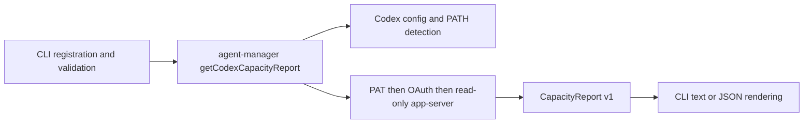

# Capacity Command Design

## Architecture

`packages/agent-manager/src/capacity/` is the domain boundary. `types.ts` defines normalized output, `codex.ts` owns credential-safe probing and mapping, and `index.ts` detects Codex, calls the probe once, redacts unexpected failures, and builds the report. The root package export exposes the report function and types.

`packages/cli/src/commands/capacity.ts` registers `capacity [provider]`, validates that an explicit provider is `codex`, calls agent-manager, and delegates rendering. `capacity/render.ts` contains presentation only.

## Fresh Probe Flow

Each invocation checks `~/.codex` and PATH, then probes once. No filesystem cache, freshness key, TTL, bypass option, multi-provider selection, parallel grouping, or orchestration timeout exists.

The Codex probe remains tiered:

1. Resolve `CODEX_HOME/auth.json`, falling back to `~/.codex/auth.json`.
2. If a PAT exists, use `whoami` then the usage endpoint.
3. Otherwise use a fresh OAuth token and stored account ID.
4. On missing, stale, unauthorized, or failed credentials, run `codex -s read-only -a untrusted app-server` and call only `account/rateLimits/read` and `account/read`.

Network and app-server calls remain bounded inside the probe. Results are normalized into schema v1; raw inputs and exceptions are never returned.

## Simplification Decisions

| Opportunity | Decision | Reason |
|---|---|---|
| Remove normalized cache and cache tests | Acted | Every run must be fresh; TTL, permissions, keying, atomic writes, and bypass paths no longer serve behavior. |
| Remove `--max-age` and `--refresh` | Acted | They only controlled the removed cache. |
| Remove Claude, Pi, GLM, and generic stubs/tests | Acted | Codex is the only supported capacity provider. |
| Replace provider registry and configured-provider scan | Acted | A direct Codex config/PATH check is clearer than generic mappings for one provider. |
| Remove parallel orchestration, provider arrays, sorting, and outer timeout | Acted | One probe has no concurrency or partial-result problem; probe boundaries already time out. |
| Move model/probe/types into agent-manager | Acted | Capacity informs agent dispatch and is reusable independently of CLI presentation. |
| Keep schema-v1 report and provider array | Rejected | It is already the documented machine-readable contract; changing it adds migration cost without simplifying the probe. |
| Collapse PAT, OAuth, and CLI probing to app-server only | Rejected | The fallbacks have distinct availability/authentication value and preserve credential-safe behavior. |
| Collapse `UsageSnapshot` into render fields | Rejected | It preserves authoritative source detail and provider-native windows for JSON consumers. |
| Merge renderer into command | Rejected | Rendering has separate behavior and tests; keeping it isolated makes the CLI flow linear. |
| Add a new package dependency/helper library | Rejected | Node APIs and the existing agent-manager dependency are sufficient. |

All acted changes pass the readability guide's Reading Test: the command path is linear, names are explicit, functions stay at one abstraction level, and no speculative abstraction remains.
