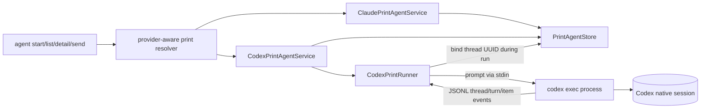

# Codex Print-Mode Agent Design

## Architecture Overview

Codex is added beside the existing Claude provider modules, sharing only the proven durable store/state primitives.



Interactive adapters remain unchanged. No generic provider framework or persistent server is introduced.

## Data Models

```ts
type PrintProvider = 'claude' | 'codex';
type PrintAgent = ClaudePrintAgent | CodexPrintAgent;

interface PrintAgentBase {
  id: string;
  name: string;
  mode: 'print';
  cwd: string;
  state: 'ready' | 'running' | 'degraded';
  sessionHealth: 'uninitialized' | 'healthy' | 'unknown' | 'mismatch';
  createdAt: string;
  updatedAt: string;
  lastActiveAt: string | null;
  lastResult: PrintLastResult | null;
  activeRun: PrintActiveRun | null;
}

interface ClaudePrintAgent extends PrintAgentBase {
  provider: 'claude';
  providerSessionId: string;
}

interface CodexPrintAgent extends PrintAgentBase {
  provider: 'codex';
  providerSessionId: string | null;
}
```

The store remains versioned. Its reader explicitly accepts the legacy Claude schema and the new discriminated schema, then validates provider-specific invariants. It rejects duplicate non-null `(provider, providerSessionId)` pairs.

## API Design

```ts
create(input: { name: string; cwd: string; provider?: PrintProvider }): Promise<PrintAgent>;
bindProviderSession(agentId: string, runToken: string, providerSessionId: string): Promise<PrintAgent>;

interface CodexPrintRunRequest {
  agent: CodexPrintAgent;
  prompt: string;
  executable?: string;
  onSpawn(identity: ProcessIdentity): Promise<void>;
  onSession(providerSessionId: string): Promise<void>;
}
```

`bindProviderSession` rereads under the mutation lock, verifies active token ownership and UUID validity, permits only Codex null-to-value or same-value idempotence, checks global uniqueness, and atomically persists.

Initial argv is `exec --json -`; resume argv is `exec resume --json UUID -`. The prompt never enters argv.

## Component Breakdown

- `PrintAgent`: shared base and provider discriminants.
- `PrintAgentStore`: provider-aware creation, strict migration, uniqueness, atomic binding, existing locking/reconciliation.
- `CodexCliProbe`: non-model version/help capability checks.
- `CodexPrintRunner`: safe spawn, process handshake, bounded JSONL parser, immediate session callback, assistant-result extraction.
- `CodexPrintAgentService`: resolve → acquire → run → bind → complete, with provider-specific health classification.
- CLI: selects service by requested/persisted provider and renders provider-specific labels/session state.
- `fake-codex.cjs`: deterministic executable contract and failure controls.

## Design Decisions

- Parallel Codex modules minimize Claude regression risk; shared-service extraction waits for another provider or demonstrated need.
- `thread.started.thread_id` is authoritative because initial and resumed 0.147.0 runs emit the same UUID.
- Binding occurs immediately during the owned first run so post-binding failure resumes instead of forking.
- Explicit UUID resume is mandatory; `--last`, names, transcript scanning, and `exec-server` are rejected.
- Unknown object events are forward-compatible, while required identity/result/completion events remain strict.

## Non-Functional Requirements

- Atomic per-agent exclusion prevents concurrent turns on one Codex thread.
- Stdout lines, stderr capture, and persisted summaries are bounded; malformed streams fail closed.
- Spawn uses no shell and no permission-bypass flags; prompt and native transcripts are never persisted.
- Creation/probe are non-billable and sends have no implicit retry.
- Existing schema records and interactive/Claude behavior remain compatible.
