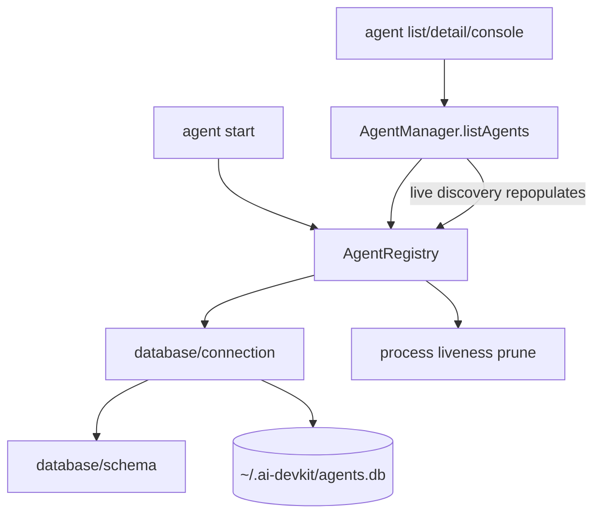

# System Design & Architecture

## Architecture Overview

`AgentRegistry` remains the public agent-storage boundary, but SQLite mechanics are isolated in a small database layer modeled after the memory/task packages. `AgentManager`, adapters, and CLI services continue using `register`, `registerBatch`, `lookup`, `list`, `rename`, and `prune`.

## Data Models

SQLite database: `~/.ai-devkit/agents.db`

Table: `agents`

| Column | Type | Notes |
|---|---|---|
| `name` | TEXT NOT NULL | User-facing agent name |
| `type` | TEXT NOT NULL | Provider type |
| `pid` | INTEGER NOT NULL | Live provider process PID |
| `tmux_session` | TEXT NOT NULL DEFAULT '' | Managed tmux session name, if known |
| `cwd` | TEXT NOT NULL DEFAULT '' | Working directory |
| `started_at` | TEXT NOT NULL | ISO timestamp from first known registry row |
| `session_id` | TEXT NOT NULL DEFAULT '' | Provider session id or `pid-<pid>` fallback |
| `session_file_path` | TEXT NOT NULL DEFAULT '' | Provider transcript path when known |
| `updated_at` | TEXT NOT NULL | Last registry update time |

Constraints:

- `PRIMARY KEY (type, pid)` to enforce one live row per provider process.
- `UNIQUE(name)` keeps name resolution stable and supports existing rename conflict behavior.

Legacy JSON behavior:

- Existing `agents.json` files are ignored rather than imported.
- Running agents are repopulated into SQLite through normal `agent list` discovery and `agent start` registration.
- This avoids resurrecting stale JSON rows after all DB rows have been pruned or stopped.

## API Design

Keep the current TypeScript API:

- `register(entry: RegistryEntry): void`
- `registerBatch(entries: RegistryEntry[]): void`
- `rename(currentName: string, newName: string): void`
- `lookup(name: string): RegistryEntry | null`
- `list(): RegistryEntry[]`
- `prune(): void`
- `isAlive(entry: RegistryEntry): boolean`

Merge behavior for same `type + pid`:

- Preserve existing `name` by default.
- Replace `name` when the incoming entry has a non-empty `tmuxSession`; this represents `agent start` registering a managed, user-provided name.
- Preserve existing `tmuxSession` when incoming `tmuxSession` is empty.
- Preserve existing `startedAt`.
- Update `cwd`, `sessionId`, and `sessionFilePath` from incoming values when they are non-empty.

## Component Breakdown

- `packages/agent-manager/src/utils/AgentRegistry.ts`
  - Own agent-specific behavior: merge/upsert rules, lookup, rename, prune, and mapping between DB rows and `RegistryEntry`.
- `packages/agent-manager/src/database/connection.ts`
  - Own SQLite path resolution, directory creation, connection setup, pragmas, query helpers, transactions, and close behavior.
- `packages/agent-manager/src/database/schema.ts`
  - Own migration discovery, `user_version` tracking, and applying pending SQL migrations.
- `packages/agent-manager/src/database/migrations/001_initial.sql`
  - Create the initial `agents` table.
- `packages/agent-manager/src/database/index.ts`
  - Re-export the database boundary for the package.
- `packages/agent-manager/src/AgentManager.ts`
  - Continue building registry entries after adapter detection.
  - Benefit from PID-aware upsert without major call-site changes.
- Tests
  - Update `AgentRegistry` tests from JSON parsing expectations to SQLite behavior.
  - Add regression coverage for duplicate PID/name preservation and concurrent registry instances.

## Design Decisions

- SQLite over JSON lock files: SQLite provides transactional writes and file locking without a custom lock protocol.
- Separate connection/schema modules over putting all storage mechanics in `AgentRegistry`: follows the existing memory/task package pattern and keeps future migrations localized.
- SQL migration files over embedded DDL: matches the existing memory/task package layout and keeps future schema changes append-only.
- Preserve API shape: reduces blast radius across CLI services, adapters, and tests.
- Ignore legacy JSON rather than importing it: live discovery can repopulate running agents, and avoiding import prevents stale rows from returning after prune/stop.
- `type + pid` primary key: matches live process identity and directly prevents the observed duplicate rows.
- `UNIQUE(name)`: keeps rename and lookup semantics explicit. If a stale row owns a desired name, existing rename/start logic can prune first.

## Non-Functional Requirements

- Registry operations must be fast enough for console polling; expected row count is small.
- SQLite initialization must be idempotent.
- Storage writes must be atomic under multiple CLI processes.
- No secrets are stored; all data is local process/session metadata.
