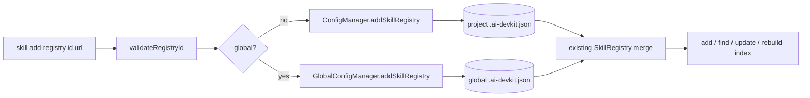

# System Design & Architecture

## Architecture Overview



The command performs validation and delegates a pure config mutation to the selected manager. It does not instantiate `SkillRegistry`, fetch the default registry, inspect Git, or touch the skill cache. Existing `SkillRegistry.fetchMergedRegistry()` supplies downstream resolution with default < global < project precedence.

## Data Models

No schema change is needed:

```ts
registries?: Record<string, string>
```

The registry ID is a validated map key and the registry URL is an opaque, verbatim string value. All unrelated top-level config and sibling registry entries survive writes.

## API Design

- CLI: `skill add-registry <id> <url> [-g|--global] [-f|--force]`.
- `ConfigManager.addSkillRegistry(id, url, { force }?)` returns the resulting `DevKitConfig` and uses the existing `read → merge → update` pattern from `addSkill()`. The two-argument form is the normal public contract; the optional flag exists only for the CLI's explicit override path.
- `GlobalConfigManager.addSkillRegistry(id, url, { force }?)` returns the resulting `GlobalDevKitConfig` and uses the existing `read → merge → write` pattern from `addPlugin()`, with an existence check that protects malformed files.
- Both setters enforce same-scope idempotency and conflict behavior so callers cannot bypass safety. A small shared pure helper computes `added`, `already-registered`, `updated`, or throws a conflict while returning the merge-preserving registry map.
- The command reads the selected target scope's current registry map before invoking its setter so it can choose precise success copy while the setter remains the authoritative safety boundary. This extra local read is acceptable and performs no network/cache work.

## Component Breakdown

- `commands/skill.ts`: registers the flat sibling command, parses flags, validates the ID, selects project/global scope, and reports success/idempotency.
- `util/skill.ts`: existing `validateRegistryId()` remains the only input validation.
- `lib/Config.ts`: merge-preserving project setter backed by `update()`.
- `lib/GlobalConfig.ts`: merge-preserving global setter and malformed-file protection.
- `util/skill-registry.ts`: shared pure registry mutation decision; it treats URL as opaque and contains no I/O.
- Existing command tests mock config/filesystem boundaries; no real network or disk is used.

## Design Decisions

- Build only `add-registry`; removal and listing remain deferred.
- Persist default-identical mappings as explicit pins because conflict/idempotency checks apply only to the selected writable scope.
- Treat URL as opaque input. This supports HTTPS, SSH/SCP syntax, non-GitHub hosts, and arbitrary future transports without expanding validation policy.
- Do no cache work. Registration must work offline and remain a fast config-only operation.
- Reuse `validateRegistryId()` instead of defining a competing identifier grammar.
- Same target-scope ID/value is idempotent; same ID/different value requires `--force` to make accidental replacement explicit.
- Never use `read() ?? {}` alone for global mutation: when the file exists but parsing fails, that would erase user data. Check existence and fail clearly when a present file cannot be read.
- Use a dedicated `CliError` conflict code/message from the shared helper. `--force` changes only conflict resolution; it does not alter validation or I/O behavior.

### Alternatives considered

- A three-command registry-management set was rejected in favor of minimal scope.
- URL normalization/remote verification was rejected because it would exclude valid inputs and violate offline behavior.
- Fetching the default registry before writing was rejected because identical defaults must still be pinned and network failure must not block registration.

## Non-Functional Requirements

- Registration is O(number of registry entries) for an object spread and performs at most the target config I/O.
- No credentials are interpreted or transmitted.
- Failed validation/conflict/malformed-global cases leave config unchanged.
- Existing command behavior and merged-registry precedence remain unchanged.
