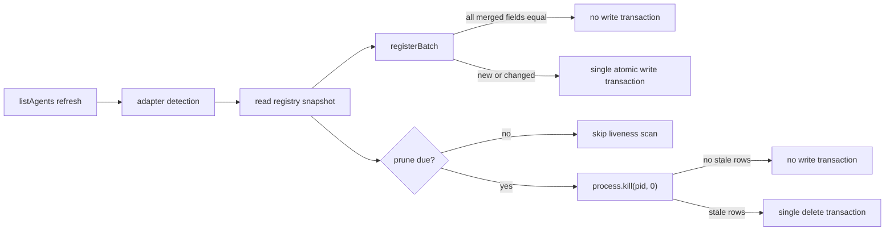

# Design

## Data Flow

## Chosen Pruning Contract

- Add `AgentRegistry.pruneIfDue()` for passive refreshes.
- The first passive call scans immediately; later passive calls scan no more than once every 30 seconds per registry instance.
- Keep `AgentRegistry.prune()` as an immediate forced scan for compatibility and correctness-sensitive flows such as `agent start`.
- Both methods update the same last-pruned timestamp after a successful scan.
- A scan with no stale entries performs no write transaction.
- The clock and interval are constructor options with backward-compatible defaults, enabling deterministic tests without global timers.

Thirty seconds reduces a three-second console poll from ten scans to one. Stale names are still cleared immediately by start's forced prune, rename checks the conflicting row's liveness directly, registration checks only a relevant name conflict, and kill targets live adapter results. Passive rows disappear within 30 seconds.

Alternatives considered:

- Prune on every refresh but avoid an empty delete transaction: rejected because process liveness scans remain on the hot path.
- Prune only on mutations such as start/rename/kill: rejected because stale rows could remain indefinitely during read-only use.
- Persist the last-prune time in SQLite for a cross-process cadence: rejected because it adds migration and coordination writes to optimize a process-local console polling problem.
- Use a 60-second interval: workable, but 30 seconds gives faster passive cleanup while still removing 90% of scans at a three-second poll rate.

## Conditional Persistence

`registerBatch()` will merge incoming entries with current rows and compare every persisted field except `updated_at`. If all merged entries are identical, it returns before opening a transaction. If any may change, one transaction retains the existing atomic batch boundary. Each entry is re-read and re-merged inside that transaction so concurrent registry writers cannot make the preflight snapshot authoritative. An entry is upserted only when the transaction-time merged fields differ.

`updated_at` changes only on insert, actual persisted-field update, or explicit rename. Unchanged detection refreshes do not imply registry updates.

## Conflict and PID Semantics

- Dead rows owning an incoming name are deleted inside the same batch transaction.
- A conflicting row with the same PID but a different agent type is stale by definition: one OS PID cannot simultaneously be two provider processes. Delete it even though `kill(pid, 0)` reports the reused PID alive.
- A live different-PID name conflict remains a database constraint error, preserving current conflict visibility.
- Name overlays and existing-entry lookup use `type + pid`, not PID alone, preserving the documented cross-type PID-reuse guard.
- Same-type PID reuse remains accepted until reliable process-start identity is available.

## Public and Migration Compatibility

Existing method calls and return types remain valid. The constructor gains only an optional second options argument, and `pruneIfDue()` is additive. No table or migration changes are needed; comparison uses the existing columns.

## Overlap and Integration Order

`feature-console-main-thread-responsiveness` is expected to touch `AgentManager.ts` and its tests to share process snapshots across adapters. It must not absorb this registry change. Merge this branch first, then rebase the snapshot branch and compose its detection changes around the conditional registration and `pruneIfDue()` call. Registry SQL and cadence tests should remain owned here; snapshot enumeration tests remain owned there.
