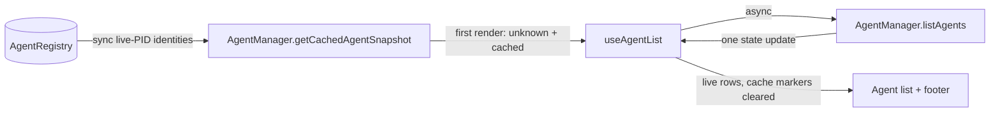

# Agent Console Fast Initial State Design

## Data Flow

## API Decision

Add `AgentManager.getCachedAgentSnapshot(): CachedAgentSnapshot[]`. The snapshot contains identity and registry metadata only: registered name, type, PID, cwd, start time, session ID, and optional session path. It filters out dead PIDs and types without a registered adapter and never invokes adapter discovery.

The alternative of returning `AgentInfo[]` was rejected because the registry cannot defensibly populate live `status`, `summary`, or `lastActive`. The console adapts snapshots into temporary `AgentInfo` placeholders with `status: unknown`, an empty summary, and explicit cached metadata kept separately in `cachedAgentPids`.

## Reconciliation and Errors

- `useState` uses a lazy synchronous initializer, so the first render cannot await discovery.
- The existing effect immediately calls `listAgents({ sortBy: 'status' })` and keeps the 3000 ms interval and in-flight guard unchanged.
- Successful discovery replaces the entire cached array and clears `cachedAgentPids` in one state update, including an empty result.
- A rejected refresh retains cached rows, clears the refreshing flag, and exposes the error.
- Existing name-based selection remains selected when the registered name survives live reconciliation; otherwise the existing selection effect chooses the first live row or clears selection.

## Merge/Overlap Risk

The responsiveness work landed in `main` first through the preview memoization, input isolation, and split-context changes (#156–#158). This branch was rebased onto that sequence. The resolution preserves its separate agent/channel contexts and adds only `isRefreshing` and `cachedAgentPids` to the agent context, alongside the lazy cached initializer and atomic cache-marker clearing. For backports or alternate merge orders, preserve the responsiveness scheduling/context structure and never reintroduce adapter discovery on the render path.
