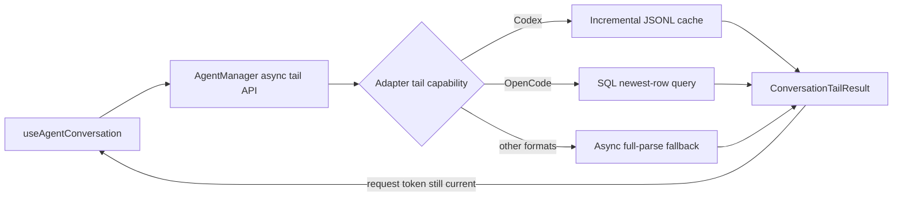

# Design

## Architecture

## Public Contract

Add tail options and a result envelope alongside `ConversationMessage`:

- `ConversationTailOptions`: `verbose`, `limit`.
- `ConversationReadStats`: bytes and complete records processed for this request, cache-hit flag, and reset reason.
- `ConversationTailResult`: newest messages plus stats.
- `AgentAdapter.getConversationTail?`: optional optimized async adapter implementation.
- `AgentManager.getConversationTail(type, path, options)`: the single console entry point. It delegates to an optimized method or the safe async fallback and always applies the requested tail bound.

The existing synchronous method stays intact for compatibility. The new manager method owns fallback selection so UI code never chooses between architectures.

## Incremental JSONL Cache

Each LRU entry is keyed by adapter/parser namespace, absolute session reference, verbosity, and tail limit. It stores:

- file identity (`dev`, `ino`) and last observed size/mtime;
- next byte offset;
- raw incomplete final-record bytes;
- adapter reducer state and bounded output messages;
- diagnostics accumulated for the current request.

Reads use `fs.promises.open`, `stat`, and positional reads. On first load, identity change, or `size < offset`, state resets and reading begins at zero. An unchanged identity/size/mtime returns cached messages without opening the data range. Complete newline-delimited records are decoded and parsed independently. Empty lines are ignored; malformed complete records increment `parseErrors`; the remaining suffix is retained until a newline arrives.

The cache holds 50 sessions and refreshes LRU order on access. Eviction discards the entire state, so a later access performs a correct full rebuild.

## Codex Reducer

Codex retains the exact existing line-to-message conversion. Reducer state additionally tracks response-item mirror keys and mirror metadata for retained event messages:

- response item first: record its key and emit it; a later mirrored event is skipped;
- event first: emit it provisionally; a later mirrored response removes the retained event and emits the response in its actual order;
- entries without turn IDs remain independent.

The response-key set is retained for the cache lifetime because a later event can refer to an earlier response. Output messages are bounded to the requested tail, while dedup state preserves semantics across appends.

## OpenCode

OpenCode implements the async API directly with SQL ordering newest-first and `LIMIT`, filtering to displayable part types for non-verbose preview. Rows are reversed before mapping so visible chronological ordering matches `getConversation()`. No file-stat cache is applied to encoded database references; SQLite is the source of truth.

## Safe Fallback

Adapters without an optimized tail method retain exact `getConversation()` semantics. The manager defers that compatibility parse out of the initiating render/effect stack, slices only after parsing, and caches unchanged real files. Gemini, the monolithic JSON adapter, provides an optimized worker-thread implementation so its read and `JSON.parse` do not block Ink. Claude, Copilot, Grok, and Pi continue through the awaited compatibility path in this change; adopting the reusable JSONL reducer is an explicit follow-up. This is intentionally a migration bridge, not a second API.

## Concurrency and UI

`useAgentConversation` awaits the manager API. Every request captures a monotonically increasing token and the selected session identity. Results/errors are committed only when mounted and still current. Poll ticks do not start a second read while one is active; a later selection invalidates the previous request. Cached messages are shown immediately, the 150 ms selection debounce and 3 s polling fallback remain, and `PREVIEW_TAIL` remains 20.

## Alternatives Considered

- Reparse asynchronously on the main thread: rejected because `Promise`/`setImmediate` changes scheduling but CPU parsing still freezes Ink.
- Replace every synchronous adapter method: rejected as an unnecessary breaking change for command and channel callers.
- Put a separate JSONL cache in the hook: rejected because it duplicates adapter parsing semantics and cannot correctly preserve Codex deduplication.
- Build adapter-specific UI readers: rejected because it creates competing architectures.

## Risks and Mitigations

- File rewritten in place between polls: identity and size regression trigger reset; replacement/rotation changes inode. Tests cover both reset paths.
- Unbounded session state: LRU bounds session count and message arrays are tail-bounded; Codex mirror keys are the only file-lifetime semantic index.
- Worker/fallback failure: return a rejected async result, preserve previously rendered messages, and surface the existing parse-error state.
- Adapter drift: parity tests compare async tail output with existing synchronous semantics.
