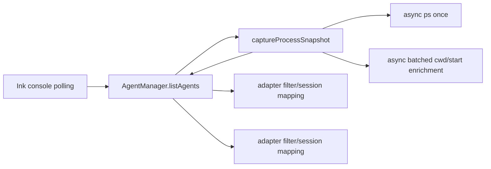

# System Design & Architecture

## Architecture Overview

`AgentManager` gathers the optional executable-name hints advertised by snapshot-aware adapters, requests one enriched snapshot, and passes the same read-only process array to those adapters. Each adapter filters with its existing `canHandle` logic before session discovery.

## Data Models and API

- `AgentDetectionContext.processes`: a read-only array of enriched `ProcessInfo` records from one capture.
- `AgentAdapter.processNames?`: executable basenames needed by that adapter (`node` included for Gemini and Pi).
- `AgentAdapter.detectAgents(context?)`: optional context preserves source compatibility for existing implementations and direct calls.
- `captureProcessSnapshot(names)`: async utility that performs one `ps` listing, filters relevant basenames, then asynchronously enriches the union of candidate PIDs.

## Design Decisions

- Chosen: optional adapter hints plus an optional detection context. This avoids enriching every OS process and preserves legacy third-party adapters.
- Rejected: capture/enrich all OS processes. It is simpler at the interface but can create oversized `lsof`/`ps -p` arguments and unnecessary work.
- Rejected: async scans inside every adapter. It frees the event loop but retains repeated scans and does not satisfy one-snapshot-per-refresh semantics.
- Rejected: manager-owned tool-specific filtering. It couples `AgentManager` to adapter command-line details and duplicates `canHandle` behavior.

## Failure and Compatibility Behavior

- Snapshot command failures resolve to an empty snapshot, matching prior discovery helpers.
- Enrichment is best-effort and preserves empty `cwd`/missing `startTime` per PID.
- `lsof` failure uses asynchronous per-PID `pwdx` fallback on platforms where available.
- Snapshot-aware built-ins use a local async snapshot when invoked without manager context.
- Adapters without `processNames` receive no context and keep their historical behavior.

## Non-Functional Requirements

- No `execFileSync` on the built-in multi-adapter refresh path.
- Exactly one base `ps -axo` capture per manager refresh with snapshot-aware adapters.
- No polling or Ink rendering configuration changes.
