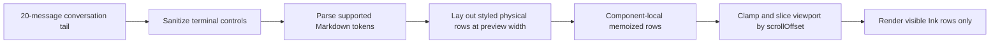

# Agent Console Markdown Preview Design

## Architecture Overview



`PreviewPane` retains the current state selection and scroll-offset adjustment. Message content and the explicit content width are the only inputs to the memoized parse/layout stage. `scrollOffset` is consumed only by the cheap viewport stage. `PreviewSection` passes the current right-pane width; narrow mode remains unchanged because the preview is not newly exposed there.

## Data Models

```ts
interface PreviewSpan {
    text: string;
    bold?: boolean;
    italic?: boolean;
    dimColor?: boolean;
    color?: string;
    backgroundColor?: string;
}

interface PreviewViewportRow {
    kind: 'header' | 'content' | 'separator' | 'indicator';
    spans: PreviewSpan[];
    role: ConversationMessage['role'] | null;
    timestamp?: string;
}
```

- Header/separator/indicator rows preserve existing semantics.
- Content rows contain already wrapped styled spans. Their plain display width never exceeds the supplied content width except where a single terminal grapheme itself cannot be split.
- Layout data exists only inside the mounted active `PreviewPane` memo for the current message array and width.

## API Design

- `PreviewSectionProps.contentWidth: number` carries `max(1, inputInnerWidth - 2)` from `ConsoleApp`: panel borders/padding are already removed by `inputInnerWidth`, and two columns are reserved for the existing message-body indent.
- `PreviewPaneProps.contentWidth?: number` defaults conservatively for direct tests/callers.
- Pure helpers parse and lay out messages, build a viewport from stable rows, and render row spans.
- No external API, persistence, schema, polling, conversation-tail, or focus-key contract changes.

## Component Breakdown

- `PreviewPane.tsx`: state preservation, message-row memoization, viewport slicing, and visible-row Ink rendering.
- `markdownPreview.ts` (or equivalently small render module): sanitization, Marked token traversal, inline style flattening, safe fallbacks, terminal-width wrapping, and message row construction.
- `PreviewSection.tsx` / `ConsoleApp.tsx`: width plumbing only.
- Focused test modules: pure Markdown/layout coverage plus `PreviewPane` render and offset-only rerender regression coverage.

## Rendering Rules

- Headings: bold accent text; heading markers are not displayed.
- Bold/emphasis: Ink bold/italic attributes.
- Inline code: distinct existing palette color; fenced code uses a dim fence label when present and indented literal lines, without highlighting.
- Lists: `•` or parser-provided ordered numbers with hanging indentation.
- Blockquotes: dim `│ ` prefix with recursively rendered body.
- Links: styled label followed by a dim plain ` (URL)` when the destination differs from the label.
- Raw HTML: sanitized literal source text, never passed to an HTML/ANSI interpreter.
- Images: safe text fallback containing alt text and destination, never fetched or rendered.
- Unsupported/malformed constructs: sanitized literal or parser text fallback; parsing exceptions fall back to sanitized source lines.
- Control handling: strip ANSI/OSC/C0 control sequences except source newlines/tabs before parsing and layout; rendered spans never contain terminal control characters.

## Design Decisions

- Add `marked` as a direct CLI dependency because it already has repository precedent, exposes block/inline tokens, and avoids a bespoke grammar.
- Add or directly declare a terminal display-width utility if required; do not rely on an undeclared transitive dependency.
- Keep parsing and layout in one `useMemo([messages, width])`. This is the smallest cache satisfying offset-only optimization and is bounded by the active 20-message tail/current width.
- Slice the viewport before mapping rows to Ink elements. No binary search or transcript virtualization is needed for twenty messages.
- Preserve numeric bottom-relative offsets and current appended-row adjustment. Frozen updates and semantic anchors remain explicit non-goals.

## Non-Functional Requirements

- **Performance:** offset-only rerenders reuse stable laid-out rows; viewport work is O(visible rows) for React element creation and O(1) bounds plus array slice for selection.
- **Memory:** one active message array's parsed/laid-out result at one width; released when messages, width, selection, or component lifetime changes.
- **Security:** no raw HTML, image retrieval, OSC hyperlinks, ANSI, or terminal controls; URLs remain inert displayed text.
- **Reliability:** parser exceptions and malformed tokens fall back to sanitized text without affecting preview state handling.
- **Compatibility:** preserve current props with optional width defaults where useful, and minimize overlap with open cached-preview metadata work.
