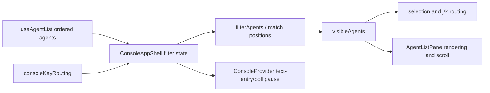

# Agent Name Filter Design

## Architecture Overview

`ConsoleAppShell` owns `{ text, editing }`, derives `visibleAgents` from the ordered source, and supplies that same array to selection, navigation, preview coherence, and `AgentListPane`. Filter editing is routed before global/list commands. The provider receives a generalized interaction-active signal so polling is paused for message composition or a filter session.

## Data Models

- `AgentFilterState = { text: string; editing: boolean }`; the shape is an extension seam, not an invitation to add other dimensions now.
- `visibleAgents = filterAgents(agents, filter.text)`; input order is preserved.
- `findMatchPositions(name, query): number[] | null` returns flat `[start, end, ...]` ranges for every non-overlapping matched occurrence; empty query returns `[]`, no match returns `null`.
- Filter session/poll pause: `editing || text.length > 0`.

## API Design

- `matchAgentByName(name, query): boolean`
- `findMatchPositions(name, query): number[] | null`
- `filterAgents(agents, query): AgentInfo[]`
- `resolveConsoleKeyAction` accepts filter state and can return open, confirm/clear-related actions while preserving current focus actions.
- `AgentListPane` receives the already-filtered agents plus total count, query, and editing state; it does not reorder agents.

No external API, authentication, storage, or new dependency is introduced.

## Component Breakdown

- `filter/agentFilter.ts`: pure case-insensitive substring logic.
- `ConsoleApp.tsx`: owns state; derives visible agents; validates selection; routes shortcuts; resumes with immediate refresh after Esc-clear.
- `consoleKeyRouting.ts`: intercepts filter editing before normal list/global actions so printable keys reach `TextInput`.
- `AgentListPane.tsx`: renders the input/confirmed chip, counts, empty result, highlighted clipped names, filtered scroll clamping, and filtered more indicators.
- `ConsoleContext.tsx`: pauses agent/channel polling for any active text-entry/filter session.
- Footer/key hints: advertises `/ filter` only in the relevant list state and explains clear behavior when active.

## Design Decisions

- Substring matching is chosen for deterministic behavior and minimum complexity; fuzzy/subsequence and ranking are rejected.
- Parent-owned filter state prevents list, preview, and navigation from observing different arrays.
- A frozen filtered snapshot prevents polling-induced row movement; Esc both clears and immediately refreshes.
- Confirmed `/` is a no-op and editing `/` is literal, avoiding implicit destructive query replacement.
- Filtering composes over source order and contains no pin-specific logic.

## Non-Functional Requirements

- Filtering is linear in agent/name size and runs in-process.
- New pure logic and routing branches require 100% statement/branch/function/line coverage.
- Name clipping counts every rendered character while preserving highlight spans and existing row chrome/channel widths.
- Existing error handling and console shortcuts remain reliable; filter text is local ephemeral UI state and creates no security boundary.
