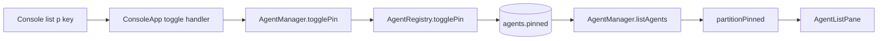

# Agent Pinning Design

## Architecture Overview



The existing SQLite registry owns pin persistence. The manager translates the console's selected name to `(type, pid)`, the registry performs the atomic mutation, and the normal refresh path carries the new state back to the console.

## Data Models

Migration `packages/agent-manager/src/database/migrations/002_pins.sql`:

```sql
ALTER TABLE agents ADD COLUMN pinned INTEGER NOT NULL DEFAULT 0;
```

- `RegistryRow.pinned` is the SQLite integer.
- `RegistryEntry.pinned` is a required Boolean read model.
- `RegistryEntry.updatedAt` exposes the existing row timestamp for pinned recency mapping; it is not a new database column.
- `AgentInfo.pinned?: boolean` is an additive public field; absent is false.
- No separate table, JSON record, `pinned_at`, or retained record exists.

## API Design

- `AgentRegistry.togglePin(type, pid): boolean | null` runs `UPDATE agents SET pinned = NOT pinned, updated_at = ? WHERE type = ? AND pid = ?`, then returns the new state. Zero matched rows return `null`.
- `AgentManager.togglePin(agentName)` resolves the current live registry entry by name, delegates by `(type, pid)`, and reports missing/dead and readonly failures clearly. The registry update remains the final race check.
- `AgentManager.listAgents()` copies `RegistryEntry.pinned` onto detected `AgentInfo` objects alongside the existing persisted-name join. For pinned entries only, it maps registry `updatedAt` to `AgentInfo.lastActive`; unpinned agents retain adapter activity timestamps.
- `partitionPinned(agents)` returns pinned agents ordered by `lastActive` descending followed by unpinned agents in input order.
- Console action union gains `{ type: 'toggle-pin' }`; only list-mode lowercase `p` produces it.

## Component Breakdown

### Database and registry

- Add migration 002 and retain the migration packaging already declared by agent-manager.
- Thread `readonly` through `AgentRegistryOptions` to `DatabaseConnection`. A readonly connection must skip write-only PRAGMAs and schema migration while retaining safe read configuration; mutation then fails with a clear readonly error.
- Map integer pin values to Boolean on reads.
- Preserve pin state through `insertOrUpdate`: **never add `pinned` to the `ON CONFLICT ... DO UPDATE SET` list**.
- Keep `pinned` out of `entriesEqual`, `mergeEntry`, and `needsWrite` so poll refreshes neither overwrite nor spuriously rewrite it.
- Existing rename updates the row in place, while prune and conflict deletion remove the row and pin together.

### Manager

- Carry existing pin state into the live list after registry registration/pruning.
- Resolve name to the live identity for toggles; a vanished row is an explicit race outcome.
- Preserve readonly database errors with a clear mutation message.

### Console

- Use the `manager` already exposed by `ConsoleAgentContext`; after a successful toggle call the existing `refresh()` function and show an error transient on failure.
- Partition before list navigation/rendering so selection and scroll clamps see one derived list.
- Initial auto-selection chooses the first pinned agent, otherwise index zero.
- Keep `MARKER_W = 2`: selected+pinned is `▶*`, unselected+pinned is ` *`, selected is `▶ `, plain is `  `.
- Replace the already-budgeted divider between the last pinned and first unpinned row with a centered `OTHERS` label. All/none pinned lists use normal dividers only.
- Keep the list header count and `↑/↓` indicators based on the full derived list.
- Add `p pin` to list-mode footer hints; detail and input routing do not change.
- Remote status remains a separate fixed-width column and coexists with the pin marker.

## Design Decisions

- The process row is the aggregate root because pin lifetime equals process lifetime.
- Existing `updated_at` supplies pinned recency; no new ordering timestamp is introduced.
- Identity persistence uses `(type, pid)`, while name is only the current UI lookup handle.
- Future filter composition is status-sort → partition → filter each partition → concatenate. This retains section semantics even when filtering hides one side; filter implementation is out of scope.
- A pure partition helper isolates ordering policy and enables exhaustive tests.

## Non-Functional Requirements

- No new dependencies or additional polling queries beyond existing registry reads.
- Toggle is a single SQLite update under existing WAL/busy-timeout settings.
- Layout width and row-height arithmetic remain stable on narrow terminals.
- Migration remains forward-only and transactionally managed by `user_version`.
- Error messages must distinguish a stale selection from a readonly mutation failure.

## Design Review

Reviewed on 2026-08-16 against the approved requirements and current database, manager, console-context, routing, and rendering code. Migration assets are already copied by the agent-manager build. The review clarified the readonly construction path and the console's existing manager/refresh wiring. Every requirement is covered and no architecture questions remain.
