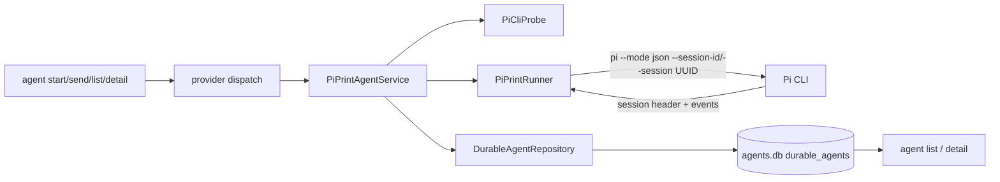

# Pi Print Mode Design

## Architecture Overview

Pi follows the merged Claude durable service/runner boundary. The open Codex design is used only as a read-only consistency reference.

## Data Models

- `DurableProvider`: `claude | pi`.
- `DurableAgent`: shared identity, durable mode, cwd binding, state, timestamps, active-run identity, and last result.
- `DurableAgentRepository` assigns a provider session UUID at creation and persists rows in SQLite migration 003.

## API Design

- `PiCliProbe.validate()` runs `pi --version` and `pi --help`, requiring `--mode`, `json`, `--session-id`, and `--session`.
- `PiPrintRunner.run(request)` uses `--session-id <uuid>` for a first run and `--session <uuid>` for resume; prompt is sent on stdin.
- `onSpawn(ProcessIdentity)` persists process ownership; the emitted session UUID must match the repository-assigned UUID.
- `PiPrintAgentService.create()` probes then creates with provider `pi`.
- `PiPrintAgentService.send()` resolves, locks, checks provider, runs, records success/failure, and always releases through `completeRun`.
- CLI creates and dispatches services by stored provider rather than assuming Claude.

## Component Breakdown

- `DurableAgent.ts`: provider union and Pi errors.
- `DurableAgentRepository.ts`: SQLite persistence, provider creation, and CAS run ownership.
- `PiCliProbe.ts`: sanitized capability validation.
- `PiPrintRunner.ts`: bounded JSONL parser, identity validation, lifecycle/result extraction, subprocess safety.
- `PiPrintAgentService.ts`: orchestration and state transitions.
- `agent.ts`: start validation, provider-aware send, labels, and detail output.
- Tests mock process and store boundaries following Claude print patterns.

## Protocol Rules

- Accept exactly one valid leading/session identity event; duplicate or invalid session identity is a protocol error.
- Verify every run emits the stored UUID.
- Collect non-empty assistant text from completed assistant messages; return the last complete assistant text.
- Require clean line-delimited JSON, a zero exit code, a session identity, `agent_end`, and at least one assistant result.
- Reject oversized lines and incomplete trailing JSON; drain stderr without echoing potentially sensitive provider content.

## Design Decisions

- Selected JSON mode over plain print mode for durable session identity.
- Use Pi's `--session-id` support so the durable repository remains the UUID authority.
- Extend only the shared provider union and create input; no migration or legacy import is needed.
- Keep synchronous send behavior and SQLite CAS ownership; no daemon or streaming transport.

## Non-Functional Requirements

- Security: `shell: false`, stdin prompts, canonical non-symlink cwd, bounded JSON lines, sanitized summaries, no stderr reflection.
- Reliability: atomic SQLite mutations, provider/session uniqueness, CAS ownership, mismatch degradation, stale-run reconciliation.
- Performance: streaming JSONL parsing with a 1 MiB default line bound; no whole-output buffering.
- Compatibility: no dependencies and no behavioral changes to interactive Pi or Claude print invocations.
