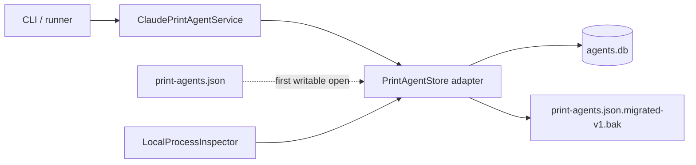

# Durable Agents SQLite Design

## Architecture Overview

`PrintAgentStore` remains the public adapter and owns row mapping, validation, migration import, and transactional state changes. `DatabaseConnection` owns SQLite configuration and schema migration. Process inspection and cwd canonicalization remain outside transactions; transactions reread state and apply conditional mutations.

## Data Model

`durable_agents` is one flattened row per durable agent:

- Identity: `id` primary key; case-insensitive unique `name`; unconstrained `provider`; `mode` defaulting to `print`; canonical `cwd`; unique `provider_session_id`.
- Lifecycle: constrained `state`, constrained `session_health`, created/updated timestamps, nullable last-active timestamp.
- Latest result: nullable constrained status, completion timestamp, exit code, and summary.
- Active run: unique token plus owner/provider PID and start-time identity, and run start timestamp.
- Integrity: running state requires every active field; non-running requires all active fields to be null.
- Indexes: state lookup and updated-desc/name-case-insensitive listing.

Migration metadata contains a durable-agent legacy-import marker. It is written in the same `BEGIN IMMEDIATE` transaction as imported rows so import eligibility and imported data cannot diverge.

## API Design

- Existing `PrintAgentStore` methods and `StoreLike` structural consumers stay unchanged.
- Options add `dbPath` and retain `filePath` for legacy import and injected-test path compatibility.
- `lockTimeoutMs`, `incompleteLockGraceMs`, and `mutationLockStaleMs` remain type-compatible but have no runtime effect and are deprecated.
- Domain errors continue to represent conflicts, busy ownership, lost tokens, invalid input, and storage failures.

## Data Flows

### First writable open

1. Open and migrate `agents.db` through migration 003.
2. Start `BEGIN IMMEDIATE` and check the import marker.
3. If unmarked legacy JSON exists, reject symlinks, parse version 1, validate every agent, and insert every row.
4. Write the marker and commit. On any error, roll back and leave JSON untouched.
5. After commit, rename JSON to `.migrated-v1.bak`.

### Ownership

- Acquire canonicalizes cwd and inspects candidate processes outside the transaction, then uses `BEGIN IMMEDIATE`, rereads the row, and conditionally updates exactly one eligible row with an atomic token and owner identity.
- Record-provider and complete use `UPDATE ... WHERE id = ? AND active_run_token = ?`; zero changes means ownership was lost.
- Reconciliation queries running rows, inspects processes, then CAS-updates using the observed token and start-time identity. A live owner or provider keeps the run busy.

### Readonly

Readonly construction requires an existing migrated database and skips directory creation, schema initialization, and write pragmas. Readonly `list()` maps rows only and never reconciles.

## Design Decisions

- A separate table isolates durable rows from the registry's dead-process pruning.
- Flattening matches the existing latest-result contract and avoids premature run-history scope.
- SQLite uniqueness and transactions replace lock directories and temp-file replacement.
- Application-layer provider validation avoids migrations when new providers arrive.
- No dual-write prevents split-brain state. The retained backup enables explicit export-based rollback.

Rejected alternatives are merging into `agents`, storing a whole JSON document in one row, adding `durable_runs`, introducing a repository abstraction, and retaining filesystem lock machinery.

## Non-Functional Requirements

- Transactions remain short; filesystem checks and process inspection occur outside them.
- WAL plus a 5-second busy timeout handle contention; acquisition contention maps to `PrintAgentBusyError`.
- Symlink-safe cwd binding and legacy-file checks prevent path substitution.
- Schema checks reject inconsistent active-run rows and invalid lifecycle/result values.
- Import and state transitions are atomic and recover cleanly on reopen.
