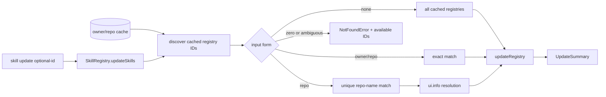

# System Design & Architecture

## Architecture Overview

The existing command and public method signatures stay unchanged. `SkillRegistry.updateSkills()` first discovers all cache candidates, then resolves the optional selector, then updates only selected candidates and derives the existing summary.

## Data Models and API

- Cached candidate: `{ path: string; id: string }`, where `id` is `owner/repo`.
- Public API remains `updateSkills(registryId?: string): Promise<UpdateSummary>`.
- Exact selectors match a full ID. Owner-less selectors compare against the substring after `/` and resolve only for one candidate.
- Failure details retain the requested `registryId`; the message appends `Available: <sorted IDs>.`.

## Component Breakdown

- `packages/cli/src/lib/SkillRegistry.ts`: candidate discovery, selector resolution, update loop, summary.
- `packages/cli/src/__tests__/lib/SkillRegistry.test.ts`: direct contract tests with a temporary home/cache and mocked Git boundary.
- `packages/cli/README.md`: all, exact, and shorthand usage.
- `CHANGELOG.md`: unreleased hardening entry following the current top-of-file convention.

## Design Decisions

- Discover before filtering so errors can enumerate all available candidates and shorthand can detect ambiguity.
- Sort available IDs for deterministic UX and assertions; update ordering may follow the same sorted list.
- Keep shorthand resolution local to cached candidates because the update operation cannot update an uncached registry.
- Inform only on successful shorthand resolution; exact IDs preserve existing output.
- Prefer real temporary directories with mocked `ensureGitInstalled`, `isGitRepository`, and `pullRepository` boundaries.

### Alternatives considered

- Merging configured registries was rejected because configuration does not guarantee a cache exists.
- Picking the first shorthand match was rejected because filesystem order is not a safe disambiguation rule.
- Moving resolution into the command was rejected because it would leave direct `SkillRegistry` callers with a different contract.

## Non-Functional Requirements

- Selection is linear in cached registry count and performs no additional network work.
- No cache contents are created, deleted, or rewritten by resolution.
- Errors occur before any registry pull for invalid or ambiguous selectors.
- Existing callers and `UpdateSummary` consumers remain source-compatible.
