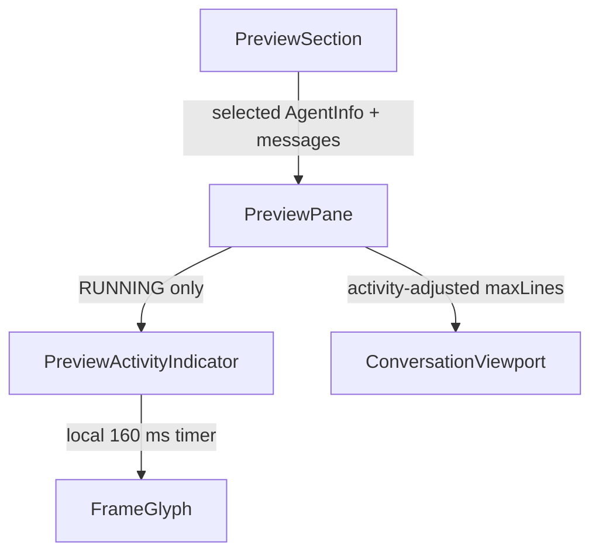

# System Design & Architecture

## Architecture Overview

`PreviewPane` derives activity from the selected `AgentInfo`, subtracts one line from the conversation budget while active, and mounts a bottom-row leaf after the flex-growing body. `PreviewActivityIndicator` alone owns frame state and its interval. Existing React/Ink primitives and console color tokens are reused.

## Data Models
**What data do we need to manage?**

- Activity is derived from `agent.status === AgentStatus.RUNNING`; no persistent model changes are required.
- Braille frames: `⠋⠙⠹⠸⠼⠴⠦⠧`. ASCII frames: `|/-\\`. Both are immutable fixed-width arrays.
- Pure helpers select the frame set from terminal capability and map an index modulo the selected frame count.

## API Design
**How do components communicate?**

- No external API, authentication, schema, or protocol changes.
- The leaf accepts `active` and owns presentation/timing. Terminal fallback is selected from `process.env.TERM === 'dumb'` through pure frame logic.
- `PreviewPaneProps` remains the public integration boundary; the selected agent already supplies status.

## Component Breakdown
**What are the major building blocks?**

- `PreviewActivityIndicator`: memoized leaf, local frame index, deterministic reset on activation, interval creation/cleanup, fixed-width glyph plus dim `working` label.
- `PreviewPane`: computes `active`, reserves one viewport line only while active, and mounts the leaf below conversation content.
- Pure frame helpers: independently cover fallback selection and modular frame lookup.
- Tests: focused leaf timer tests plus `PreviewPane` integration/regression tests using Vitest fake timers and Ink render utilities.

## Design Decisions
**Why did we choose this approach?**

- Option C was selected over static text, animated dots, and shimmer for clarity and terminal-native fit.
- The inactive row is reclaimed, accepting a one-line geometry change on status transition.
- Cadence is 160 ms. Reduced-motion behavior is deferred.
- Unicode is default; `TERM=dumb` is the only automatic ASCII fallback. An explicit capability setting is deferred.
- Activity continues during input-paused polling and represents last observed status.
- The activity row stays outside `buildPreviewRows`, row-count compensation, and viewport scroll state.

## Non-Functional Requirements
**How should the system perform?**

- Frame updates are limited to the leaf subtree; parent render counts and Markdown layout calls remain stable across ticks.
- At most one interval exists per mounted active preview and is cleared on deactivation or unmount.
- Frame ticks never invoke scroll clamping or alter conversation row identity.
- No new security surface or sensitive data handling is introduced.
