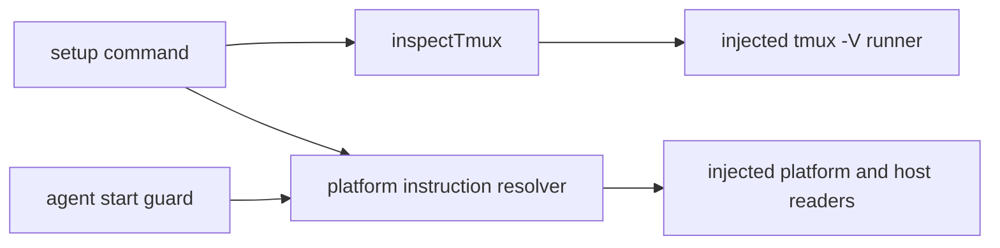

# Tmux Setup Prerequisite Design

`util/tmux.ts` owns a discriminated inspection result and fixed guidance recipes. Environment access is assembled by `createTmuxInspectionDeps`; tests inject every boundary. Setup checks once after option validation and before its service. Agent start resolves the same guidance only after `TmuxUnavailableError`.

`parseOsRelease` normalizes `ID` and `ID_LIKE` as data. No host-controlled value is interpolated into commands. `ENOENT` means missing; other failures remain distinct. Unknown systems fall back, while Nix, BSD, and native Windows are explicit punts and WSL is labeled as distro-local.
