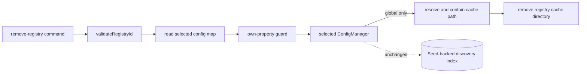

# Skill Registry Removal Design

## Architecture Overview



The command validates and guards the selected scope, while config managers persist the pure planner result. Project removal stops after config mutation. Global removal additionally deletes the contained registry cache path. The discovery index is intentionally unchanged because its seed contains unconfigured registries by design.

## Data Models

```ts
type SkillRegistryRemoveStatus = 'removed' | 'not-registered';
interface SkillRegistryRemoveMutation {
  registries: Record<string, string>;
  status: SkillRegistryRemoveStatus;
}
```

The planner tests own-property presence, copies the input, and omits only the selected ID.

## API Design

- `skill remove-registry <id> [-g|--global]`
- `planSkillRegistryRemove(registries, id)` is pure.
- Project/global config managers expose `removeSkillRegistry(id)`.
- `--global` resolves `~/.ai-devkit/skills/<id>`, verifies containment under the cache root, and recursively removes it.
- Missing selected-scope entries return the concise `try --global` error.

## Component Breakdown

| Component | Change |
|---|---|
| `util/skill-registry.ts` | Pure removal planner and types |
| `Config.ts`, `GlobalConfig.ts` | Scoped removal writers |
| `commands/skill.ts` | Scope guard and contained global cache deletion |
| Tests/docs | Behavior, exact copy, and follow-ups |

## Design Decisions

- Mutate only the selected scope.
- Do not clean the index: seed catalog entries are valid even without local registry configuration.
- Never use the network during removal.
- Protect the built-in ID explicitly; default sources are structurally protected by absence from user config maps.
- Preserve cache for project removal; delete the selected cached repository for global removal.
- Keep `remove-registry` paired with `add-registry`; defer registry-group migration.

## Non-Functional Requirements

- Work is constant-time apart from recursive global cache deletion.
- Writes retain existing config safety conventions.
- Invalid IDs cannot influence filesystem paths.
- Resolved cache targets must be strict descendants of `SKILL_CACHE_DIR`.
