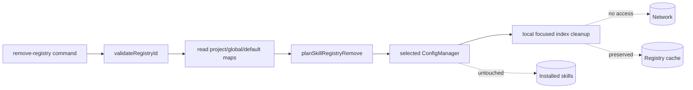

# Skill Registry Removal Design

## Architecture Overview



The command resolves precedence and messages. Config managers persist the pure planner result. `SkillIndex` performs a focused local inverse of registry indexing.

## Data Models

```ts
type SkillRegistryRemoveStatus = 'removed' | 'not-registered';
interface SkillRegistryRemoveMutation {
  registries: Record<string, string>;
  status: SkillRegistryRemoveStatus;
  removedUrl?: string;
}
```

The planner tests own-property presence, copies the input, and omits only the selected ID.

## API Design

- `skill remove-registry <id> [-g|--global]`
- `planSkillRegistryRemove(registries, id)` is pure.
- Project/global config managers expose `removeSkillRegistry(id)`.
- `SkillManager.removeSkillIndexForRegistry(id)` delegates to local filtering of `skills[].registry` and `meta.registryHeads[id]`.
- Exact output follows the approved exploration, including shadow reports and partial-success repair guidance.

## Component Breakdown

| Component | Change |
|---|---|
| `util/skill-registry.ts` | Pure removal planner and types |
| `Config.ts`, `GlobalConfig.ts` | Scoped removal writers |
| `SkillIndex.ts`, `SkillManager.ts` | Local focused index cleanup |
| `commands/skill.ts` | Command and scope/default protection |
| Tests/docs | Behavior, exact copy, and follow-ups |

## Design Decisions

- Mutate only the selected scope.
- Config plus focused index cleanup avoids stale search results.
- Never use the network; a lower source repopulates on later refresh.
- Built-in/default sources are read-only, while configured shadows remain removable.
- Preserve cache to protect symlink-backed installs across projects.
- Keep `remove-registry` paired with `add-registry`; defer registry-group migration.
- Defer `--purge-cache`; a future version must require `--yes` in non-TTY use, protect effective/built-in sources, and never remove installed skills.

## Non-Functional Requirements

- Local complexity is linear in index size.
- Writes retain existing config/index safety conventions.
- Invalid IDs cannot influence filesystem paths.
- Failures distinguish pre-write rejection from repairable post-write index failure.
