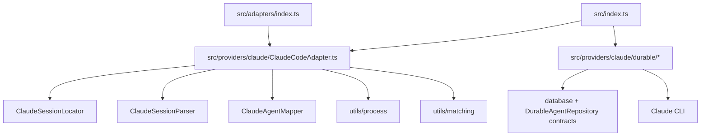

# Claude Provider Refactor Design

## Architecture Overview

The refactor introduces a Claude provider-local implementation area while preserving current package-root adapter and durable exports.



The public package shape remains stable. The internal shape changes from feature/top-level scattered Claude files to provider-local ownership:

```text
packages/agent-manager/src/
  providers/
    claude/
      ClaudeCodeAdapter.ts
      ClaudeSessionLocator.ts
      ClaudeSessionParser.ts
      ClaudeAgentMapper.ts
      types.ts
      durable/
        ClaudeCliProbe.ts
        ClaudePrintRunner.ts
        ClaudePrintAgentService.ts
```

## Data Models

No persisted schema changes are introduced.

Provider-local transient types:

- `ClaudePidFileEntry`: parsed shape of `~/.claude/sessions/<pid>.json`.
- `ClaudeDirectMatch`: process, session file, optional live status, optional waiting reason.
- `ClaudeLocatedSessionFile`: existing `SessionFile` plus Claude-resolved cwd semantics.
- `ClaudeAgentMappingInput`: parsed Claude session, process, located session file, optional live info.

Existing public models remain unchanged:

- `AgentInfo`
- `ProcessInfo`
- `ConversationMessage`
- `SessionSummary`
- `DurableAgent`
- `CapacityReport`

## API Design

### Public API

No public package-root API change.

Existing exports stay valid:

```ts
export { ClaudeCodeAdapter } from './providers/claude/ClaudeCodeAdapter.js';
export { ClaudeCliProbe } from './providers/claude/durable/ClaudeCliProbe.js';
export { ClaudePrintRunner } from './providers/claude/durable/ClaudePrintRunner.js';
export { ClaudePrintAgentService } from './providers/claude/durable/ClaudePrintAgentService.js';
```

The implementation now exports these directly from `src/providers/claude/...` through `src/index.ts` and `src/adapters/index.ts`. Thin path-level wrapper files were removed because they added no behavior or contract value.

### Internal Interfaces

The first implementation should prefer small concrete classes/functions over broad interfaces:

```ts
class ClaudeSessionLocator {
  matchRunningProcesses(processes: ProcessInfo[]): ClaudeMatchSet;
  discoverHistoricalSessionFiles(): Array<{ filePath: string; defaultCwd: string }>;
  getProjectDir(cwd: string): string;
}

class ClaudeAgentMapper {
  mapSessionToAgent(input: ClaudeAgentMappingInput): AgentInfo;
  mapProcessOnlyAgent(processInfo: ProcessInfo): AgentInfo;
}
```

Avoid introducing a cross-provider `Provider` or `CapabilityProvider` public abstraction in this feature. If needed later, it should be based on multiple real provider capability implementations.

## Component Breakdown

### `providers/claude/ClaudeCodeAdapter.ts`

Keeps the `AgentAdapter` implementation and orchestrates the flow:

1. Capture/filter Claude processes.
2. Ask `ClaudeSessionLocator` for direct and legacy matches.
3. Parse matched session files with `ClaudeSessionParser`.
4. Map sessions/processes to `AgentInfo` with `ClaudeAgentMapper`.
5. Delegate conversation and historical session listing.

### `providers/claude/ClaudeSessionLocator.ts`

Owns Claude filesystem/session location rules:

- Claude project path encoding.
- `claude --resume <uuid>` extraction.
- PID-file read and stale guard.
- PID-file live status mapping.
- Direct match construction.
- Legacy CWD + birthtime discovery setup.
- Historical session candidate walking.

It may still call shared utilities such as `batchGetSessionFileBirthtimes`, `safeStat`, `safeReaddir`, `listJsonl`, and `matchProcessesToSessions`.

### `providers/claude/ClaudeSessionParser.ts`

Moves from `utils/` without logic changes. It remains responsible for Claude JSONL parsing, conversation extraction, noise filtering, and JSONL-derived status.

### `providers/claude/ClaudeAgentMapper.ts`

Owns conversion from Claude provider data to `AgentInfo`:

- live PID status precedence;
- waiting reason summary decoration;
- process-only fallback representation;
- generated agent names;
- project path and session file path assignment.

### `providers/claude/durable/*`

Provider-local home for Claude print-mode execution mechanics. Existing `src/durable/*` files should stay as compatibility exports unless planning decides the move is too broad for the first implementation pass.

## Design Decisions

- **Provider-local first, generic later.** The chosen structure improves locality without inventing abstractions before there are multiple implementations.
- **Compatibility exports stay.** Public and existing internal import paths are kept stable while implementation files move.
- **Move/extract before behavior change.** The initial implementation should avoid modifying matching/status/listing behavior.
- **Capacity and durable are capabilities.** Their current top-level facades can remain public, but provider-specific implementation should live with the provider over time.
- **Claude first.** Codex capacity, Pi sessions, Gemini sessions, and other providers are explicitly deferred.

## Non-Functional Requirements

- **Reliability:** All existing Claude interactive and durable behavior must remain covered by tests.
- **Performance:** Session discovery should preserve existing batching behavior and should not add broad directory scans to `detectAgents()`.
- **Security:** Prompt content, provider output, and credentials handling remain unchanged. Durable prompt stdin behavior and bounded result sanitization remain intact.
- **Maintainability:** New modules should have one clear responsibility and avoid one-file directories unless they are compatibility wrappers.
- **Deletion cost:** Compatibility wrappers should be easy to remove in a future breaking cleanup, but they must stay for this feature.
