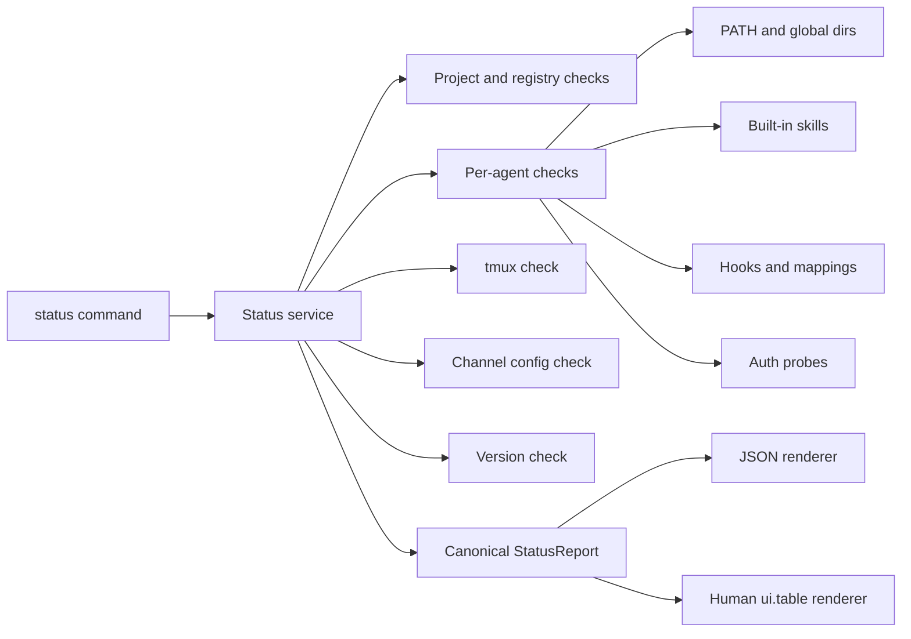

# Design: AI DevKit Status Command

## Architecture Overview

`ai-devkit status` is a CLI-owned diagnostic aggregator. It reads local setup state through injected filesystem and process boundaries, reuses existing authoritative constants and the Codex capacity/auth probe, derives normalized check statuses, and then sends one canonical report to either JSON or human rendering.



### Module layout

- `packages/cli/src/commands/status.ts`
  - Registers `status` and `-j, --json`.
  - Calls the status service through `withErrorHandler`.
  - Contains no check logic.
- `packages/cli/src/services/status/status.service.ts`
  - Orchestrates all independent checks.
  - Defines injectable runtime dependencies for filesystem, executable, subprocess, npm, clock, and Codex auth boundaries.
  - Aggregates leaf statuses and counts.
- `packages/cli/src/services/status/status.types.ts`
  - Defines the canonical report and nested check contracts.
  - Exports `CheckStatus = 'pass' | 'warn' | 'fail'` and `AuthState = 'authenticated' | 'unauthenticated' | 'unknown'`.
- `packages/cli/src/services/status/status.helpers.ts`
  - Small pure helpers for status aggregation, JSON-record validation, safe path display, asset comparison, and secret-safe errors.
- `packages/cli/src/commands/status/render.ts`
  - Emits exact JSON with `JSON.stringify(report, null, 2)`.
  - Renders the same report for humans using shared `ui.text`, `ui.table`, and established chalk conventions.
- `packages/cli/src/__tests__/services/status/status.service.test.ts`
  - Unit tests with isolated temporary homes/projects and injected process/network probes.
- `packages/cli/src/__tests__/commands/status.test.ts`
  - Registration, JSON contract, rendering, and nonfatal multi-failure tests.

No new agent-manager abstraction is planned. The existing `getCodexCapacityReport` API already provides the required safe Codex authentication signal. Status maps only its `authenticated` field and discards capacity windows, credits, and availability.

## Check-to-Source Mapping

| Requirement | Implementation | Authoritative source |
|---|---|---|
| FR-01 executables | Resolve `codex`, `pi`, `claude` by scanning `PATH` for executable files | Agent command names from `AGENTS` in `@ai-devkit/agent-manager` |
| FR-02 global dirs | `fs.access` against `~/.codex`, `~/.pi`, `~/.claude` | Setup definitions in `setup.service.ts` |
| FR-03 built-in skills | Compare `BUILTIN_SKILL_NAMES` with `<global-root>/<name>/SKILL.md` | `constants.ts` and `ENVIRONMENT_DEFINITIONS` |
| FR-04 Codex hook | Compare installed script bytes with bundled asset; parse `hooks.json`; validate mapping record | CLI setup assets and `CodexAdapter` mapping path |
| FR-04 Claude hook | Compare installed script bytes with bundled asset; parse `settings.json` registration | CLI setup assets and setup service command constant |
| FR-04 Pi tracker | Use read-only `pi list` output to detect package; validate sessions registry | Setup service install package and `PiAdapter` tracker path |
| FR-05 auth | Codex capacity probe auth field; `claude auth status --json`; structural Pi auth file check | Existing Codex probe and provider-owned local commands/files |
| FR-06 tmux | Resolve executable and run `tmux -V` | Existing `TmuxManager.isAvailable` behavior |
| FR-07 channels | Read raw `~/.ai-devkit/channels.json` and validate supported entry shapes locally | Channel connector types and connection-time credential rules |
| FR-08 registries | Parse project and global config independently and normalize string records | `ConfigManager`, `GlobalConfigManager`, `filterStringRecord` |
| FR-09 versions | Installed CLI package metadata plus injected npm-version reader using `npm view ai-devkit version` | CLI `package.json` and npm registry |
| FR-10 project config | Parse `.ai-devkit.json`; validate object shape and environment codes | `DevKitConfig` and `isValidEnvironmentCode` |

## Data Model

```ts
type CheckStatus = 'pass' | 'warn' | 'fail';
type AuthState = 'authenticated' | 'unauthenticated' | 'unknown';

interface StatusReport {
  generatedAt: string;
  overall: CheckStatus;
  aiDevkit: VersionCheck;
  project: { cwd: string; config: ProjectConfigCheck };
  agents: {
    codex: AgentStatusCheck;
    pi: AgentStatusCheck;
    claude: AgentStatusCheck;
  };
  tmux: TmuxCheck;
  registries: RegistriesCheck;
  channels: ChannelsCheck;
  checks: { passed: number; warnings: number; failed: number };
}
```

### Per-agent contract

Each agent contains:

- `executable`: command, resolved path or `null`, status, safe errors.
- `globalConfig`: display path, presence, readability, status.
- `auth`: `state`, evidence source, status, safe errors.
- `builtInSkills`: display path, required count, present count, missing array, status.
- `hooks`: agent-specific nested checks plus an aggregate status.
- `status`: worst status across the agent's checks.

Agent-specific hook data remains structurally distinct:

- Codex: mapping script, registration, and mapping file health.
- Claude: prompt script and registration.
- Pi: tracker registration and sessions registry health.

### Status aggregation

Statuses are ordered `pass < warn < fail`. Every leaf check is counted once. Aggregate objects use the worst child status but are not counted again, preventing inflated totals. `overall` is the worst leaf status.

Absence semantics are explicit:

- Missing required executable, global directory, required built-in skill, or registered hook: `fail`.
- Missing Codex/Pi session mapping registry before any session: `warn`.
- Npm lookup unavailable: `warn` with `latestVersion` and `updateAvailable` set to `null`.
- Missing project config: reportable `fail`, not a thrown error.
- Pi auth file that is structurally valid: `unknown` auth with `warn`, because presence does not prove credential validity.

## API and Command Design

```text
ai-devkit status
ai-devkit status --json
ai-devkit status -j
```

Registration follows other top-level commands:

```ts
registerStatusCommand(program);
```

The service API is:

```ts
getStatusReport(options?: StatusServiceOptions): Promise<StatusReport>
```

`StatusServiceOptions` accepts `cwd`, `homeDir`, `path`, `now`, and dependency overrides. Production defaults use Node APIs; tests supply controlled implementations. The report never contains dependency objects or raw command output.

### Canonical JSON shape

```json
{
  "generatedAt": "2026-08-23T00:00:00.000Z",
  "overall": "warn",
  "aiDevkit": {
    "installedVersion": "0.55.0",
    "latestVersion": null,
    "updateAvailable": null,
    "latestVersionSource": "npm",
    "status": "warn",
    "errors": ["npm registry unavailable"]
  },
  "project": {
    "cwd": "/repo",
    "config": {
      "path": "/repo/.ai-devkit.json",
      "present": true,
      "valid": true,
      "version": "0.55.0",
      "environments": ["codex"],
      "errors": [],
      "status": "pass"
    }
  },
  "agents": {
    "codex": {},
    "pi": {},
    "claude": {}
  },
  "tmux": {},
  "registries": {},
  "channels": {},
  "checks": { "passed": 0, "warnings": 0, "failed": 0 }
}
```

Arrays stay present when empty. Meaningfully unavailable scalar values are `null`. Paths are absolute for the current project and `~/...` display paths for user-global state. The report has no schema-version field until a real compatibility migration requires one.

## Component Behavior

### Independent probe orchestration

The service starts logically independent checks together with `Promise.all`. Each check catches expected I/O, parse, subprocess, and network errors at its own boundary and returns a finding. Only programmer errors that prevent report construction escape to `withErrorHandler`.

### Files and hook health

- File reads are bounded to known configuration, hook, auth-structure, and registry paths.
- Hook equality uses exact bytes against packaged assets; hook code is never executed.
- Registration parsing accepts unrelated provider settings while requiring the exact AI DevKit command entry.
- Mapping validators count entries and stale paths without returning PID keys, mapped file names, or contents.

### Authentication

- Codex calls `getCodexCapacityReport` and maps `true`, `false`, or `null` to the three auth states. Capacity fields are ignored.
- Claude executes only `claude auth status --json`, applies a timeout, parses the documented status field defensively, and replaces all raw failures with fixed safe messages.
- Pi reads and structurally validates `~/.pi/agent/auth.json`; it never returns keys or values and never claims authenticated from presence alone.

### Channels

The status service does not use `ChannelConfigRepository.getConfig()` because that method intentionally converts missing and corrupt files into the same empty configuration. Status needs to distinguish those states, so it reads the known repository path directly and validates a secret-free projection. Telegram and Slack readiness follow current connection-time field requirements. Unsupported entry types fail schema validation without echoing their configuration.

### Human rendering

Human output is a projection of `StatusReport`, not a second execution path:

- `ui.text` introduces sections.
- `ui.table` renders compact rows for AI DevKit/project, agents, tmux, registries, and channels.
- `chalk.green`, `chalk.yellow`, and `chalk.red` represent pass, warn, and fail; identifiers use cyan and supporting evidence uses dim text, matching capacity and agent-list conventions.
- Missing built-ins and safe errors appear as short follow-up lines.
- No renderer receives raw secrets or raw provider output.

## Design Decisions

1. **CLI-owned aggregator rather than agent-manager-owned status framework.** Most checks concern CLI assets and configuration. Only the existing Codex auth/capacity boundary is shared. This keeps deletion cost low and avoids a speculative provider abstraction.
2. **Canonical report first, render second.** Both output modes consume the same object, preventing behavior drift and making agent-manager parsing deterministic.
3. **Injected boundaries rather than global mocks.** Tests can prove missing files, malformed JSON, command failures, and npm failures without reading real user state or accessing networks.
4. **Direct channel config read.** Required to distinguish absent and malformed files; the operational repository's fallback behavior remains unchanged.
5. **Fixed safe errors.** Raw provider and subprocess errors are never emitted because they may contain credentials or command output.
6. **No automatic remediation.** The service does not reuse setup writers or registry fetchers; it only reads and reports.

## Alternatives Rejected

- Calling and parsing existing CLI command output: duplicates rendering contracts and makes failures harder to isolate.
- Putting all checks in agent-manager: couples project config, channels, npm, and CLI assets to the agent runtime package.
- Generic provider plugin/check registry: no current caller beyond three fixed agents.
- Live auth validation for Pi: no verified read-only provider probe exists; structural evidence remains `unknown`.
- Live channel credential validation: violates the approved local-only readiness boundary.
- Returning raw capacity results for Codex: explicitly outside scope.

## Non-Functional Requirements

### Security

- Never serialize credential values, file contents, session identifiers, mapping keys, raw auth responses, or raw subprocess/network errors.
- Use fixed error codes/messages at sensitive boundaries.
- Never execute installed hook scripts.
- Apply short timeouts to Claude auth, Pi package listing, tmux, and npm subprocesses.

### Reliability

- Every independent check completes even when siblings fail.
- Missing or malformed user state produces a report rather than an exception.
- The report is deterministic under injected dependencies and fixed time.

### Performance

- Filesystem checks may run concurrently.
- External subprocesses are bounded and run concurrently where independent.
- No registry fetch, skill-index scan, session traversal, channel network call, or live-agent discovery occurs.

### Compatibility and rollout

- The change adds a top-level command without altering existing command behavior or public package types.
- Existing capacity, setup, channel, skill, and agent commands remain authoritative for their detailed operations.
- The first release establishes the JSON contract through unit and CLI tests; future incompatible changes require explicit compatibility design.

## Requirements Coverage

FR-01 through FR-10 map directly to the check table and service components above. AC-11 and AC-12 are covered by canonical aggregation and isolated probes; AC-13 is covered by safe projections and secret-sentinel tests; AC-14 is covered by dependency assertions proving forbidden live/mutating APIs are never called.

## Questions & Open Items

- None. The architecture, data contract, source mapping, rendering approach, security boundary, and rejected alternatives are resolved for planning.
