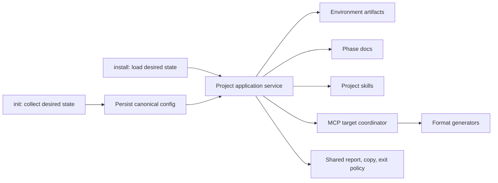

# Complete Project Initialization Design

## Architecture



`init` owns the first-run outcome; `install` reconciles existing intent. Neither CLI handler calls the other.

## Internal Contract

```ts
type ApplicationStatus = 'installed' | 'matched' | 'skipped' | 'conflict' | 'failed';
interface ApplicationItemResult {
  section: 'environment' | 'phase' | 'skill' | 'mcpServer';
  name: string;
  target?: string;
  status: ApplicationStatus;
  message?: string;
}
```

The report is complete only without `conflict` or `failed`. Shared rendering and exit policy consume this contract.

## Apply Order and Components

1. Validate desired input.
2. Persist `.ai-devkit.json`, registries, normalized skills, and MCP declarations.
3. Apply environment templates.
4. Create missing phases; overwrite only with approval or `--overwrite`.
5. Apply project skills once.
6. Group MCP environments by physical target and apply each once.
7. Render one report and exit truthfully.

Refactor `reconcileAndInstall` into this boundary. MCP generators retain format conversion and additive merge but expose target identity and parse errors. Claude/GitHub share a compatible `.mcp.json` writer. Existing unrelated servers and top-level keys remain preserved.

## Reliability, Security, and Trade-offs

Desired state is saved before side effects, allowing `install` to resume. Malformed MCP config fails without a write. Sequential application prevents concurrent target writes. No new shell execution, destructive MCP synchronization, data layer, flag, or speculative abstraction is introduced.

Rejected alternatives: an MCP-only init path duplicates orchestration; mandatory `init && install` adds first-run load; calling `installCommand` from `initCommand` couples UI handlers and repeats work.
