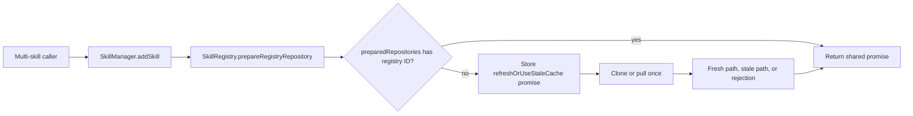

# Registry preparation memoization design

## Architecture



`SkillManager` remains the skill orchestrator. `SkillRegistry` owns repository state, refresh/fallback behavior, memoization, and its UX messages.

## Data Model and API

```ts
private readonly preparedRepositories = new Map<string, Promise<string>>();

prepareRegistryRepository(registryId: string, gitUrl?: string): Promise<string>;
private refreshOrUseStaleCache(registryId: string, gitUrl?: string): Promise<string>;
```

Public signatures do not change. The map key is registry ID only. The promise is inserted before it is awaited so sequential and concurrent callers share the same operation and outcome.

## Outcomes and Freshness

- Refresh succeeds: reuse the resolved repository path for later skills.
- Refresh fails with cache: resolve once to the cached path, warn once, and do not retry in that instance.
- Refresh fails without cache: retain and reuse the rejected promise, preventing per-skill retries.
- Cached path is not Git: reuse the as-is result and message once.
- Different registry IDs: maintain independent promises and outcomes.
- New `SkillRegistry` instance: starts empty and performs a fresh attempt.

No TTL is used. A command installs from one coherent registry snapshot, while a later command creates a new manager/registry and refreshes again.

## UX

Remove `Checking local cache...` from `SkillManager`. On the first preparation only, `SkillRegistry` emits:

- Start: `Refreshing registry <id>...`
- Success: `Registry <id> refreshed.`
- Stale fallback: `Could not refresh registry <id>: <error>. Using cached registry contents for this run.`

Clone and non-Git details may remain, but no preparation messages repeat for memoized calls.

## Alternatives Rejected

- Batch `addSkills`: larger caller and result-contract change with no current need beyond deduplication.
- Command preparation pass: leaks cache coordination across multiple command/service callers.
- TTL or process-global state: changes cross-command freshness and complicates URLs, tests, and retries.
- Prepared handles or split public APIs: adds a temporal protocol without an independent caller.

## Non-functional Considerations

- Performance: repository network/disk work is O(unique registries), not O(skills).
- Reliability: all skills from one registry use one consistent snapshot and fallback decision.
- Security: registry/skill validation and Git URL handling remain unchanged.
- Removal cost: delete one map and inline one private helper to restore prior behavior.
