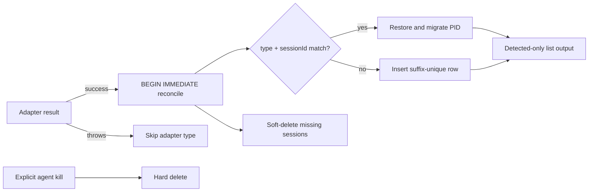

# Session-Identity Soft-Delete Design

## Architecture



Adapter output is observer-relative truth. Soft deletion makes a blind
observer's conclusion reversible and self-healing, while `deleted_at` records
when the observer stopped seeing a session for incident forensics.

## Schema and identity

Migration `005_interactive_agent_soft_delete.sql` is additive:

```sql
ALTER TABLE agents ADD COLUMN deleted_at TEXT;
CREATE INDEX idx_agents_identity ON agents(type, session_id);
```

The logical key is `(type, session_id)`. The legacy physical primary key
`(type,pid)` remains because the approved migration is additive. When a new
session reuses an occupied PID, reconciliation moves the displaced soft-deleted
row to a reserved negative PID tombstone before inserting the live row. Its
logical identity and metadata remain restorable; a later observation migrates
it back to its detected positive PID.

## Transaction algorithm

Within one immediate transaction, indexed session lookup restores matches,
PID conflicts are tombstoned and soft-deleted, new names are suffix-uniquified,
and rows absent from successful adapter types receive `deleted_at`. Failed
adapter types are excluded. Statements are prepared/batched within the single
transaction; there are no per-row transactions or liveness probes.

`durable_agents` uses separate repository and lifecycle code and is untouched.
