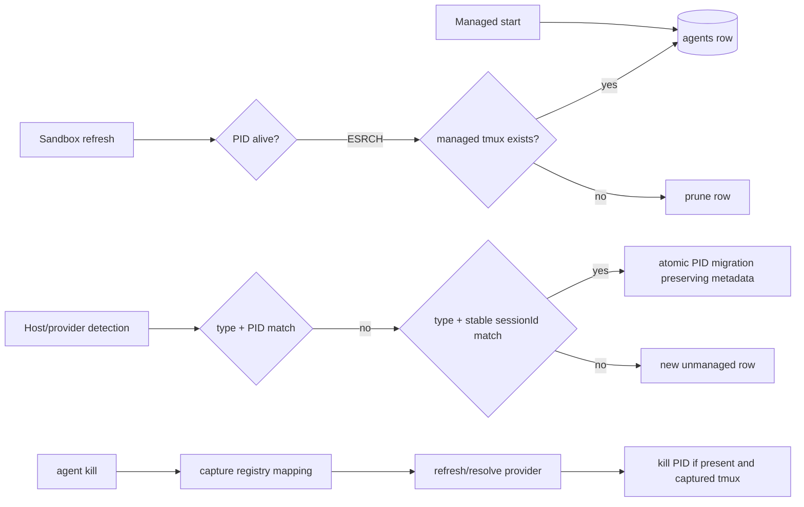

# System Design & Architecture

## Architecture Overview

`AgentRegistry` owns liveness and continuity. `AgentManager` resolves detected
agents against a registry snapshot. The CLI kill flow captures managed metadata
before detection can mutate it.

## Data Models
**What data do we need to manage?**

- No schema migration is required. Interactive rows keep `(type, pid)` as the
  primary key and carry `name`, `tmux_session`, and `session_id`.
- Stable-session matching selects an existing row only when type and non-empty,
  non-synthetic session ID match uniquely.
- Migration deletes the superseded identity and inserts/updates the new identity
  in one transaction.
- `durable_agents` remains separate and untouched.

## API Design
**How do components communicate?**

- Extend `AgentRegistryOptions` with an injectable managed-session liveness probe.
- Add registry lookup by stable provider session identity and use it during
  `AgentManager.listAgents()` snapshot reconciliation.
- Extend kill orchestration inputs so a registry entry captured before refresh
  can be supplied without a second lossy lookup.

## Component Breakdown
**What are the major building blocks?**

- `AgentRegistry`: tmux-aware prune decision and atomic identity migration.
- `AgentManager`: PID-first, stable-session-second continuity matching.
- agent CLI/service: capture-first kill resolution and cleanup.
- `TmuxManager`: existing session-existence and kill operations; no shell
  interpolation.

## Design Decisions
**Why did we choose this approach?**

- Prefer confirming managed tmux existence over skipping all managed-row pruning;
  this retains cleanup once both PID and session are gone.
- Keep PID as the primary identity and treat session ID as a guarded continuity
  key, avoiding a database migration.
- Do not match by cwd or generated name because either can identify multiple
  agents.
- Do not use PID rollover as the explanation for the live incident; it is a
  separately reproduced defect covered by the same continuity layer.

## Non-Functional Requirements
**How should the system perform?**

- Avoid tmux probes for unmanaged rows and live PIDs.
- Invoke tmux without a shell and pass the session name as an argument.
- Ambiguous session-ID matches fail closed and create an unmanaged row rather
  than stealing metadata.
- Registry mutation remains transactional.
