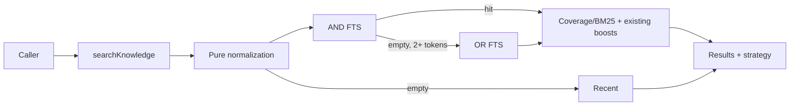

# Design

## Contracts
No schema change. `SearchKnowledgeResult` gains `strategy: 'strict' | 'broad' | 'recent'`. Raw candidates gain `token_coverage` in `0..1`; strict candidates use 1. Pure exported builders remain the eval seam, without a provider class, registry, flag, or speculative semantic interface.

## Components
- Normalize Unicode input into safe alphanumeric technical segments; punctuation and separators become boundaries. Compare lowercased tokens against a small stopword set, remove one-character tokens, and deduplicate in order.
- Quote each term and place prefix `*` outside the quote. `buildFtsQuery` retains implicit AND.
- A pure broad builder joins the same terms with `OR`. Broad SQL computes per-row matched-token coverage and orders coverage descending, BM25 ascending before a bounded limit.
- The handler uses recent items only for no searchable tokens, executes strict first, broad only after empty strict with 2+ tokens, applies one final rank/top-k pass, and does not catch database errors.

## Decisions
Staging preserves precision while improving recall. Coverage prevents one common term from dominating broad search. The internal candidate multiplier serves the current top-k caller and is not a flag. Stopwords alone, OR-only, best-single-token, custom tokenizers, synonyms, and embeddings are rejected for this scope.

## Non-functional requirements
No network/dependency/migration. Queries stay parameterized. Candidate work is bounded for the existing 50 ms target. The only behavioral incompatibility is intentional: hidden database failures now surface.
