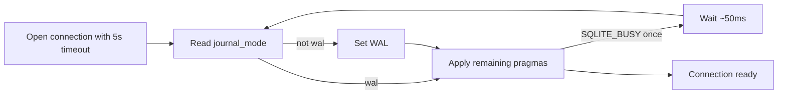

# Design

Each package keeps its local connection class and existing pragma order after WAL. `configure()` delegates to a single-attempt sequence and catches only `SQLITE_BUSY`; it waits synchronously because `better-sqlite3` and the constructors are synchronous, then retries the whole idempotent sequence once. Other errors propagate immediately, and a second busy error propagates.

Reading `journal_mode` does not initiate a transition. Already-WAL and readonly already-WAL connections therefore skip the write-oriented mode-set. Constructor `timeout: 5000` arms SQLite's handler before configuration begins.

Alternatives rejected: only moving `busy_timeout` leaves the repeated mode transition; unbounded retries hide persistent lock problems; a shared abstraction would broaden this small fix and package coupling.
