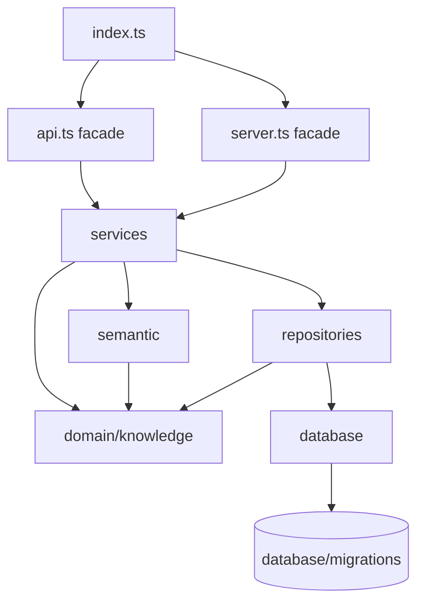

# System Design & Architecture

## Architecture Overview
**What is the high-level system structure?**



The refactor keeps the current package as one deployable unit and changes only internal organization. The target layering is:

- Root facades: `index.ts`, `api.ts`, `server.ts` keep public compatibility and adapt external callers to services.
- `services/`: business workflows and orchestration for store, update, list, summary, lexical search, hybrid search, and semantic maintenance.
- `repositories/`: SQL queries and persisted row reads/writes against the SQLite schema.
- `database/`: connection singleton, pragmas, schema initialization, migration discovery, reset, and exported database utilities.
- `domain/knowledge/`: knowledge types, input validation, normalization, row-to-DTO mapping, persisted tag parsing, and memory-specific errors.
- `semantic/`: optional semantic infrastructure: config, model manifest/cache/download, local embedder, vector serialization, cosine similarity, and fusion primitives.

## Data Models
**What data do we need to manage?**

Persisted schema remains unchanged:

- `knowledge`: id, title, content, tags JSON, scope, normalized title, content hash, timestamps, nullable embedding BLOB, nullable embedding version.
- `knowledge_fts`: FTS5 virtual table synchronized by existing triggers.
- SQLite `user_version`: migration version.

Public DTOs remain unchanged:

- `KnowledgeItem`
- `StoreKnowledgeInput` / `StoreKnowledgeResult`
- `UpdateKnowledgeInput` / `UpdateKnowledgeResult`
- `SearchKnowledgeInput` / `SearchKnowledgeResult`
- `ListKnowledgeInput` / `ListKnowledgeResult`
- `KnowledgeSummaryResult`
- `SearchRetrievalExplanation`
- `SemanticSearchStatus`

Internal row types can move under `domain/knowledge/types.ts`, but consumers must still be able to import public types from `@ai-devkit/memory`.

## API Design
**How do components communicate?**

External contracts stay stable:

- Package exports:
  - `@ai-devkit/memory`
  - `@ai-devkit/memory/api`
- Binary:
  - `ai-devkit-memory`
- MCP tools:
  - `memory_storeKnowledge`
  - `memory_updateKnowledge`
  - `memory_searchKnowledge`
  - deprecated aliases `memory.storeKnowledge`, `memory.updateKnowledge`, `memory.searchKnowledge`
- CLI/library command helpers:
  - `memoryStoreCommand`
  - `memoryUpdateCommand`
  - `memorySearchCommand`
  - `memorySearchCommandAsync`
  - `memoryStoreCommandAsync`
  - `memoryUpdateCommandAsync`
  - `memoryListCommand`
  - `memorySummaryCommand`
  - `memorySemanticStatusCommand`
  - `memoryDownloadSemanticCommand`
  - `memoryReembedCommand`

Internal interfaces are function-first, not class/interface-heavy:

- Repositories export functions that accept the current `DatabaseConnection` or use the existing singleton consistently.
- Services own workflow decisions: validation, normalization, duplicate policy, semantic fallback, embedding invalidation, and result assembly.
- Root facades own option parsing and database open/close lifecycle for command helpers.

## Component Breakdown
**What are the major building blocks?**

Target source tree:

```text
packages/memory/src/
  index.ts
  api.ts
  server.ts

  database/
    connection.ts
    schema.ts
    migrations/
      001_initial.sql
      002_semantic_embeddings.sql
    index.ts

  repositories/
    knowledge.repository.ts
    search.repository.ts
    semantic.repository.ts

  services/
    config.service.ts
    knowledge.service.ts
    search.service.ts
    semantic.service.ts

  domain/
    knowledge/
      types.ts
      normalize.ts
      validate.ts
      mapping.ts
      errors.ts

  semantic/
    model.ts
    embedder.ts
    embeddings.ts
```

Repository responsibilities:

- `knowledge.repository.ts`: insert/update/read/list/summary rows and duplicate lookup queries.
- `search.repository.ts`: strict FTS query, broad FTS query, and recent fallback query.
- `semantic.repository.ts`: embedding status counts, eligible semantic rows, embedding writes, and backfill row reads.

Service responsibilities:

- `knowledge.service.ts`: `storeKnowledge`, `updateKnowledge`, `listKnowledge`, `getKnowledgeSummary`.
- `search.service.ts`: `searchKnowledge` lexical orchestration and ranking.
- `semantic.service.ts`: `searchKnowledgeHybrid`, semantic-aware store/update, status/download, and reembed orchestration.

## Design Decisions
**Why did we choose this approach?**

- Layered structure over feature folders: the package has one main domain but several infrastructure concerns. Layers make database, service, semantic runtime, and external adapters easier to reason about.
- `domain/knowledge/` rather than flat `domain/`: keeps the domain folder concrete today and leaves room for future domains.
- Separate `semantic/` outside domain: semantic retrieval depends on model cache, downloads, ONNX/tokenizers, vectors, and runtime fallback; those are not pure knowledge-domain rules.
- No repository interfaces yet: a second storage backend does not exist, so interfaces would add ceremony without reducing coupling.
- Move and preserve behavior first, simplify second: file moves should be reviewable independently from any logic cleanup.
- Keep database singleton in the first refactor: changing lifecycle and structure together would make regressions harder to diagnose.
- Migrate tests with the relevant slices: tests should describe the new layer boundaries, but public compatibility tests remain at root/API level.

Alternatives considered:

- Keep current `handlers/` and just add helpers: less churn, but it leaves ownership unclear as semantic/search/storage grows.
- Full clean architecture with adapters/use-cases/entities/interfaces: clearer theory, but too heavy for this package and likely to create pass-through wrappers.
- Domain-first folders like `knowledge/`, `search/`, `semantic/`: simpler, but the user prefers scalable layer names and the package already has natural repository/service/database boundaries.

## Non-Functional Requirements
**How should the system perform?**

- Search, store, and update performance should remain within existing behavior; no extra database round trips should be added unless they replace duplicated existing work.
- Semantic search must retain the `MAX_SEMANTIC_CORPUS` safety cap and fail-open behavior.
- Model downloads must remain HTTPS with pinned checksum and size validation.
- SQLite WAL, busy timeout, synchronous mode, and migration behavior must remain unchanged.
- The final organization must reduce reader load: a maintainer should know whether to edit repository, service, domain, semantic, or facade code from the nature of the change.
