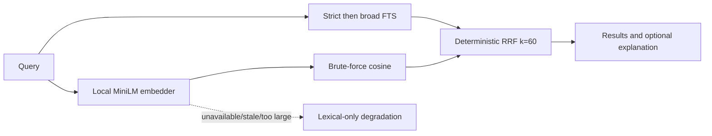

# System Design & Architecture

## Architecture Overview

**What is the high-level system structure?**

- Key components and their responsibilities
  - `services/config.ts` (`readSemanticConfig`) — reads `memory.semantic` from `.ai-devkit.json` for the MCP server process; defaults to `false` on any parse/read failure.
  - `services/model.ts` — pins model identity/revision/checksums (`MODEL_ID`, `MODEL_REVISION`, `MODEL_FILES`), resolves the on-disk cache directory, verifies file integrity (`inspectModelFiles`), and performs the checksummed atomic download (`ensureModelFiles`).
  - `services/embedder.ts` — loads the tokenizer + ONNX session once per process (`getDefaultLocalEmbedder`) and exposes `embed`/`embedMany`; mean-pools and L2-normalizes the model's token-level output into a single vector.
  - `services/semantic.ts` — pure retrieval primitives: embedding text construction, BLOB (de)serialization, cosine similarity, and reciprocal-rank fusion (`fuseSearchResults`).
  - `handlers/semantic-search.ts` (`searchKnowledgeHybrid`) — orchestrates lexical search + semantic candidate scan + fusion, and decides retrieval mode/status per call.
  - `handlers/semantic-maintenance.ts` — semantic-aware store/update (write path), `reembedKnowledge` (resumable backfill), and `getSemanticStatus`/`downloadSemanticModel` (operator commands).
  - `server.ts` / `api.ts` — read the config flag once per process/command and route to the semantic-aware or plain lexical handler; the CLI (`packages/cli/src/commands/memory.ts`) reads the same flag via `ConfigManager.getMemorySemanticEnabled()`.
- Technology stack choices and rationale
  - `onnxruntime-web` (WASM execution provider, single-threaded) + `@huggingface/tokenizers` for inference: pure-JS/WASM, no native/platform-specific binary, ~100 MB installed on Linux.
  - Verified: direct ONNX output matches Transformers.js output to float precision, so no separate compatibility layer was needed.
  - SQLite (already the memory store's engine) holds the embedding as a BLOB column rather than a separate vector store, keeping storage and lexical/semantic data in one transactionally-consistent place.

## Data Models

**What data do we need to manage?**

- Core entities
  - `knowledge.embedding` — nullable `BLOB`, little-endian `Float32Array` of `MODEL_DIMENSION` (384) values, L2-normalized.
  - `knowledge.embedding_version` — nullable `TEXT`, `MODEL_VERSION` string (`${MODEL_ID}@${MODEL_REVISION}:q8:${MODEL_DIMENSION}`) identifying the exact model/quantization/dimension that produced the vector.
  - `SemanticCandidate` — an in-memory retrieval candidate (`id, title, content, tags, scope, similarity`), never persisted.
  - `SearchRetrievalExplanation` — `{ lexicalRank, semanticRank, semanticSimilarity, rrfScore }`, attached to a result only when `explain: true`.
  - `SemanticSearchStatus` — `{ status: 'ready' | 'unavailable' | 'corpus-too-large', embeddingVersion, eligibleCount, reason? }`, always attached to a hybrid search response.
- Data schemas/structures
  - Migration `002_semantic_embeddings.sql`: `ALTER TABLE knowledge ADD COLUMN embedding BLOB`, `ALTER TABLE knowledge ADD COLUMN embedding_version TEXT`, plus an index on `embedding_version` to make the eligible-corpus count and eligible-row scan cheap.
  - Embedding text (`buildEmbeddingText`): trimmed title, blank line, trimmed content, then (if present) a `Tags: a, b, c` line with tags trimmed, deduped by sort order, so re-embedding the same fields is byte-for-byte deterministic.
- Data flow between components
  - Write path: `store`/`update` compute `buildEmbeddingText(...)` → `embedder.embed(...)` → `serializeEmbedding(...)` → written alongside the row in the same SQL statement/transaction as the lexical fields.
  - Read path: lexical FTS query and an `embedding_version = current AND embedding IS NOT NULL` row scan run independently, are each ranked, then fused by `fuseSearchResults`.

## API Design

**How do components communicate?**

- External APIs
  - None. The only network call is the one-time (per cache miss) HTTPS fetch of the four pinned model files from Hugging Face during `ensureModelFiles`.
- Internal interfaces
  - `readSemanticConfig(directory?): { enabled: boolean }`
  - `getDefaultLocalEmbedder(): Promise<LocalEmbedder>` — memoized per process; `LocalEmbedder = { embed(text), embedMany(texts) }`.
  - `searchKnowledgeHybrid(input, { embedder? }): Promise<SearchKnowledgeResult>`
  - `storeKnowledgeSemantic(input, { embedder? })`, `updateKnowledgeSemantic(input, { embedder? })`, `reembedKnowledge({ embedder?, force?, batchSize? })`
  - `getSemanticStatus({ modelsRoot? })`, `downloadSemanticModel({ modelsRoot? })` — the `modelsRoot` override exists purely as a test seam (isolate from the real `~/.ai-devkit/models` cache); it is not exposed through the CLI or config.
- Request/response formats
  - Config: `{ "memory": { "semantic": true } }` in `.ai-devkit.json` — any value other than the literal boolean `true` is treated as disabled.
  - CLI: `ai-devkit memory semantic status`, `ai-devkit memory semantic download`, `ai-devkit memory reembed [--force]`, `ai-devkit memory search --explain`.
  - `SearchKnowledgeResult` gains optional `retrievalMode: 'lexical' | 'hybrid'` and `semantic: SemanticSearchStatus`; per-item `retrieval` is present only with `explain: true`, so default output shape for existing callers is unchanged.
- Authentication/authorization approach
  - N/A — local-only feature; the one network fetch is unauthenticated, checksum-verified static file download.

## Component Breakdown

**What are the major building blocks?**

- Backend services/modules (all in `packages/memory/src`)
  - `services/config.ts`, `services/model.ts`, `services/embedder.ts`, `services/semantic.ts`
  - `handlers/semantic-search.ts`, `handlers/semantic-maintenance.ts`
  - `handlers/store.ts` / `handlers/update.ts` — extended to accept an optional pre-computed embedding and to null out a stale embedding when title/content/tags change.
- CLI integration (`packages/cli/src`)
  - `lib/Config.ts#getMemorySemanticEnabled`, `commands/memory.ts` — reads the flag once per command and picks the async semantic-aware command vs. the sync lexical one.
- Database/storage layer
  - Existing SQLite `knowledge` table, extended additively (migration 002).
- Third-party integrations
  - `onnxruntime-web@1.22.0`, `@huggingface/tokenizers@0.1.3` (new direct dependencies of `@ai-devkit/memory`).

## Design Decisions

**Why did we choose this approach?**

- Brute-force cosine over a capped, indexed corpus instead of an ANN index
  - Pros: no new storage engine, no index maintenance, deterministic ranking, trivial to reason about and test.
  - Cons: doesn't scale past the cap.
  - Mitigation: `MAX_SEMANTIC_CORPUS = 5,000` — above that, `searchKnowledgeHybrid` reports `corpus-too-large` and serves lexical-only rather than doing an unbounded scan. Revisiting this cap (e.g., adding an ANN index) is out of scope per the requirements non-goals.
- RRF (`1/(60 + rank)`) fusion instead of a learned or weighted-score blend
  - Pros: rank-based, so it is insensitive to the very different score distributions of BM25 vs. cosine similarity; no calibration/tuning surface.
  - Cons: less expressive than a tuned weighted blend.
  - Tie-breaking is fully deterministic: score → lexical presence → lexical rank → semantic rank → id, so repeated runs over the same data always produce the same order (verified by test).
- Lexical results are always a strict superset baseline (fused, never replaced)
  - Pros: any regression in the semantic channel can only add or reorder results within the fused set, not remove a lexical hit.
  - Cons: none material — this was the primary reason it passed the "zero per-query identifier-exact regressions" gate.
- Fail-open (degrade to lexical) rather than fail-closed on any semantic error
  - Pros: a broken/missing model, corrupt embedding row, or dimension mismatch never turns a working search into an error.
  - Cons: silent degradation could mask an operational problem — mitigated by always returning a `semantic.status`/`reason` field so callers (and `--explain`) can see *why* a call fell back.
- One pinned model, no per-project configurability
  - Pros: removes an entire class of "which model produced this embedding" bugs and keeps the embedding-version compatibility check trivial (`embedding_version = MODEL_VERSION`).
  - Cons: cannot swap models without a code change.
  - Alternatives considered: BGE (small) was benchmarked and rejected — see the Model Selection Gate in the requirements doc; it did not clear the paraphrase nDCG@5/recall@5 improvement threshold.
- `memory.semantic` resolves with project > global > default(false) precedence
  - The flag can be set in the per-project `.ai-devkit.json` (`memory.semantic`) and/or the global `~/.ai-devkit/.ai-devkit.json` (`memory.semantic`, `GlobalDevKitConfig.memory.semantic`).
  - Resolution (`ConfigManager#getMemorySemanticEnabled`, `packages/cli/src/lib/Config.ts`): if the project config has an explicit boolean value (`true` or `false`), that value wins outright. Only when the project value is absent or malformed does the resolver fall back to the global config's explicit `true`; anything else defaults to `false`.
  - Rationale (user-driven): a developer who wants semantic search on for every project they touch should be able to set it once globally instead of repeating `"memory": { "semantic": true }` in every project's `.ai-devkit.json`. An explicit per-project setting (on or off) still overrides the global default, so a project can opt out even when semantic is on globally.
  - This was reverted from an earlier pass in this branch that removed the (at-the-time unread) global field as dead code — the field was always intended to be load-bearing; the gap was that nothing wired it yet, not that it should be deleted. No new config surface was added: it is the same `boolean` value read from one more file, resolved through a single function at the one call site (`ConfigManager#getMemorySemanticEnabled`) that every semantic-aware command/server path already went through.
- Patterns applied
  - Fail-open degradation at every semantic call site (search, store, update, backfill) rather than a single global "is semantic available" gate, so a corrupt single row or a mid-session network blip degrades only that call.
  - Config read at the process/command boundary (`server.ts`, `commands/memory.ts`) rather than threaded as a parameter through every handler, since the flag is process-lifetime, not per-call.

## Non-Functional Requirements

**How should the system perform?**

- Performance targets
  - Warm p95 search latency < 50 ms at 1,000 rows with semantic enabled (measured: 29.78 ms).
  - Embedding runtime footprint < 150 MB installed, excluding the model cache.
- Scalability considerations
  - Explicit corpus scan cap (5,000 eligible rows) with a reported `corpus-too-large` status rather than silent slowdown.
  - Backfill (`reembedKnowledge`) processes ID-ordered batches (default 32) and commits each batch in its own transaction, so a large corpus can be re-embedded incrementally and resumed after interruption.
- Security requirements
  - Model files are downloaded over HTTPS and verified against pinned SHA-256 checksums and exact byte sizes before use; a checksum mismatch throws rather than silently using a tampered/corrupt file.
  - Downloaded files are written to a per-process temp path and atomically renamed into place (`rename` after `writeFile` with `0o600` mode) to avoid partial-file corruption from a crashed download.
- Reliability/availability needs
  - Missing model, download failure, corrupt/stale embedding rows, and oversized corpus are all first-class degradation paths with dedicated tests, not incidental catch-alls.
  - The additive migration and nullable columns mean semantic search can be disabled at any time (`memory.semantic: false`) with zero impact on lexical search or existing rows.
