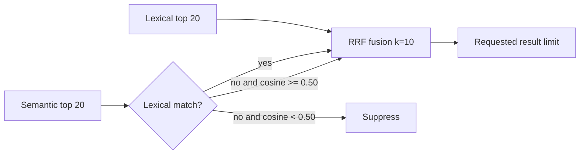

# Memory Hybrid Noise Reduction Design

## Architecture

The change stays inside `fuseSearchResults`. It adds no API, persisted data, model work, or caller-specific branch.

## Ranking Rules

1. Every lexical candidate enters fusion.
2. A semantic candidate already present lexically contributes its semantic reciprocal-rank score at any cosine value. Independent channel agreement remains useful evidence.
3. A semantic-only candidate enters fusion only at cosine similarity 0.50 or greater.
4. Both channels use reciprocal-rank fusion with `k=10`, increasing separation between high and deep ranks.
5. Existing deterministic tie-breaking remains score, lexical presence, lexical rank, semantic rank, then ID.

The threshold is internal rather than configurable because no current caller needs a tuning surface. Removing either policy is a one-line change plus its unit test.

## Alternatives Tested

| Candidate | hit@1 | hit@3 | hit@5 | Irrelevant top-3 | Coverage | Zero | Decision |
|---|---:|---:|---:|---:|---:|---:|---|
| Semantic baseline, `k=60` | 88% | 97% | 98% | 4.7% (6/127) | 42.3% | 0% | Replace |
| Equal RRF `k=10` | 88% | 97% | 98% | 4.0% (5/126) | 42.0% | 0% | Useful but incomplete |
| Asymmetric RRF 60/90 | 86% | 97% | 98% | 4.0% (5/125) | 41.7% | 0% | Rejected: loses 2 pp hit@1 |
| Semantic-only cosine >=0.50 | 88% | 97% | 98% | 3.3% (4 judged irrelevant) | 55.5% | 1% | Retained |
| Combined cosine >=0.50 + `k=10` | 88% | 97% | 98% | 2.5% (3 judged irrelevant) | 55.0% | 1% | Selected |

The rank-discount experiment remains visible in Git history and was reverted before testing the threshold. The selected combination targets both observed mechanisms and passes the hit@3 gate.

## Trade-offs

- The selected policy can return fewer than the requested limit when all semantic-only candidates are weak. This is intentional: the former lexical-zero query `169.254.169.254` received five unrelated semantic results with cosine 0.14–0.18 and no relevant hit.
- Coverage rises partly because weak unjudged results are no longer returned. Report raw counts and returned-slot denominators alongside conditional rates.
- A fixed threshold may not generalize perfectly beyond expanded-100. Pooled judgments are a follow-up, not a reason to retain demonstrated noise.

## Non-functional Properties

- Performance: no additional inference or database work; filtering reduces fusion work.
- Security/privacy: unchanged local inference and data handling.
- Reliability: semantic failure still degrades to lexical-only search.
- Compatibility: no public type, response, configuration, or schema change.
