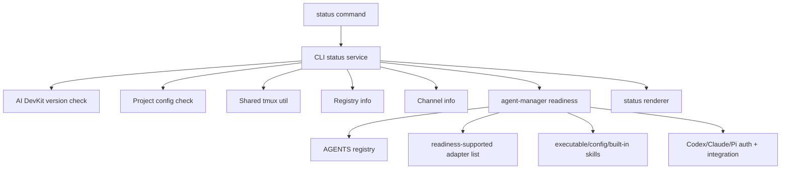

# System Design & Architecture

## Architecture Overview
**What is the high-level system structure?**

- `packages/agent-manager/src/readiness/AgentReadiness.ts` owns adapter readiness.
- Readiness uses an explicit supported-adapter list and omits `gemini_cli` while that adapter is pending removal.
- `packages/cli/src/services/status/status.service.ts` orchestrates the full CLI report.
- `packages/cli/src/commands/status/render.ts` renders executable agents from the report for human output, while JSON keeps the full report.
- Existing TypeScript/Vitest stack remains unchanged.

## Data Models
**What data do we need to manage?**

- `AgentReadinessReport`:
  - `type`
  - `executable`
  - `globalConfig`
  - `builtInSkills`
  - optional `auth`
  - optional `integration`
  - aggregate `status`
- `AuthReadinessCheck` includes `provider` and `availableProviders`, with no credential values.
- `IntegrationReadinessCheck` has a generic `label`, `installed`, and structured `details`.
- CLI `StatusReport.agents` becomes a record keyed by all startable adapter types.

## API Design
**How do components communicate?**

- `getAgentReadinessReports(options)` returns readiness reports for all startable adapters.
- `getAgentReadinessReport(agent, options)` supports focused testing and future consumers.
- `worstReadinessStatus(statuses)` provides shared aggregation.
- CLI passes:
  - `homeDir`
  - `path`
  - `assetRoot`
  - `builtInSkillNames`
  - per-agent `skillRoots`
  - injectable file/command/auth helpers for tests.

## Component Breakdown
**What are the major building blocks?**

- Generic readiness checks:
  - executable lookup through `PATH`
  - global config directory readability
  - AI DevKit built-in skill presence, where missing skills warn instead of fail
- Specific readiness checks:
  - Codex auth via existing capacity report hook.
  - Codex AI DevKit hook script, registration, and session mapping file.
  - Claude auth via local credentials/config file evidence.
  - Claude AI DevKit hook script and registration.
  - Pi auth provider parsing from `~/.pi/agent/auth.json`.
  - Pi AI DevKit plugin/session tracker via `pi list` plus mapping validation.
  - OpenCode auth provider parsing from `opencode auth list`.
- CLI-owned checks:
  - package version
  - project config
  - registries
  - channels
  - tmux

## Design Decisions
**Why did we choose this approach?**

- Adapter readiness belongs to `agent-manager` because that package already owns adapter metadata and provider-specific behavior.
- Built-in skill names and paths stay injected from the CLI because they depend on CLI environment mapping.
- Generic adapters omit `auth`/`integration` until there is reliable non-interactive evidence to check.
- OpenCode has reliable non-interactive auth evidence through `opencode auth list`, so it participates in auth readiness without a hook/plugin integration.
- Missing built-in skills are warning-level because an adapter can still run without them; the warning prompts setup or install follow-up without classifying the adapter as unusable.
- Human output omits adapters without an executable to avoid noisy follow-up checks for tools the user does not have installed.
- Top-level status checks use `Promise.all` because they are independent filesystem/process probes.
- Pi stale mapping entries are informational; stale files can remain after sessions end and must not fail plugin readiness.

## Non-Functional Requirements
**How should the system perform?**

- Keep status latency bounded by the slowest independent probe instead of the sum of probes.
- Avoid serial filesystem checks inside built-in skill and mapping checks.
- Do not expose auth token, API key, base URL, or model values in reports.
- Preserve deterministic ordering in rendered output.
