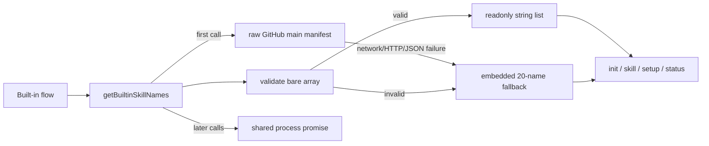

# Remote Built-in Skills Manifest Design

## Architecture Overview



`packages/cli/src/lib/BuiltinSkills.ts` is the only fetch, parse, validation, fallback, and promise-cache boundary. Consumers remain responsible only for using the resolved names.

## Data Model

`skills/built-in.json` is a bare JSON array:

```json
["agent-communication", "agent-management"]
```

The internal API is:

```ts
getBuiltinSkillNames(): Promise<readonly string[]>
```

Runtime names are strings. The unused compile-time `BuiltinSkillName` union is deleted because remote data cannot truthfully define a literal union.

## Component Breakdown

- `BuiltinSkills.ts` owns the raw `main` URL, trusted registry identifier, embedded fallback, validation, warning, and process-local promise.
- `init.ts` resolves built-ins only when the existing flow elects to install them, then maps names to template entries.
- `skill.ts` resolves names before the `--built-in` loop.
- `setup.service.ts` resolves names in the default installer; the cache prevents repeated requests across agents.
- `status.service.ts` resolves names before readiness checks; counts describe the selected live or fallback set.
- `SkillManager` remains unchanged and resolves `skills/<name>/SKILL.md` from the refreshed repository.

## Failure Contract

The loader treats a non-OK response, invalid JSON, or invalid manifest as one failure class: emit a warning containing the reason and return the embedded fallback. Consumers do not branch on source or fail setup.

Validation requires a non-empty array whose elements are non-empty, unique strings accepted by the existing skill-name rules. Validation is all-or-nothing.

## Design Decisions

- Fetch from `main` so maintainers can add built-ins without a CLI release.
- Use a bare array because there is no current caller for metadata or schema fields.
- Use a process-local promise cache, not persistent storage, because one stable result per invocation is sufficient.
- Keep the fallback beside the loader so there is one compiled list and no consumer duplication.
- Keep the registry identifier compiled because the remote manifest controls membership, not installation origin.
- Do not change `SkillManager`; its existing runtime path lookup already supports skills unknown to the compiled CLI.

## Non-Functional Requirements

- No built-in flow may contact the manifest more than once per process.
- Setup and status remain usable when GitHub is unavailable.
- Untrusted remote data is validated before it controls installation paths.
- Tests replace global `fetch` and never rely on network state.
