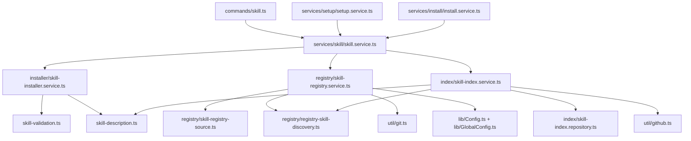

# System Design & Architecture

## Architecture Overview
**What is the high-level system structure?**



The feature keeps the repository's existing TypeScript/ESM stack and existing command/service direction. The skill module becomes a feature-owned service area under `services/skill`.

## Data Models
**What data do we need to manage?**

- `SkillEntry`: searchable skill index item with `name`, `registry`, `path`, `description`, and `lastIndexed`.
- `SkillIndexData`: persisted search index with metadata and skill entries.
- `SkillRegistryData`: merged registry map keyed by registry id.
- `InstalledSkill` and `GlobalInstalledSkill`: list output models used by commands.
- `AddSkillOptions` and `RemoveSkillOptions`: install/remove scope and environment options.
- `UpdateSummary` and `UpdateResult`: registry update result models.

## API Design
**How do components communicate?**

`SkillService` is the public application boundary for skill workflows:

```ts
addSkill(registryId: string, skillName: string, options?: AddSkillOptions): Promise<'installed' | 'matched'>
addSkills(registryId: string, skillNames: string[], options?: AddSkillOptions): Promise<'installed' | 'matched'>
listInstallableSkills(registryId: string): Promise<RegistrySkillChoice[]>
removeSkill(skillName: string, options?: RemoveSkillOptions): Promise<void>
listSkills(): Promise<InstalledSkill[]>
listGlobalSkills(envCodes?: string[]): Promise<GlobalInstalledSkill[]>
addRegistry(id: string, source: string, options?: AddSkillRegistryCommandOptions): Promise<SkillRegistryAddStatus>
removeRegistry(id: string, options?: RemoveSkillRegistryCommandOptions): Promise<'project' | 'global'>
updateSkills(registryId?: string): Promise<UpdateSummary>
findSkills(keyword: string, options?: { refresh?: boolean }): Promise<SkillEntry[]>
rebuildIndex(outputPath?: string): Promise<void>
```

Command rendering and interactive skill selection remain in `commands/skill.ts`. Services expose installable skill choices and install explicit skill names. Services may still use existing terminal UI for long-running status messages where current behavior already does so.

## Component Breakdown
**What are the major building blocks?**

- `skill.service.ts`: coordinates top-level skill use cases and owns dependency construction.
- `registry/skill-registry.service.ts`: fetches/merges registries, prepares Git/local registry repositories, adds/removes registry config, updates caches, and removes registry cache.
- `registry/registry-skill-discovery.ts`: discovers valid skills from registry directories and enforces local registry containment/metadata bounds.
- `installer/skill-installer.service.ts`: resolves install targets, lists installable skills, and installs/removes/lists installed skills for project/global targets.
- `index/skill-index.service.ts`: finds skills, rebuilds the index, updates one registry in the index, removes registry entries, and decides when to refresh or use stale data.
- `index/skill-index.repository.ts`: reads/writes/checks the persisted JSON index.
- Shared root files:
  - `skill-validation.ts`
  - `skill-description.ts`
  - `skill-builtins.ts`
  - `skill.types.ts`

## Design Decisions
**Why did we choose this approach?**

- Use `services/skill` instead of `lib`/`util` because skill behavior is a feature module, not generic infrastructure.
- Use one public `SkillService` plus three collaborator services because a file-per-use-case structure is too verbose for this module.
- Keep shared skill-domain primitives at the `services/skill` root because validation, description parsing, and built-ins are used across registry, installer, and index.
- Use explicit filenames for searchability.
- Use dot suffixes only for architectural roles, such as `.service.ts`, `.repository.ts`, and `.types.ts`.
- Keep checkbox selection in the command because selection, cancellation, and choice label formatting are CLI UI concerns.
- Keep installer target resolution inside `skill-installer.service.ts` because it is short and installer-specific.
- Do not keep `SkillManager` as a long-term compatibility wrapper because the type is internal to `packages/cli`.

## Non-Functional Requirements
**How should the system perform?**

- Preserve existing index caching, seed index fallback, registry update behavior, and concurrency.
- Preserve local registry containment checks and metadata size limits.
- Avoid broad behavior changes while moving code.
- Keep testability high by placing pure helpers in small files and persistence behind a repository.
