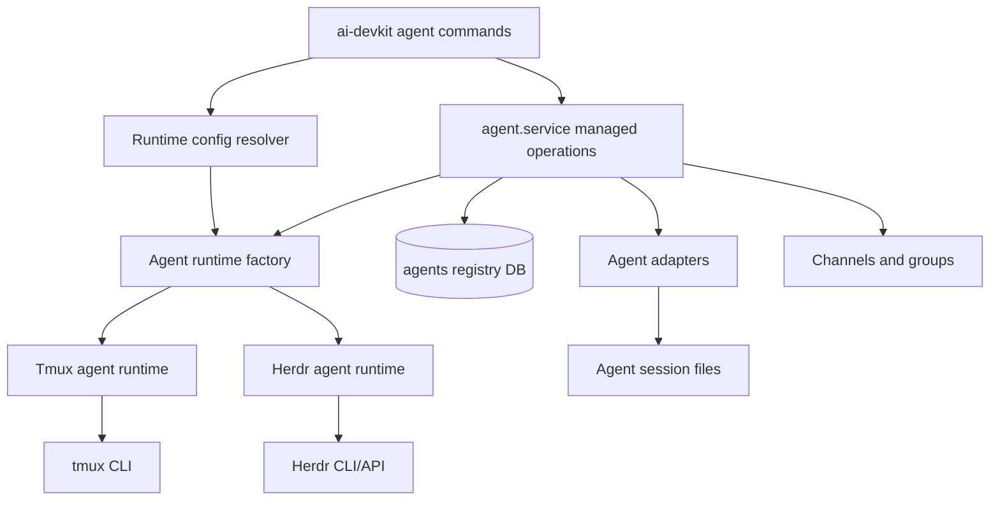

# System Design & Architecture

## Architecture Overview

Add a small runtime dispatch boundary around managed interactive agent operations. Keep agent adapters responsible for understanding agent tools such as Codex, Claude, Pi, Gemini, and Copilot. Keep runtime implementations responsible for where interactive processes live and how terminal IO/focus works.



Responsibilities:

- Global config resolver: parse `~/.ai-devkit/.ai-devkit.json` runtime config once near command entry.
- Runtime factory: return a Herdr runtime only when the global provider is `herdr`; otherwise keep the existing tmux branch.
- Runtime implementation: start, send, read/wait, focus/open, stop for a terminal backend.
- Agent registry: persist AI DevKit names, type, cwd, session metadata, runtime provider, and opaque runtime ref.
- Agent adapters: detect and parse agent-specific process/session/transcript data.
- Herdr: own sessions, panes, PTYs, process IO, focus/open behavior, and lifecycle detection.

## Data Models

Config:

```json
// ~/.ai-devkit/.ai-devkit.json
{
  "agentRuntime": {
    "provider": "herdr"
  }
}
```

Type model:

```ts
type AgentRuntimeProvider = 'tmux' | 'herdr';

interface RuntimeBackedRegistryFields {
  runtime: AgentRuntimeProvider;
  runtimeRef: unknown | null;
}
```

Registry migration:

```sql
ALTER TABLE agents ADD COLUMN runtime TEXT NOT NULL DEFAULT 'tmux';
ALTER TABLE agents ADD COLUMN runtime_ref TEXT NOT NULL DEFAULT '';
```

Compatibility:

- Treat `runtime_ref` as the canonical runtime handle for both tmux and Herdr.
- Keep the physical `tmux_session` column only as a legacy backfill/compatibility column.
- For tmux records, write `runtime_ref = { "session": "<name>" }` and mirror that session into `tmux_session` only for old readers.
- For Herdr records, write `runtime = 'herdr'` and Herdr's opaque ref JSON.
- When `runtime` is missing on old records, read as `tmux`.
- When tmux `runtime_ref` is empty, synthesize `{ "session": tmux_session }` in memory.

Example Herdr ref:

```json
{
  "session": "default",
  "paneId": "w1:p2",
  "agentName": "reviewer"
}
```

## API Design

Internal Herdr runtime interfaces:

```ts
interface HerdrStartRuntime {
  readonly provider: 'herdr';
  isAvailable(): Promise<RuntimeAvailability>;
  startAgent(input: RuntimeStartInput): Promise<RuntimeStartResult>;
}

interface HerdrInteractiveRuntime extends HerdrStartRuntime {
  send(input: RuntimeSendInput): Promise<void>;
  wait(input: RuntimeWaitInput): Promise<void>;
  readOutput(input: RuntimeReadOutputInput): Promise<string>;
  focus(input: RuntimeFocusInput): Promise<boolean>;
  stop(input: RuntimeStopInput): Promise<void>;
}

type RuntimeAvailability =
  | { ok: true; insideRuntime: boolean; currentPaneId?: string }
  | { ok: false; reason: 'binary-missing' | 'backend-unreachable' | 'invalid-environment'; detail: string };
```

Herdr availability rules:

- If provider is `herdr`, require the `herdr` binary.
- Require Herdr backend/API reachability through `herdr api snapshot` or equivalent.
- Use `HERDR_ENV=1` and `HERDR_PANE_ID` only as context signals.
- Do not require the user to run `ai-devkit agent start` from inside Herdr.

Runtime dispatch:

- `agent start`: use configured global runtime.
- `agent send`, `agent send --wait`, focus/open, and kill: use the target registry row's stored runtime.
- Old registry rows without runtime use tmux.

## Component Breakdown

- `packages/cli/src/util/config.ts`: validate global `agentRuntime.provider` using provider values exported by `agent-manager`.
- `packages/cli/src/lib/GlobalConfig.ts`: read global runtime provider from `~/.ai-devkit/.ai-devkit.json`.
- `packages/cli/src/lib/Config.ts`: delegate runtime provider lookup to global config for caller compatibility.
- `packages/cli/src/services/agent/agent.service.ts`: keep managed-agent command orchestration while consuming runtime interfaces from `agent-manager`.
- `packages/agent-manager/src/terminal/TmuxManager.ts`: keep as low-level tmux helper.
- `packages/agent-manager/src/runtime/AgentRuntime.ts`: centralize runtime interfaces, Herdr runtime construction, and registry-entry runtime predicates.
- `packages/agent-manager/src/runtime/HerdrAgentRuntime.ts`: add injectable Herdr CLI client and typed parsing/errors.
- `packages/agent-manager/src/utils/AgentRegistry.ts`: persist runtime/runtimeRef with old-row defaults.
- `packages/agent-manager/src/database/migrations/005_agent_runtime.sql`: additive migration.
- Herdr CLI client: injectable exec dependency, JSON parsing, typed errors.

## Design Decisions

- Use `runtimeRef` in active code paths. The legacy `tmux_session` DB column remains only to backfill old rows and avoid a destructive SQLite migration in this feature branch.
- Store Herdr refs in `runtime_ref`, not a new DB. AI DevKit already owns agent registry records; a second DB would duplicate identity and lifecycle state.
- Use stored runtime for existing agents. A target agent should be operated through the backend that owns its live session, regardless of current config.
- Do not mirror Herdr details into `agent detail`. AI DevKit detail should show AI DevKit assignment/session metadata, with a compact runtime reference/debug field if needed.
- Use Herdr CLI/API initially. Socket API can replace the transport later behind the same runtime interface.
- Treat Herdr IDs as opaque. The adapter captures returned IDs from Herdr responses and never guesses or derives them.

## Non-Functional Requirements

Reliability:

- Runtime availability errors should be specific and actionable.
- Malformed `runtime_ref` should not crash unrelated agent list operations; report target-specific failures for operations that need the ref.
- Existing tmux flows must keep passing tests.

Performance:

- CLI-based Herdr operations are acceptable for MVP.
- Runtime interface should allow a future socket/event-backed Herdr client without changing command semantics.

Security:

- Do not execute shell strings through a shell when calling Herdr; use argument arrays.
- Do not store secrets in `runtime_ref`.
- Treat Herdr response JSON as untrusted input and validate required fields.

Compatibility:

- Old records and current docs/tests should remain valid during the migration.
- User-facing messages should stop hardcoding "tmux" where the operation is now runtime-generic.
