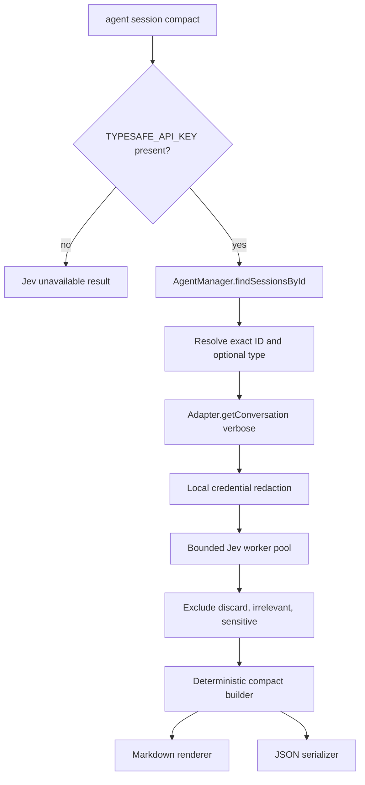

# Jev Session Compaction Design

## Architecture Overview

The feature extends the existing `agent session` command group. The command owns session selection and output. A small session-compaction service owns availability, redaction, Jev classification, deterministic assembly, and rendering. Provider-specific transcript parsing stays in `agent-manager`.



## Data Models

```ts
type CompactCategory =
  | "user_instruction"
  | "decision"
  | "code_change"
  | "command_evidence"
  | "validation_evidence"
  | "blocker"
  | "next_step"
  | "memory_candidate"
  | "discard";

type CompactImportance = "irrelevant" | "useful" | "important" | "critical";

interface ClassifiedSessionEvent {
  role: "user" | "assistant" | "system";
  content: string;
  timestamp?: string;
  keep: boolean;
  category: CompactCategory;
  importance: CompactImportance;
  sensitive: boolean;
}

interface SessionCompact {
  intent: string;
  currentState: string;
  decisions: string[];
  changedFiles: string[];
  commands: string[];
  validation: string[];
  openQuestions: string[];
  nextStep: string;
  memoryCandidates: string[];
  resumePrompt: string;
  jev: { available: true; model: string; classifiedEvents: number };
}

type JevUnavailable = {
  jev: { available: false; reason: "TYPESAFE_API_KEY is not set" };
};
```

The builder preserves source wording rather than claiming generated facts. It uses the first retained user instruction as intent, the latest retained operational events as current state, the latest next-step event as next step, and category groups for array fields. Blockers populate open questions. The resume prompt is a fixed template composed from those fields.

## API Design

### CLI

```text
ai-devkit agent session compact --id <session-id> [--type <type>] [--format markdown|json]
```

- Default format: `markdown`.
- Unavailable Markdown is the single required sentence.
- Unavailable JSON is the `JevUnavailable` object.
- Availability is checked before `AgentManager.findSessionsById()` so no transcript is read without a usable configuration signal.

### Internal boundaries

```ts
interface SessionEventClassifier {
  readonly model: string;
  classify(message: ConversationMessage): Promise<ClassifiedSessionEvent>;
}

async function compactSession(
  messages: ConversationMessage[],
  classifier: SessionEventClassifier,
): Promise<SessionCompact>;

function renderSessionCompactMarkdown(result: SessionCompact): string;
```

The default classifier wraps `@typesafe-ai/sdk` and asks one `choice` question for category, one `choice` for importance, and two `noul` questions for retention and sensitivity. It validates returned labels before constructing a classified event.

## Component Breakdown

- `packages/cli/src/services/session-compact/session-compact.types.ts`: stable feature types and enums.
- `packages/cli/src/services/session-compact/jev-classifier.ts`: SDK adapter and response validation.
- `packages/cli/src/services/session-compact/session-compact.service.ts`: redaction, filtering, deterministic assembly, and Markdown rendering.
- `packages/agent-manager/src/AgentManager.ts` and built-in adapters: exact session-ID resolution using provider-native storage, with a compatibility fallback for external adapters.
- `packages/cli/src/commands/agent.ts`: Commander wiring, early availability gate, exact session resolution, output selection.
- `packages/cli/src/__tests__/services/session-compact/*`: classifier/service unit tests with no network.
- `packages/cli/src/__tests__/commands/agent.test.ts`: command-level unavailable and successful wiring tests.
- `skills/session-compact/SKILL.md` and `skills/built-in.json`: agent instructions and distribution manifest.

## Design Decisions

1. **Use `agent session compact`, not a new top-level `session`.** Historical discovery and detail already live under `agent`; extending that namespace minimizes concepts and shares resolution behavior.
2. **Select by session ID, not raw input path.** Adapters already own heterogeneous file/database formats and normalize them to `ConversationMessage[]`.
3. **No silent fallback.** Missing configuration is a typed, successful unavailable result; API/runtime failures are errors.
4. **Deterministic output after classification.** Jev is a decision model, not a prose generator. Keeping source content also makes the artifact auditable.
5. **One injectable classifier boundary.** Tests avoid network access and the SDK can be replaced without changing the builder or CLI.
6. **Bounded classification concurrency.** Eight workers overlap independent Jev calls; each result is written to its source index so deterministic artifact ordering is preserved. A bounded pool avoids the request spike of unbounded `Promise.all`.
7. **Redact before Jev and exclude Jev-sensitive events.** This reduces exposure and prevents sensitive events from entering the artifact, while acknowledging regex redaction is not comprehensive DLP.
8. **Direct lookup is adapter-wide and additive.** All built-in adapters implement exact-ID lookup using their native filesystem or database shape. The interface method is optional so external adapters continue to work through manager-level list-and-filter fallback.

### Rejected alternatives

- Top-level `session compact`: duplicates the existing `agent session` resource namespace.
- `--input <path>` first: leaks provider parsing into the command and cannot naturally represent database-backed sessions.
- Put compaction into `agent-manager`: provider-independent classification and presentation are CLI application concerns.
- Add a general AI-provider layer: no second current caller.
- Ask Jev to generate the artifact: unsupported by its typed-decision role.

## Non-Functional Requirements

- Do not log, serialize, interpolate into errors, or transmit `TYPESAFE_API_KEY` as state.
- Redact common bearer tokens, private-key blocks, and credential assignments before classification.
- Validate all Jev labels at the integration boundary; never coerce unknown labels to a normal category.
- Preserve script-friendly stdout. Normal JSON/Markdown output goes to stdout; runtime errors follow existing stderr/exit-1 handling.
- No filesystem writes by the command.
- Test all new branches without live credentials or network calls.
