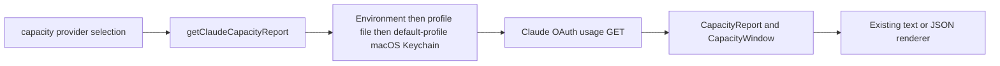

# Claude Capacity Design

## Architecture Overview



The change adds one provider module under `packages/agent-manager/src/capacity/` and one direct branch in the existing CLI selector. The provider module owns credential resolution, request construction, response/error handling, and normalization. No generic provider layer is added.

## Data Models

- `CapacityReport`: unchanged; Claude reports `harness: "claude"`, `provider: "anthropic"`, generation time, auth/availability state, windows, and `creditsRemaining: null`.
- `CapacityWindow`: unchanged. Session, weekly, and model scopes use percentage/reset fields. Extra usage additionally uses `limitType: "CREDIT_LIMIT"` and monetary `total`, `current`, and `remaining` values.
- Claude credential input: OAuth access token plus optional expiry, resolved without returning metadata to callers.
- Claude usage payload: treated as untrusted `unknown`; parsers accept only finite numbers, valid timestamps, non-empty model identity, and plain objects/arrays.

## API Design

`getClaudeCapacityReport(options?)` mirrors the existing z.ai entry point and accepts injectable `now`, `env`, `readFile`, `keychainRead`, `platform`, `fetch`, and `timeoutMs` boundaries.

The provider sends:

```text
GET https://api.anthropic.com/api/oauth/usage
Authorization: Bearer <OAuth token>
Accept: application/json
Content-Type: application/json
anthropic-beta: oauth-2025-04-20
User-Agent: claude-code/2.1.0
```

The public report never contains the token, credential path, raw response body, or provider exception.

### Normalization contract

| Source                | Window ID                    | Label                      | Duration       |
| --------------------- | ---------------------------- | -------------------------- | -------------- |
| `five_hour`           | `session`                    | Session                    | 300 minutes    |
| `seven_day`           | `weekly`                     | Weekly                     | 10,080 minutes |
| `seven_day_sonnet`    | `claude:sonnet:weekly`       | Sonnet weekly              | 10,080 minutes |
| `seven_day_opus`      | `claude:opus:weekly`         | Opus weekly                | 10,080 minutes |
| scoped `limits` entry | `claude:weekly:<model-slug>` | `<display name> weekly`    | 10,080 minutes |
| enabled `extra_usage` | `claude:extra-usage`         | `Extra usage · <currency>` | unknown        |

Window parsers keep a valid object even when utilization or reset is absent, setting the corresponding normalized field to `null`. Invalid optional entries are skipped. Scoped entries require the observed `weekly_scoped`/`weekly` classification and a non-all-model identity; first occurrence wins on duplicate IDs.

Availability follows the existing capacity convention: `yes` when any window has utilization below 100, `no` when at least one utilization exists and all known utilizations are at least 100, and `unknown` when none is known.

### Failure contract

| Condition                              | Result                                                           |
| -------------------------------------- | ---------------------------------------------------------------- |
| Missing/malformed credential source    | Sanitized credential error before fetch                          |
| Known expired file/Keychain credential | Sanitized expired-auth error before fetch                        |
| HTTP 401                               | Sanitized unauthorized error                                     |
| HTTP 403                               | Sanitized forbidden error                                        |
| HTTP 429                               | Sanitized rate-limit error with normalized retry time when valid |
| Other non-2xx                          | Sanitized status-only request error                              |
| Network/abort                          | Sanitized request-failed error                                   |
| Invalid JSON/non-object JSON           | Sanitized malformed-response error                               |

These failures use ordinary provider-local errors because existing CLI behavior already propagates a single-provider failure and warns while retaining successful reports for a multi-provider request.

## Component Breakdown

- `capacity/claude.ts`: constants, credential resolution, parsing, availability calculation, bounded fetch, Retry-After parsing, and safe provider errors.
- `capacity/claude.ts`: provider-owned `ClaudeCapacityOptions`, credential resolution, request handling, and normalization.
- `capacity/index.ts`: `getClaudeCapacityReport` wrapper and option-type re-export with injected clock.
- `agent-manager/src/index.ts`: public export.
- `cli/commands/capacity.ts`: add `claude` to the supported union/list and direct reader branch.
- `cli/commands/capacity/render.ts`: add the `anthropic` display label; existing window rendering is reused.
- Provider fixtures/tests: credentials and usage shapes plus HTTP/error cases.
- CLI tests: selection, default provider set, JSON/text rendering, and partial failure.

## Design Decisions

| Decision            | Choice                                   | Rationale                                                                              |
| ------------------- | ---------------------------------------- | -------------------------------------------------------------------------------------- |
| Credential sources  | Environment, profile file, then Keychain | Preserves explicit/profile precedence while supporting normal macOS Claude Code login. |
| Keychain            | Default macOS profile only               | Avoids mixing one global item into an explicitly selected custom profile.              |
| Claude CLI fallback | Defer                                    | Auth status has no usage; TUI scraping is interactive and brittle.                     |
| User-Agent version  | Fixed fallback version                   | Satisfies the endpoint without spawning Claude or adding detection machinery.          |
| Monetary data       | Existing credit-limit fields             | Preserves returned extra-usage values without changing the public contract.            |
| Model limits        | Known flat fields plus scoped `limits`   | Covers observed endpoint shapes without guessing arbitrary fields.                     |
| Partial payloads    | Preserve valid entries                   | Missing optional provider data must not erase truthful windows or become zero.         |
| Provider selection  | One direct CLI branch                    | Three providers do not justify a registry or new abstraction.                          |

## Non-Functional Requirements

- One bounded request per Claude probe; default timeout matches existing capacity providers.
- No credential writes, refresh, caching, retries, or Claude CLI calls. Keychain access uses fixed `/usr/bin/security` arguments without a shell, a 1.5-second timeout, and a bounded output buffer.
- All error messages are stable and omit response bodies and credentials.
- 429 exposes only a normalized retry time when `Retry-After` is valid.
- Parsing time is linear in the number of returned limits, with deterministic de-duplication.
- New and changed code targets complete branch coverage where practical and must pass repository lint, build, focused tests, and full tests.
